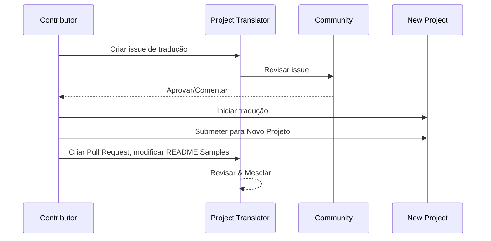

# Projeto Tradutor

Uma extensão vscode fácil de usar para localização multilíngue de projetos.

Repositório do projeto: `https://github.com/Project-Translation/project_translator`

<!--  -->


## Traduções Disponíveis

A extensão suporta tradução para estes idiomas:

- [简体中文 (zh-cn)](./readmes/README.zh-cn.md)
- [繁體中文 (zh-tw)](./readmes/README.zh-tw.md)
- [日本語 (ja-jp)](./readmes/README.ja-jp.md)
- [한국어 (ko-kr)](./readmes/README.ko-kr.md)
- [Français (fr-fr)](./readmes/README.fr-fr.md)
- [Deutsch (de-de)](./readmes/README.de-de.md)
- [Español (es-es)](./readmes/README.es-es.md)
- [Português (pt-br)](./readmes/README.pt-br.md)
- [Русский (ru-ru)](./readmes/README.ru-ru.md)
- [العربية (ar-sa)](./readmes/README.ar-sa.md)
- [العربية (ar-ae)](./readmes/README.ar-ae.md)
- [العربية (ar-eg)](./readmes/README.ar-eg.md)

## Exemplos

| Projeto                                                                             | Repositório Original                                                                                       | Descrição                                                                                                                                                              | Estrelas | Tags                                                                                                                                                                                                                                                                                                                                                                                                                                                                                                                                                                                                                                                                 |
| ----------------------------------------------------------------------------------- | --------------------------------------------------------------------------------------------------------- | ---------------------------------------------------------------------------------------------------------------------------------------------------------------------- | -------- | -------------------------------------------------------------------------------------------------------------------------------------------------------------------------------------------------------------------------------------------------------------------------------------------------------------------------------------------------------------------------------------------------------------------------------------------------------------------------------------------------------------------------------------------------------------------------------------------------------------------------------------------------------------------- |
| [algorithm-visualizer](https://github.com/Project-Translation/algorithm-visualizer) | [algorithm-visualizer/algorithm-visualizer](https://github.com/algorithm-visualizer/algorithm-visualizer) | :fireworks:Plataforma Online Interativa que Visualiza Algoritmos a partir do Código                                                                                     | 47301    | [`algorithm`](https://github.com/topics/algorithm), [`animation`](https://github.com/topics/animation), [`data-structure`](https://github.com/topics/data-structure), [`visualization`](https://github.com/topics/visualization)                                                                                                                                                                                                                                                                                                                                                                                                                                     |
| [algorithms](https://github.com/Project-Translation/algorithms)                     | [algorithm-visualizer/algorithms](https://github.com/algorithm-visualizer/algorithms)                     | :crystal_ball:Visualizações de Algoritmos                                                                                                                               | 401      | N/A                                                                                                                                                                                                                                                                                                                                                                                                                                                                                                                                                                                                                                                                  |
| [cline-docs](https://github.com/Project-Translation/cline-docs)                     | [cline/cline](https://github.com/cline/cline)                                                             | Agente de codificação autônomo diretamente na sua IDE, capaz de criar/editar arquivos, executar comandos, usar o navegador e mais com sua permissão a cada passo do caminho. | 39572    | N/A                                                                                                                                                                                                                                                                                                                                                                                                                                                                                                                                                                                                                                                                  |
| [cursor-docs](https://github.com/Project-Translation/cursor-docs)                   | [getcursor/docs](https://github.com/getcursor/docs)                                                       | Documentação de Código Aberto do Cursor                                                                                                                                | 309      | N/A                                                                                                                                                                                                                                                                                                                                                                                                                                                                                                                                                                                                                                                                  |
| [gobyexample](https://github.com/Project-Translation/gobyexample)                   | [mmcgrana/gobyexample](https://github.com/mmcgrana/gobyexample)                                           | Go por Exemplo                                                                                                                                                         | 7523     | N/A                                                                                                                                                                                                                                                                                                                                                                                                                                                                                                                                                                                                                                                                  |
| [golang-website](https://github.com/Project-Translation/golang-website)             | [golang/website](https://github.com/golang/website)                                                       | [espelho] Casa dos sites go.dev e golang.org                                                                                                                            | 402      | N/A                                                                                                                                                                                                                                                                                                                                                                                                                                                                                                                                                                                                                                                                  |
| [reference-en-us](https://github.com/Project-Translation/reference-en-us)           | [Fechin/reference](https://github.com/Fechin/reference)                                                   | ⭕ Compartilhe folha de referência rápida para desenvolvedores.                                                                                                         | 7808     | [`awk`](https://github.com/topics/awk), [`bash`](https://github.com/topics/bash), [`chatgpt`](https://github.com/topics/chatgpt), [`cheatsheet`](https://github.com/topics/cheatsheet), [`cheatsheets`](https://github.com/topics/cheatsheets), [`css`](https://github.com/topics/css), [`golang`](https://github.com/topics/golang), [`grep`](https://github.com/topics/grep), [`markdown`](https://github.com/topics/markdown), [`python`](https://github.com/topics/python), [`reference`](https://github.com/topics/reference), [`sed`](https://github.com/topics/sed), [`snippets`](https://github.com/topics/snippets), [`vim`](https://github.com/topics/vim) |
| [styleguide](https://github.com/Project-Translation/styleguide)                     | [google/styleguide](https://github.com/google/styleguide)                                                 | Guias de estilo para projetos de código aberto originados do Google                                                                                                     | 38055    | [`cpplint`](https://github.com/topics/cpplint), [`style-guide`](https://github.com/topics/style-guide), [`styleguide`](https://github.com/topics/styleguide)                                                                                                                                                                                                                                                                                                                                                                                                                                                                                                         |
| [vscode-docs](https://github.com/Project-Translation/vscode-docs)                   | [microsoft/vscode-docs](https://github.com/microsoft/vscode-docs)                                         | Documentação pública do Visual Studio Code                                                                                                                              | 5914     | [`vscode`](https://github.com/topics/vscode)                                                                                                                                                                                                                                                                                                                                                                                                                                                                                                                                                                                                                         |

## Solicitando Tradução de Projeto

Se você deseja contribuir com uma tradução ou precisa que um projeto seja traduzido:

1. Crie uma issue usando o seguinte modelo:

```md
**Projeto**: [project_url]
**Idioma Alvo**: [target_lang]
**Descrição**: Breve descrição do porquê esta tradução seria valiosa
```

2. Fluxo de trabalho:


```mermaid
sequenceDiagram
  Contributor->>Project Translator: Criar issue de tradução
  Project Translator->>Community: Revisar issue
  Community-->>Contributor: Aprovar/Comentar
  Contributor->>New Project: Iniciar tradução
  Contributor->>New Project: Submeter para Novo Projeto
  Contributor->>Project Translator: Criar Pull Request, modificar README.Samples
  Project Translator-->>Project Translator: Revisar & Mesclar
```

3. Após o PR ser mesclado, a tradução será adicionada à seção Exemplos.

Traduções em andamento: [Ver Issues](https://github.com/Project-Translation/project_translator/issues)

## Recursos

- 📁 Suporte a Tradução em Nível de Pasta
  - Traduz pastas inteiras de projetos para múltiplos idiomas
  - Mantém a estrutura e hierarquia original da pasta
  - Suporte para tradução recursiva de subpastas
  - Detecção automática de conteúdo traduzível
  - Processamento em lote para traduções em grande escala eficientes
- 📄 Suporte a Tradução em Nível de Arquivo
  - Traduz arquivos individuais para múltiplos idiomas
  - Preserva a estrutura e formatação original do arquivo
  - Suporte para modos de tradução de pasta e arquivo
- 💡 Tradução Inteligente com IA
  - Mantém automaticamente a integridade da estrutura do código
  - Traduz apenas comentários de código, preserva a lógica do código
  - Mantém formatos de estrutura de dados como JSON/XML
  - Qualidade profissional de tradução de documentação técnica
- ⚙️ Configuração Flexível
  - Configure pasta de origem e múltiplas pastas de destino
  - Suporte para intervalos personalizados de tradução de arquivos
  - Defina tipos específicos de arquivos para ignorar
  - Suporte para múltiplas opções de modelos de IA
- 🚀 Operações Amigáveis ao Usuário
  - Exibição de progresso de tradução em tempo real
  - Suporte para pausar/retomar/parar tradução
  - Manutenção automática da estrutura da pasta de destino
  - Tradução incremental para evitar trabalho duplicado
- 🔄 Tradução Diferencial (Experimental)
  - Modo diff-apply para atualizações eficientes de traduções existentes
  - Reduz o uso da API traduzindo apenas o conteúdo alterado
  - Preserva o histórico de versões com edições mínimas
  - ⚠️ Recurso experimental - veja [Recursos Avançados](#differential-translation-diff-apply-mode) para detalhes

## Instalação

1. Procure por "[Project Translator](https://marketplace.visualstudio.com/items?itemName=techfetch-dev.project-translator)" no marketplace de extensões do VS Code
2. Clique em instalar
   
Alternativamente, instale a partir do Visual Studio Marketplace: `https://marketplace.visualstudio.com/items?itemName=techfetch-dev.project-translator` ou procure por `techfetch-dev.project-translator` na visualização de Extensões do VS Code.

## Configuração

A extensão suporta as seguintes opções de configuração:

```json
{
  "projectTranslator.specifiedFolders": [
    {
      "sourceFolder": {
        "path": "Caminho da pasta de origem",
        "lang": "Código do idioma de origem"
      },
      "targetFolders": [
        {
          "path": "Caminho da pasta de destino",
          "lang": "Código do idioma de destino"
        }
      ]
    }
  ],
  "projectTranslator.specifiedFiles": [
    {
      "sourceFile": {
        "path": "Caminho do arquivo de origem",
        "lang": "Código do idioma de origem"
      },
      "targetFiles": [
        {
          "path": "Caminho do arquivo de destino",
          "lang": "Código do idioma de destino"
        }
      ]
    }
  ],
  "projectTranslator.currentVendor": "openai",
  "projectTranslator.vendors": [
    {
      "name": "openai",
      "apiEndpoint": "URL do endpoint da API",
      "apiKeyEnvVarName": "MY_OPENAI_API_KEY",
      "model": "gpt-4o",
      "rpm": "10",
      "maxTokensPerSegment": 4096,
      "timeout": 30,
      "temperature": 0.0
    }
  ],
  "projectTranslator.userPrompts": [
      "1. Should return no need translate if the markdown file has 'draft' set to 'true' in the front matter.",
      "2. './readmes/' in the sentences should replace with './'",
  ],
  "projectTranslator.ignore": {
    "paths": [
      "**/node_modules/**"
    ],
    "extensions": [
      ".log"
    ]
  },
}
```

Detalhes principais da configuração:

| Opção de Configuração                   | Descrição                                                                                     |
| --------------------------------------- | --------------------------------------------------------------------------------------------- |
| `projectTranslator.specifiedFolders`    | Múltiplas pastas de origem com suas pastas de destino correspondentes para tradução           |
| `projectTranslator.specifiedFiles`      | Múltiplos arquivos de origem com seus arquivos de destino correspondentes para tradução       |
| `projectTranslator.translationIntervalDays` | Intervalo de tradução em dias (padrão 7 dias)                                                 |
| `projectTranslator.copyOnly`            | Arquivos para copiar mas não traduzir (com arrays `paths` e `extensions`)                     |
| `projectTranslator.ignore`              | Arquivos para ignorar completamente (com arrays `paths` e `extensions`)                      |
| `projectTranslator.skipFrontMatterMarkers` | Ignorar arquivos baseado em marcadores de front matter (com arrays `enabled` e `markers`)     |
| `projectTranslator.currentVendor`       | Fornecedor de API atual em uso                                                               |
| `projectTranslator.vendors`             | Lista de configuração de fornecedores de API (pode usar apiKey diretamente ou apiKeyEnvVarName para variáveis de ambiente) |
| `projectTranslator.systemPrompts`       | Array de prompts do sistema para guiar o processo de tradução                                |
| `projectTranslator.userPrompts`         | Array de prompts definidos pelo usuário, estes prompts serão adicionados após os prompts do sistema durante a tradução |
| `projectTranslator.segmentationMarkers` | Marcadores de segmentação configurados por tipo de arquivo, suporta expressões regulares     |
| `projectTranslator.debug`               | Ativar modo de depuração para registrar todas as requisições e respostas da API no canal de saída (padrão: false) |
| `projectTranslator.logFile`             | Configuração para arquivos de log de depuração (veja [Recurso de Arquivo de Log](./docs/log-file-feature.md)) |
| `projectTranslator.diffApply.enabled`   | Ativar modo experimental de tradução diferencial (padrão: false)                             |

## Uso

1. Abra a paleta de comandos (Ctrl+Shift+P / Cmd+Shift+P)
2. Digite "Translate Project" e selecione o comando
3. Se a pasta de origem não estiver configurada, uma caixa de diálogo de seleção de pasta aparecerá
4. Aguarde a tradução ser concluída

Durante a tradução:

- Pode pausar/retomar a tradução através dos botões da barra de status
- Pode parar o processo de tradução a qualquer momento
- Progresso da tradução mostrado na área de notificação
- Logs detalhados exibidos no painel de saída

## Desenvolvimento

### Sistema de Build

Esta extensão usa esbuild para empacotamento rápido e desenvolvimento:

#### Scripts Disponíveis

- `npm run build` - Build de produção com minificação
- `npm run compile` - Build de desenvolvimento
- `npm run watch` - Modo de observação para desenvolvimento
- `npm test` - Executar testes

#### Tarefas do VS Code

- **Build** (Ctrl+Shift+P → "Tasks: Run Task" → "build") - Empacota a extensão para produção
- **Watch** (Ctrl+Shift+P → "Tasks: Run Task" → "watch") - Modo de desenvolvimento com auto-rebuild

### Configuração de Desenvolvimento

1. Clone o repositório
2. Execute `npm install` para instalar dependências
3. Pressione `F5` para iniciar depuração ou execute a tarefa "watch" para desenvolvimento

A configuração do esbuild:

- Empacota todos os arquivos TypeScript em um único `out/extension.js`
- Exclui a API do VS Code (marcada como external)

## Recursos Avançados

### Usando Variáveis de Ambiente para Chaves de API

O Project Translator suporta o uso de variáveis de ambiente para chaves de API, que é uma abordagem mais segura do que armazenar chaves de API diretamente em arquivos de configuração:

1. Configure seu fornecedor com uma propriedade `apiKeyEnvVarName`:

```json
{
  "projectTranslator.vendors": [
    {
      "name": "openai",
      "apiEndpoint": "https://api.openai.com/v1",
      "apiKeyEnvVarName": "OPENAI_API_KEY",
      "model": "gpt-4"
    },
    {
      "name": "openrouter",
      "apiEndpoint": "https://openrouter.ai/api/v1",
      "apiKeyEnvVarName": "OPENROUTER_API_KEY",
      "model": "anthropic/claude-3-opus"
    }
  ]
}
```

2. Defina a variável de ambiente no seu sistema:
   - No Windows: `set OPENAI_API_KEY=sua_chave_api`
   - No macOS/Linux: `export OPENAI_API_KEY=sua_chave_api`

3. Quando a extensão for executada, ela:
   - Primeiro verificará se `apiKey` é fornecido diretamente na configuração
   - Se não, procurará pela variável de ambiente especificada por `apiKeyEnvVarName`

Esta abordagem mantém suas chaves de API fora dos arquivos de configuração e sistemas de controle de versão.

### Ignorar Tradução Baseado no Front Matter

O Project Translator pode ignorar a tradução de arquivos Markdown baseado em seus metadados de front matter. Isso é útil para documentos rascunho ou arquivos marcados como não necessitando tradução.

Para habilitar este recurso, configure a opção `projectTranslator.skipFrontMatterMarkers`:

```json
{
  "projectTranslator.skipFrontMatterMarkers": {
    "enabled": true,
    "markers": [
      {
        "key": "draft",
        "value": "true"
      },
      {
        "key": "translate",
        "value": "false"
      }
    ]
  }
}
```

Com esta configuração, qualquer arquivo Markdown com front matter contendo `draft: true` ou `translate: false` será ignorado durante a tradução e diretamente copiado para o local de destino.

Exemplo de arquivo Markdown que seria ignorado:
```
---
draft: true
title: "Documento Rascunho"
---

Este documento é um rascunho e não deve ser traduzido.
```

### Modo de Tradução Diferencial (Diff-Apply)

> **⚠️ Aviso de Recurso Experimental**: O modo de tradução diferencial é atualmente um recurso experimental e pode ter problemas de estabilidade e compatibilidade. É recomendado usá-lo com cautela em ambientes de produção e sempre fazer backup de arquivos importantes.

A extensão suporta um modo opcional de tradução diferencial (diff-apply). Quando habilitado, a extensão envia tanto o conteúdo de origem quanto o arquivo de destino traduzido existente para o modelo. O modelo deve retornar um ou mais blocos SEARCH/REPLACE (texto simples, sem cercas de código). A extensão aplica esses blocos localmente para minimizar alterações, reduzir o uso da API e melhor preservar o histórico de versões.

- **Alternar**: Configure `projectTranslator.diffApply.enabled` nas configurações do VS Code ou `project.translation.json` (padrão: `false`).
- **Opções**:
  - `validationLevel`: `normal` ou `strict` (padrão: `normal`). No modo `strict`, marcadores inválidos ou falhas de correspondência causarão um erro e a extensão retornará ao fluxo de tradução padrão.
  - `autoBackup`: Se verdadeiro, cria um backup `.bak` do arquivo de destino antes de aplicar edições (padrão: `true`).
  - `maxOperationsPerFile`: (mantido para compatibilidade) não usado pela nova estratégia.

Fluxo de trabalho:
1. Se `diffApply.enabled` for `true` e o arquivo de destino existir, a extensão lê ambos os conteúdos de origem e destino.
2. Ela chama o modelo com um prompt diferencial e exige retornar blocos SEARCH/REPLACE de texto simples.
3. Localmente, a extensão analisa e aplica os blocos SEARCH/REPLACE. Se a aplicação falhar, retorna à tradução completa normal e sobrescreve o arquivo de destino.

Exemplo SEARCH/REPLACE (múltiplos blocos permitidos):

```
<<<<<<< SEARCH
:start_line: 10
-------
const label = "Old"
=======
const label = "New"
>>>>>>> REPLACE

<<<<<<< SEARCH
:start_line: 25
-------
function foo() {
  return 1
}
=======
function foo() {
  return 2
}
>>>>>>> REPLACE
```

Notas:
- Use conteúdo exato incluindo indentação e espaços em branco nas seções SEARCH. Se não tiver certeza, use o conteúdo mais recente do arquivo.
- Mantenha uma única linha de `=======` entre SEARCH e REPLACE.
- Se nenhuma alteração for necessária, o modelo deve retornar uma string vazia.

Por que a tradução diferencial atualmente tem desempenho ruim (explicação)

- **Desafios de alinhamento e comparação entre idiomas**: A tradução diferencial requer enviar tanto o documento de origem original quanto o documento traduzido existente para o modelo, e o modelo deve compará-los entre idiomas para decidir quais partes da tradução precisam ser alteradas. Esta é uma tarefa fundamentalmente mais difícil do que modificar um único documento no local porque o modelo deve alinhar com precisão segmentos em diferentes idiomas e julgar diferenças semânticas.

- **Complexidade da preservação de formato e limites**: Muitos documentos contêm blocos de código, tabelas, marcadores de frontend ou espaços reservados especiais. Um fluxo de trabalho diff confiável deve preservar essas estruturas enquanto faz edições textuais. Se o modelo não puder produzir consistentemente resultados que sigam estritamente o formato SEARCH/REPLACE, aplicar edições automaticamente pode introduzir regressões de formatação ou erros estruturais.

- **Problemas de consistência de contexto e terminologia**: Edições pequenas e localizadas frequentemente dependem de contexto mais amplo e de um glossário existente de terminologia/estilo. Quando solicitado a produzir edições mínimas, o modelo pode negligenciar a consistência global (terminologia, estilo, comentários, nomes de variáveis), resultando em traduções inconsistentes ou semanticamente deslocadas.

- **Estabilidade do modelo e compensações de custo**: Alcançar uma tradução diferencial confiável requer modelos com forte raciocínio comparativo e saídas estáveis e previsíveis. Os modelos mainstream atuais não fornecem de forma confiável tanto alinhamento robusto entre idiomas quanto saídas estritamente formatadas a um custo razoável, então os sistemas geralmente retornam à retradução completa para garantir a correção.

Portanto, embora a tradução diferencial possa teoricamente reduzir tokens de saída caros e melhor preservar o histórico de versões, ela é atualmente limitada pelas capacidades de comparação entre idiomas dos modelos e estabilidade de saída. Este recurso permanece experimental; mitigações recomendadas incluem manter backups automáticos (`autoBackup: true`), usar um nível de validação tolerante (`validationLevel: "normal"`), e retornar à retradução completa quando a correspondência ou formatação falhar. No futuro, pós-processadores especializados de alinhamento bilíngue ou modelos menores personalizados podem melhorar a estabilidade da abordagem diff.

Economia de custos e por que ajuda

- **Custo de token de entrada vs saída**: APIs de grandes modelos comumente cobram diferentemente por tokens de entrada (prompt) e saída (completion). Frequentemente, tokens de saída são significativamente mais caros porque o modelo gera texto mais longo. Diff-apply ajuda porque enviamos a **origem atualizada (entrada)** e o **arquivo traduzido existente (entrada)** para o modelo e pedimos um JSON compacto de edições. A resposta do modelo é um JSON pequeno (poucos tokens de saída) em vez de um arquivo retraduzido completo (muitos tokens de saída), então você paga muito menos pela parte cara de saída.

- **Enviar apenas o que mudou**: Em vez de retraduzir o arquivo inteiro sempre que pequenas alterações ocorrem, diff-apply instrui o modelo a calcular as operações de edição mínimas para atualizar a tradução existente. Isso é particularmente eficaz para arquivos que foram previamente traduzidos e recebem apenas edições incrementais.

- **Melhor para arquivos formatados**: Arquivos com formatação estrita (JSON, XML, Markdown com blocos de código) se beneficiam muito porque diff-apply preserva a estrutura e altera apenas partes textuais que precisam de tradução. Isso reduz a chance de regressões relacionadas ao formato e tokens de saída extras causados pela reformatação do modelo.

- **Unidade base orientada por linhas, agregação mais inteligente**: A ferramenta trata a unidade básica de tradução como uma "linha", e a estratégia SEARCH/REPLACE aplica correspondência exata ou aproximada perto de `:start_line:`. Use `validationLevel: "normal"` para comportamento tolerante e `"strict"` quando você precisa de edições conservadoras e exatas.

Quando usar diff-apply:

- Use quando o arquivo de destino já existe e foi previamente traduzido.
- Use para documentos grandes e formatados onde retraduzir o arquivo inteiro seria caro.
- Evite para arquivos completamente novos sem tradução prévia, ou quando você deseja uma retradução fresca.


### Documentação de Design

- Gera source maps para builds de desenvolvimento
- Minifica código para builds de produção
- Fornece integração de problem matcher para VS Code

## Notas

- Garanta cota de uso de API suficiente
- Recomendado testar com pequenos projetos primeiro
- Use chaves de API dedicadas e remova-as após a conclusão

## Licença

[Licença](LICENSE)