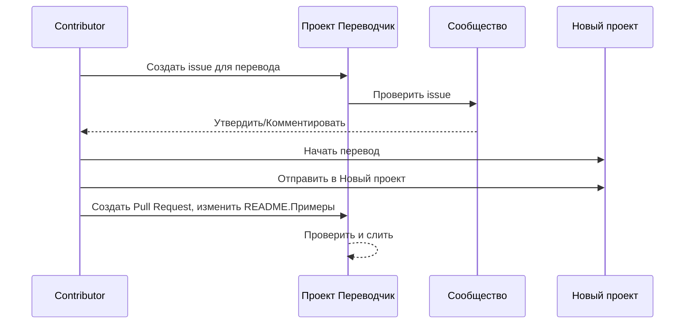

# Проект Переводчик

Расширение для VSCode: удобный инструмент для многоязычной локализации проектов.

## Доступные переводы

Расширение поддерживает перевод на следующие языки:

- [简体中文 (zh-cn)](./readmes/README.zh-cn.md)
- [繁體中文 (zh-tw)](./readmes/README.zh-tw.md)
- [日本語 (ja-jp)](./readmes/README.ja-jp.md)
- [한국어 (ko-kr)](./readmes/README.ko-kr.md)
- [Français (fr-fr)](./readmes/README.fr-fr.md)
- [Deutsch (de-de)](./readmes/README.de-de.md)
- [Español (es-es)](./readmes/README.es-es.md)
- [Português (pt-br)](./readmes/README.pt-br.md)
- [Русский (ru-ru)](./readmes/README.ru-ru.md)
- [العربية (ar-sa)](./readmes/README.ar-sa.md)
- [العربية (ar-ae)](./readmes/README.ar-ae.md)
- [العربية (ar-eg)](./readmes/README.ar-eg.md)

## Примеры

| Проект                                                   | Языки                                                                                                                                                 |
| --------------------------------------------------------- | --------------------------------------------------------------------------------------------------------------------------------------------------------- |
| [google/styleguide](https://github.com/google/styleguide) | [en-us](https://github.com/google/styleguide) оригинал от @google<br>[zh-cn](https://github.com/Project-Translation/styleguide-zh-cn) перевод от @jqknono |

## Запрос на перевод проекта

Если вы хотите внести перевод или нужен перевод проекта:

1. Создайте issue, используя следующий шаблон:

```md
**Проект**: [project_url]
**Целевой язык**: [target_lang]
**Описание**: Краткое описание, почему этот перевод будет полезен
```

2. Рабочий процесс:



3. После слияния PR перевод будет добавлен в раздел Примеры.

Текущие переводы в процессе: [Просмотреть Issues](https://github.com/Project-Translation/project_translator/issues)

## Возможности
- 📁 Поддержка перевода на уровне папок
  - Перевод целых проектных папок на несколько языков
  - Сохранение исходной структуры и иерархии папок
  - Поддержка рекурсивного перевода подпапок
  - Автоматическое обнаружение переводимого контента
  - Пакетная обработка для эффективного перевода в большом масштабе
- 📄 Поддержка перевода на уровне файлов
  - Перевод отдельных файлов на несколько языков
  - Сохранение исходной структуры и форматирования файлов
  - Поддержка режимов перевода как для папок, так и для файлов
- 💡 Умный перевод с использованием ИИ
  - Автоматически сохраняет целостность структуры кода
  - Переводит только комментарии кода, сохраняя логику кода
  - Сохраняет форматы структур данных JSON/XML и других
  - Качество перевода профессиональной технической документации
- ⚙️ Гибкая настройка
  - Настройка исходной папки и нескольких целевых папок
  - Поддержка пользовательских интервалов перевода файлов
  - Установка определенных типов файлов для игнорирования
  - Поддержка нескольких вариантов моделей ИИ
- 🚀 Пользовательские операции
  - Отображение прогресса перевода в реальном времени
  - Поддержка паузы/возобновления/остановки перевода
  - Автоматическое поддержание структуры целевой папки
  - Инкрементальный перевод для избежания дублирования работы

## Установка

1. Найдите "[Project Translator](https://marketplace.visualstudio.com/items?itemName=techfetch-dev.project-translator)" в marketplace расширений VS Code
2. Нажмите установить

## Настройка

Расширение поддерживает следующие опции настройки:

```json
{
  "projectTranslator.specifiedFolders": [
    {
      "sourceFolder": {
        "path": "Путь к исходной папке",
        "lang": "Код исходного языка"
      },
      "destFolders": [
        {
          "path": "Путь к целевой папке",
          "lang": "Код целевого языка"
        }
      ]
    }
  ],
  "projectTranslator.specifiedFiles": [
    {
      "sourceFile": {
        "path": "Путь к исходному файлу",
        "lang": "Код исходного языка"
      },
      "destFiles": [
        {
          "path": "Путь к целевому файлу",
          "lang": "Код целевого языка"
        }
      ]
    }
  ],
  "projectTranslator.currentVendor": "openai",
  "projectTranslator.vendors": [
    {
      "name": "openai",
      "apiEndpoint": "URL конечной точки API",
      "apiKey": "Ключ аутентификации API",
      "model": "Имя используемой модели",
      "rpm": "Максимальное количество запросов в минуту",
      "maxTokensPerSegment": 4096,
      "timeout": 30,
      "temperature": 0.0
    }
  ]
}
```

Ключевые детали настройки:
| Параметр конфигурации                            | Описание                                                                                       |
| ------------------------------------------------ | ---------------------------------------------------------------------------------------------- |
| `projectTranslator.specifiedFolders`             | Несколько исходных папок с соответствующими папками назначения для перевода                    |
| `projectTranslator.specifiedFiles`               | Несколько исходных файлов с соответствующими файлами назначения для перевода                   |
| `projectTranslator.translationIntervalDays`      | Интервал перевода в днях (по умолчанию 7 дней)                                                |
| `projectTranslator.ignoreTranslationExtensions`  | Список расширений текстовых файлов, которые не требуют перевода, эти файлы будут скопированы напрямую |
| `projectTranslator.ignorePaths`                  | Список игнорируемых шаблонов путей с использованием подстановочных знаков, эти файлы не будут скопированы |
| `projectTranslator.currentVendor`                | Текущий используемый поставщик API                                                            |
| `projectTranslator.vendors`                      | Список конфигураций поставщиков API                                                            |
| `projectTranslator.systemPrompts`                | Массив системных подсказок для руководства процессом перевода                                  |
| `projectTranslator.userPrompts`                  | Массив пользовательских подсказок, эти подсказки будут добавлены после системных подсказок во время перевода |
| `projectTranslator.segmentationMarkers`          | Маркеры сегментации, настроенные по типу файла, поддерживают регулярные выражения              |

## Использование

1. Откройте палитру команд (Ctrl+Shift+P / Cmd+Shift+P)
2. Введите "Перевести проект" и выберите команду
3. Если исходная папка не настроена, появится диалог выбора папки
4. Дождитесь завершения перевода

Во время перевода:

- Можно приостановить/возобновить перевод с помощью кнопок на панели состояния
- Можно остановить процесс перевода в любое время
- Прогресс перевода отображается в области уведомлений
- Подробные журналы отображаются в панели вывода

## Примечания

- Убедитесь в достаточном лимите использования API
- Рекомендуется сначала протестировать на небольших проектах
- Используйте выделенные ключи API и удалите их после завершения

## Лицензия

[Лицензия](LICENSE)