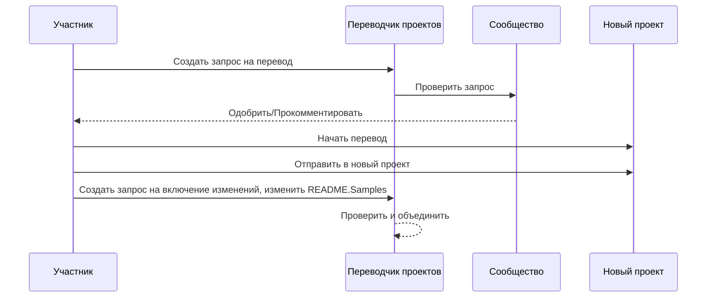

# Переводчик проектов

Расширение для VSCode: простой в использовании инструмент для многоязыковой локализации проектов.

## Доступные переводы

Расширение поддерживает перевод на следующие языки:

- [简体中文 (zh-cn)](./README.zh-cn.md)
- [繁體中文 (zh-tw)](./README.zh-tw.md)
- [日本語 (ja-jp)](./README.ja-jp.md)
- [한국어 (ko-kr)](./README.ko-kr.md)
- [Français (fr-fr)](./README.fr-fr.md)
- [Deutsch (de-de)](./README.de-de.md)
- [Español (es-es)](./README.es-es.md)
- [Português (pt-br)](./README.pt-br.md)
- [Русский (ru-ru)](./README.ru-ru.md)
- [العربية (ar-sa)](./README.ar-sa.md)
- [العربية (ar-ae)](./README.ar-ae.md)
- [العربية (ar-eg)](./README.ar-eg.md)

## Примеры

| Проект                                                                             | Исходный репозиторий                                                                                       | Описание                                                                                                                                                               | Звёзды | Теги                                                                                                                                                                                                                                                                                                                                                                                                                                                                                                                                                                                                                                                                 |
| ----------------------------------------------------------------------------------- | --------------------------------------------------------------------------------------------------------- | ------------------------------------------------------------------------------------------------------------------------------------------------------------------------- | ----- | -------------------------------------------------------------------------------------------------------------------------------------------------------------------------------------------------------------------------------------------------------------------------------------------------------------------------------------------------------------------------------------------------------------------------------------------------------------------------------------------------------------------------------------------------------------------------------------------------------------------------------------------------------------------- |
| [algorithm-visualizer](https://github.com/Project-Translation/algorithm-visualizer) | [algorithm-visualizer/algorithm-visualizer](https://github.com/algorithm-visualizer/algorithm-visualizer) | :fireworks: Интерактивная онлайн-платформа, визуализирующая алгоритмы на основе кода                                                                                               | 47301 | [`algorithm`](https://github.com/topics/algorithm), [`animation`](https://github.com/topics/animation), [`data-structure`](https://github.com/topics/data-structure), [`visualization`](https://github.com/topics/visualization)                                                                                                                                                                                                                                                                                                                                                                                                                                     |
| [algorithms](https://github.com/Project-Translation/algorithms)                     | [algorithm-visualizer/algorithms](https://github.com/algorithm-visualizer/algorithms)                     | :crystal_ball: Визуализация алгоритмов                                                                                                                                    | 401   | N/A                                                                                                                                                                                                                                                                                                                                                                                                                                                                                                                                                                                                                                                                  |
| [cline-docs](https://github.com/Project-Translation/cline-docs)                     | [cline/cline](https://github.com/cline/cline)                                                             | Автономный агент программирования прямо в вашей IDE, способный создавать/редактировать файлы, выполнять команды, использовать браузер и многое другое с вашего разрешения на каждом шагу. | 39572 | N/A                                                                                                                                                                                                                                                                                                                                                                                                                                                                                                                                                                                                                                                                  |
| [cursor-docs](https://github.com/Project-Translation/cursor-docs)                   | [getcursor/docs](https://github.com/getcursor/docs)                                                       | Открытая документация Cursor                                                                                                                                        | 309   | N/A                                                                                                                                                                                                                                                                                                                                                                                                                                                                                                                                                                                                                                                                  |
| [gobyexample](https://github.com/Project-Translation/gobyexample)                   | [mmcgrana/gobyexample](https://github.com/mmcgrana/gobyexample)                                           | Go по примеру                                                                                                                                                             | 7523  | N/A                                                                                                                                                                                                                                                                                                                                                                                                                                                                                                                                                                                                                                                                  |
| [golang-website](https://github.com/Project-Translation/golang-website)             | [golang/website](https://github.com/golang/website)                                                       | [зеркало] Домашняя страница сайтов go.dev и golang.org                                                                                                                       | 402   | N/A                                                                                                                                                                                                                                                                                                                                                                                                                                                                                                                                                                                                                                                                  |
| [reference-en-us](https://github.com/Project-Translation/reference-en-us)           | [Fechin/reference](https://github.com/Fechin/reference)                                                   | ⭕ Быстрые справочные шпаргалки для разработчиков.                                                                                                                      | 7808  | [`awk`](https://github.com/topics/awk), [`bash`](https://github.com/topics/bash), [`chatgpt`](https://github.com/topics/chatgpt), [`cheatsheet`](https://github.com/topics/cheatsheet), [`cheatsheets`](https://github.com/topics/cheatsheets), [`css`](https://github.com/topics/css), [`golang`](https://github.com/topics/golang), [`grep`](https://github.com/topics/grep), [`markdown`](https://github.com/topics/markdown), [`python`](https://github.com/topics/python), [`reference`](https://github.com/topics/reference), [`sed`](https://github.com/topics/sed), [`snippets`](https://github.com/topics/snippets), [`vim`](https://github.com/topics/vim) |
| [styleguide](https://github.com/Project-Translation/styleguide)                     | [google/styleguide](https://github.com/google/styleguide)                                                 | Руководства по стилю для проектов с открытым исходным кодом от Google                                                                                                                   | 38055 | [`cpplint`](https://github.com/topics/cpplint), [`style-guide`](https://github.com/topics/style-guide), [`styleguide`](https://github.com/topics/styleguide)                                                                                                                                                                                                                                                                                                                                                                                                                                                                                                         |
| [vscode-docs](https://github.com/Project-Translation/vscode-docs)                   | [microsoft/vscode-docs](https://github.com/microsoft/vscode-docs)                                         | Публичная документация для Visual Studio Code                                                                                                                               | 5914  | [`vscode`](https://github.com/topics/vscode)                                                                                                                                                                                                                                                                                                                                                                                                                                                                                                                                                                                                                         |

## Запрос перевода проекта

Если вы хотите внести перевод или нуждаетесь в переводе проекта:

1. Создайте запрос, используя следующий шаблон:

```md
**Проект**: [project_url]
**Целевой язык**: [target_lang]
**Описание**: Краткое описание, почему этот перевод будет полезен
```

2. Рабочий процесс:



3. После объединения запроса перевод будет добавлен в раздел Примеры.

Текущие переводы в процессе: [Просмотреть запросы](https://github.com/Project-Translation/project_translator/issues)

## Возможности

- 📁 Поддержка перевода на уровне папок
  - Перевод целых папок проектов на несколько языков
  - Сохранение исходной структуры и иерархии папок
  - Поддержка рекурсивного перевода подпапок
  - Автоматическое обнаружение переводимого содержимого
  - Пакетная обработка для эффективного перевода в больших масштабах
- 📄 Поддержка перевода на уровне файлов
  - Перевод отдельных файлов на несколько языков
  - Сохранение исходной структуры файлов и форматирования
  - Поддержка режимов перевода как папок, так и файлов
- 💡 Умный перевод с использованием ИИ
  - Автоматическое сохранение целостности структуры кода
  - Перевод только комментариев в коде, сохранение логики кода
  - Сохранение форматов JSON/XML и других структур данных
  - Профессиональное качество перевода технической документации
- ⚙️ Гибкая настройка
  - Настройка исходной папки и нескольких целевых папок
  - Поддержка пользовательских интервалов перевода файлов
  - Установка определённых типов файлов для игнорирования
  - Поддержка нескольких вариантов моделей ИИ
- 🚀 Удобные операции
  - Отображение хода перевода в реальном времени
  - Поддержка приостановки/возобновления/остановки перевода
  - Автоматическое поддержание структуры целевой папки
  - Инкрементальный перевод для избежания дублирования работы

## Установка

1. Найдите "[Project Translator](https://marketplace.visualstudio.com/items?itemName=techfetch-dev.project-translator)" в магазине расширений VS Code
2. Нажмите установить

## Настройка

Расширение поддерживает следующие параметры конфигурации:

```json
{
  "projectTranslator.specifiedFolders": [
    {
      "sourceFolder": {
        "path": "Путь к исходной папке",
        "lang": "Код исходного языка"
      },
      "targetFolders": [
        {
          "path": "Путь к целевой папке",
          "lang": "Код целевого языка"
        }
      ]
    }
  ],
  "projectTranslator.specifiedFiles": [
    {
      "sourceFile": {
        "path": "Путь к исходному файлу",
        "lang": "Код исходного языка"
      },
      "targetFiles": [
        {
          "path": "Путь к целевому файлу",
          "lang": "Код целевого языка"
        }
      ]
    }
  ],
  "projectTranslator.currentVendor": "openai",
  "projectTranslator.vendors": [
    {
      "name": "openai",
      "apiEndpoint": "URL конечной точки API",
      "apiKey": "Ключ аутентификации API",
      "apiKeyEnvVarName": "Имя переменной среды для ключа API",
      "model": "Используемая модель",
      "rpm": "Максимальное количество запросов в минуту",
      "maxTokensPerSegment": 4096,
      "timeout": 30,
      "temperature": 0.0
    }
  ]
}
```

Основные детали конфигурации:

| Параметр конфигурации                        | Описание                                                                                    |
| ------------------------------------------- | ---------------------------------------------------------------------------------------------- |
| `projectTranslator.specifiedFolders`        | Несколько исходных папок с соответствующими целевыми папками для перевода           |
| `projectTranslator.specifiedFiles`          | Несколько исходных файлов с соответствующими целевыми файлами для перевода               |
| `projectTranslator.translationIntervalDays` | Интервал перевода в днях (по умолчанию 7 дней)                                                  |
| `projectTranslator.copyOnly`                | Файлы, которые нужно копировать, но не переводить (с массивами `paths` и `extensions`)                         |
| `projectTranslator.ignore`                  | Файлы, которые полностью игнорируются (с массивами `paths` и `extensions`)                              |
| `projectTranslator.skipFrontMatterMarkers`  | Пропуск файлов на основе меток front matter (с массивами `enabled` и `markers`)                 |
| `projectTranslator.currentVendor`           | Текущий используемый API-провайдер                                                                      |
| `projectTranslator.vendors`                 | Список конфигураций API-провайдеров (можно использовать apiKey напрямую или apiKeyEnvVarName для переменных окружения) |
| `projectTranslator.systemPrompts`           | Массив системных подсказок для управления процессом перевода                                        |
| `projectTranslator.userPrompts`             | Массив пользовательских подсказок, которые будут добавлены после системных подсказок при переводе |
| `projectTranslator.segmentationMarkers`     | Метки сегментации, настроенные по типу файлов, поддерживают регулярные выражения                     |
| `projectTranslator.debug`                   | Включить режим отладки для записи всех API-запросов и ответов в выходной канал (по умолчанию: false)     |
| `projectTranslator.logFile`                 | Конфигурация файлов отладочного журнала (см. [Функция журнала](./docs/log-file-feature.md))         |

## Использование

1. Откройте палитру команд (Ctrl+Shift+P / Cmd+Shift+P)
2. Введите "Translate Project" и выберите команду
3. Если исходная папка не настроена, появится диалог выбора папки
4. Дождитесь завершения перевода

Во время перевода:

- Можно приостанавливать/возобновлять перевод с помощью кнопок на панели состояния
- Можно остановить процесс перевода в любой момент
- Ход перевода отображается в области уведомлений
- Подробные журналы отображаются на панели вывода

## Разработка

### Система сборки

Это расширение использует esbuild для быстрой сборки и разработки:

#### Доступные скрипты

- `npm run build` - Сборка для производства с минификацией
- `npm run compile` - Сборка для разработки
- `npm run watch` - Режим наблюдения для разработки
- `npm test` - Запуск тестов

#### Задачи VS Code

- **Build** (Ctrl+Shift+P → "Tasks: Run Task" → "build") - Сборка расширения для производства
- **Watch** (Ctrl+Shift+P → "Tasks: Run Task" → "watch") - Режим разработки с автоматической пересборкой

### Настройка разработки

1. Клонируйте репозиторий
2. Запустите `npm install` для установки зависимостей
3. Нажмите `F5` для запуска отладки или выполните задачу "watch" для разработки

Конфигурация esbuild:

- Объединяет все файлы TypeScript в один `out/extension.js`
- Исключает API VS Code (отмечено как внешнее)

## Расширенные функции

### Использование переменных окружения для API-ключей

Project Translator поддерживает использование переменных окружения для API-ключей, что является более безопасным подходом по сравнению с хранением ключей непосредственно в конфигурационных файлах:

1. Настройте провайдера с помощью свойства `apiKeyEnvVarName`:

```json
{
  "projectTranslator.vendors": [
    {
      "name": "openai",
      "apiEndpoint": "https://api.openai.com/v1",
      "apiKeyEnvVarName": "OPENAI_API_KEY",
      "model": "gpt-4"
    },
    {
      "name": "openrouter",
      "apiEndpoint": "https://openrouter.ai/api/v1",
      "apiKeyEnvVarName": "OPENROUTER_API_KEY",
      "model": "anthropic/claude-3-opus"
    }
  ]
}
```

2. Установите переменную окружения в вашей системе:
   - В Windows: `set OPENAI_API_KEY=your_api_key`
   - В macOS/Linux: `export OPENAI_API_KEY=your_api_key`

3. Когда расширение запускается, оно будет:
   - Сначала проверять, указан ли `apiKey` напрямую в конфигурации
   - Если нет, оно будет искать переменную окружения, указанную в `apiKeyEnvVarName`

Такой подход позволяет держать API-ключи вне конфигурационных файлов и систем контроля версий.

### Пропуск перевода на основе front matter

Project Translator может пропускать перевод файлов Markdown на основе метаданных front matter. Это полезно для черновиков или файлов, помеченных как не требующие перевода.

Чтобы включить эту функцию, настройте параметр `projectTranslator.skipFrontMatterMarkers`:

```json
{
  "projectTranslator.skipFrontMatterMarkers": {
    "enabled": true,
    "markers": [
      {
        "key": "draft",
        "value": "true"
      },
      {
        "key": "translate",
        "value": "false"
      }
    ]
  }
}
```

При такой конфигурации любой файл Markdown с front matter, содержащим `draft: true` или `translate: false`, будет пропущен при переводе и напрямую скопирован в целевое расположение.

Пример файла Markdown, который будет пропущен:
```
---
draft: true
title: "Черновой документ"
---

Этот документ является черновиком и не должен переводиться.
```


### Документация по проектированию

- Генерирует исходные карты для сборок разработки
- Минифицирует код для производственных сборок
- Предоставляет интеграцию с problem matcher для VS Code

## Примечания

- Убедитесь в достаточном квоте использования API
- Рекомендуется сначала тестировать с небольшими проектами
- Используйте выделенные API-ключи и удалите их после завершения

## Лицензия

[Лицензия](LICENSE)