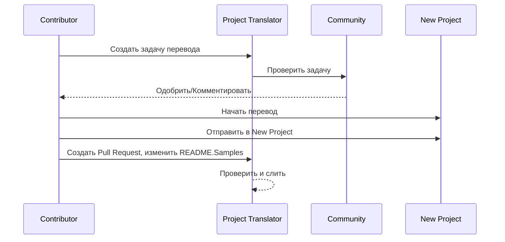

# Проектный переводчик

Расширение VSCode: удобный инструмент для многоканальной локализации проектов.

<!--
## Доступные переводы

Расширение поддерживает перевод на эти языки:

- [简体中文 (zh-cn)](./README.zh-cn.md)
- [繁體中文 (zh-tw)](./README.zh-tw.md)
- [日本語 (ja-jp)](./README.ja-jp.md)
- [한국어 (ko-kr)](./README.ko-kr.md)
- [Français (fr-fr)](./README.fr-fr.md)
- [Deutsch (de-de)](./README.de-de.md)
- [Español (es-es)](./README.es-es.md)
- [Português (pt-br)](./README.pt-br.md)
- [Русский (ru-ru)](./README.ru-ru.md)
- [العربية (ar-sa)](./README.ar-sa.md)
- [العربية (ar-ae)](./README.ar-ae.md)
- [العربية (ar-eg)](./README.ar-eg.md) -->

## Примеры
| Project                                                                             | Original Repository                                                                                       | Description                                                                                                                                                               | Stars | Tags                                                                                                                                                                                                                                                                                                                                                                                                                                                                                                                                                                                                                                                                 |
| ----------------------------------------------------------------------------------- | --------------------------------------------------------------------------------------------------------- | ------------------------------------------------------------------------------------------------------------------------------------------------------------------------- | ----- | -------------------------------------------------------------------------------------------------------------------------------------------------------------------------------------------------------------------------------------------------------------------------------------------------------------------------------------------------------------------------------------------------------------------------------------------------------------------------------------------------------------------------------------------------------------------------------------------------------------------------------------------------------------------- |
| [algorithm-visualizer](https://github.com/Project-Translation/algorithm-visualizer) | [algorithm-visualizer/algorithm-visualizer](https://github.com/algorithm-visualizer/algorithm-visualizer) | :fireworks:Интерактивная онлайн-платформа, визуализирующая алгоритмы из кода                                                                                               | 47301 | [`алгоритм`](https://github.com/topics/algorithm), [`анимация`](https://github.com/topics/animation), [`структура-данных`](https://github.com/topics/data-structure), [`визуализация`](https://github.com/topics/visualization)                                                                                                                                                                                                                                                                                                                                                                                                                                     |
| [algorithms](https://github.com/Project-Translation/algorithms)                     | [algorithm-visualizer/algorithms](https://github.com/algorithm-visualizer/algorithms)                     | :crystal_ball:Визуализации алгоритмов                                                                                                                                    | 401   | N/A                                                                                                                                                                                                                                                                                                                                                                                                                                                                                                                                                                                                                                                                  |
| [cline-docs](https://github.com/Project-Translation/cline-docs)                     | [cline/cline](https://github.com/cline/cline)                                                             | Автономный агент для кодирования прямо в вашей IDE, способный создавать/редактировать файлы, выполнять команды, использовать браузер и многое другое с вашего разрешения на каждом шаге. | 39572 | N/A                                                                                                                                                                                                                                                                                                                                                                                                                                                                                                                                                                                                                                                                  |
| [cursor-docs](https://github.com/Project-Translation/cursor-docs)                   | [getcursor/docs](https://github.com/getcursor/docs)                                                       | Открытая документация Cursor                                                                                                                                            | 309   | N/A                                                                                                                                                                                                                                                                                                                                                                                                                                                                                                                                                                                                                                                                  |
| [gobyexample](https://github.com/Project-Translation/gobyexample)                   | [mmcgrana/gobyexample](https://github.com/mmcgrana/gobyexample)                                           | Go by Example                                                                                                                                                             | 7523  | N/A                                                                                                                                                                                                                                                                                                                                                                                                                                                                                                                                                                                                                                                                  |
| [golang-website](https://github.com/Project-Translation/golang-website)             | [golang/website](https://github.com/golang/website)                                                       | [mirror] Домашняя страница сайтов go.dev и golang.org                                                                                                                       | 402   | N/A                                                                                                                                                                                                                                                                                                                                                                                                                                                                                                                                                                                                                                                                  |
| [reference-en-us](https://github.com/Project-Translation/reference-en-us)           | [Fechin/reference](https://github.com/Fechin/reference)                                                   | ⭕ Краткий справочник-шпаргалка для разработчиков.                                                                                                                      | 7808  | [`awk`](https://github.com/topics/awk), [`bash`](https://github.com/topics/bash), [`chatgpt`](https://github.com/topics/chatgpt), [`cheatsheet`](https://github.com/topics/cheatsheet), [`cheatsheets`](https://github.com/topics/cheatsheets), [`css`](https://github.com/topics/css), [`golang`](https://github.com/topics/golang), [`grep`](https://github.com/topics/grep), [`markdown`](https://github.com/topics/markdown), [`python`](https://github.com/topics/python), [`reference`](https://github.com/topics/reference), [`sed`](https://github.com/topics/sed), [`snippets`](https://github.com/topics/snippets), [`vim`](https://github.com/topics/vim) |
| [styleguide](https://github.com/Project-Translation/styleguide)                     | [google/styleguide](https://github.com/google/styleguide)                                                 | Руководства по стилю для проектов с открытым исходным кодом, originating от Google                                                                                                                   | 38055 | [`cpplint`](https://github.com/topics/cpplint), [`style-guide`](https://github.com/topics/style-guide), [`styleguide`](https://github.com/topics/styleguide)                                                                                                                                                                                                                                                                                                                                                                                                                                                                                                         |
| [vscode-docs](https://github.com/Project-Translation/vscode-docs)                   | [microsoft/vscode-docs](https://github.com/microsoft/vscode-docs)                                         | Публичная документация для Visual Studio Code                                                                                                                               | 5914  | [`vscode`](https://github.com/topics/vscode)                                                                                                                                                                                                                                                                                                                                                                                                                                                                                                                                                                                                                         |

## Запрос перевода проекта

Если вы хотите внести вклад в перевод или вам нужен перевод проекта:

1. Создайте issue, используя следующий шаблон:

```md
**Проект**: [project_url]
**Целевой язык**: [target_lang]
**Описание**: Краткое описание, почему этот перевод будет полезным
```

2. Рабочий процесс:


3. После слияния PR перевод будет добавлен в раздел Samples.

Текущие переводы в процессе: [Просмотреть задачи](https://github.com/Project-Translation/project_translator/issues)

## Возможности

- 📁 Поддержка перевода на уровне папок
  - Переводить целые папки проектов на несколько языков
  - Сохранять исходную структуру и иерархию папок
  - Поддержка рекурсивного перевода подпапок
  - Автоматическое обнаружение переводимого содержимого
  - Пакетная обработка для эффективного перевода в больших масштабах
- 📄 Поддержка перевода на уровне файлов
  - Переводить отдельные файлы на несколько языков
  - Сохранять исходную структуру и форматирование файлов
  - Поддержка режимов перевода как для папок, так и для файлов
- 💡 Умный перевод с ИИ
  - Автоматически сохраняет целостность структуры кода
  - Переводит только комментарии к коду, сохраняя логику кода
  - Сохраняет форматы JSON/XML и других структур данных
  - Качество перевода профессиональной технической документации
- ⚙️ Гибкая конфигурация
  - Настроить исходную папку и несколько целевых папок
  - Поддержка пользовательских интервалов перевода файлов
  - Установка конкретных типов файлов для игнорирования
  - Поддержка нескольких вариантов моделей ИИ
- 🚀 Простота в использовании
  - Отображение прогресса перевода в реальном времени
  - Поддержка паузы/возобновления/остановки перевода
  - Автоматическое поддержание структуры целевой папки
  - Инкрементальный перевод для избежания дублирования работы

## Установка

1. Найти "[Project Translator](https://marketplace.visualstudio.com/items?itemName=techfetch-dev.project-translator)" в маркетплейсе расширений VS Code
2. Нажать установить

## Конфигурация

Расширение поддерживает следующие опции конфигурации:

```json
{
  "projectTranslator.specifiedFolders": [
    {
      "sourceFolder": {
        "path": "Путь к исходной папке",
        "lang": "Код исходного языка"
      },
      "destFolders": [
        {
          "path": "Путь к целевой папке",
          "lang": "Код целевого языка"
        }
      ]
    }
  ],
  "projectTranslator.specifiedFiles": [
    {
      "sourceFile": {
        "path": "Путь к исходному файлу",
        "lang": "Код исходного языка"
      },
      "destFiles": [
        {
          "path": "Путь к целевому файлу",
          "lang": "Код целевого языка"
        }
      ]
    }
  ],
  "projectTranslator.currentVendor": "openai",
  "projectTranslator.vendors": [
    {
      "name": "openai",
      "apiEndpoint": "URL конечной точки API",
      "apiKey": "Ключ аутентификации API",
      "model": "Имя модели для использования",
      "rpm": "Максимальное количество запросов в минуту",
      "maxTokensPerSegment": 4096,
      "timeout": 30,
      "temperature": 0.0
    }
  ]
}
```

Ключевые детали конфигурации:

| Опция конфигурации                       | Описание                                                                                  |
| ---------------------------------------- | ---------------------------------------------------------------------------------------- |
| `projectTranslator.specifiedFolders`     | Несколько исходных папок с соответствующими целевыми папками для перевода                 |
| `projectTranslator.specifiedFiles`       | Несколько исходных файлов с соответствующими целевыми файлами для перевода                |
| `projectTranslator.translationIntervalDays` | Интервал перевода в днях (по умолчанию 7 дней)                                            |
| `projectTranslator.copyOnly`             | Файлы для копирования без перевода (с массивами `paths` и `extensions`)                  |
| `projectTranslator.ignore`               | Файлы для полного игнорирования (с массивами `paths` и `extensions`)                     |
| `projectTranslator.currentVendor`        | Текущий используемый поставщик API                                                       |
| `projectTranslator.vendors`              | Список конфигурации поставщиков API                                                      |
| `projectTranslator.systemPrompts`        | Массив системных подсказок для руководства процессом перевода                             |
| `projectTranslator.userPrompts`          | Массив пользовательских подсказок, которые будут добавлены после системных подсказок во время перевода |
| `projectTranslator.segmentationMarkers`  | Маркеры сегментации, настроенные по типу файла, поддерживают регулярные выражения         |

## Использование

1. Открыть палитру команд (Ctrl+Shift+P / Cmd+Shift+P)
2. Ввести "Translate Project" и выбрать команду
3. Если исходная папка не настроена, появится диалоговое окно для выбора папки
4. Дождаться завершения перевода

Во время перевода:

- Можно ставить на паузу/возобновлять перевод с помощью кнопок в строке состояния
- Можно остановить процесс перевода в любое время
- Прогресс перевода отображается в области уведомлений
- Подробные логи отображаются в панели вывода

## Примечания
- Обеспечьте достаточный лимит использования API
- Рекомендуется сначала протестировать на небольших проектах
- Используйте выделенные ключи API и удалите их после завершения

## Лицензия

[Лицензия](LICENSE)