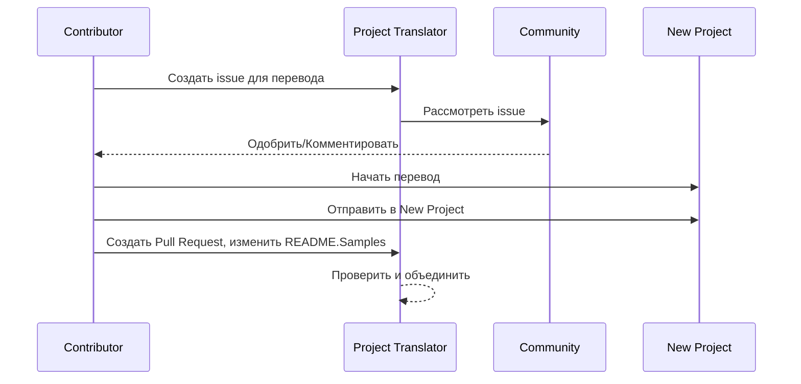

# Переводчик проектов

Простое расширение для VS Code для локализации проектов на несколько языков.

Репозиторий проекта: `https://github.com/Project-Translation/project_translator`

## Установка

1. Маркетплейс:
   - VS Code Extensions Marketplace: [https://marketplace.visualstudio.com/items?itemName=techfetch-dev.project-translator](https://marketplace.visualstudio.com/items?itemName=techfetch-dev.project-translator)
   - Open VSX Registry: [https://open-vsx.org/extension/techfetch-dev/project-translator](https://open-vsx.org/extension/techfetch-dev/project-translator)
2. Найдите `techfetch-dev.project-translator` в представлении расширений VS Code и нажмите "Установить"

<!--  -->


## Доступные переводы

Расширение поддерживает перевод на следующие языки:

- [简体中文 (zh-cn)](./README.zh-cn.md)
- [繁體中文 (zh-tw)](./README.zh-tw.md)
- [日本語 (ja-jp)](./README.ja-jp.md)
- [한국어 (ko-kr)](./README.ko-kr.md)
- [Français (fr-fr)](./README.fr-fr.md)
- [Deutsch (de-de)](./README.de-de.md)
- [Español (es-es)](./README.es-es.md)
- [Português (pt-br)](./README.pt-br.md)
- [Русский (ru-ru)](./README.ru-ru.md)
- [العربية (ar-sa)](./README.ar-sa.md)
- [العربية (ar-ae)](./README.ar-ae.md)
- [العربية (ar-eg)](./README.ar-eg.md)

## Примеры

| Проект                                                                             | Оригинальный репозиторий                                                                                       | Описание                                                                                                                                                               | Звёзды | Теги                                                                                                                                                                                                                                                                                                                                                                                                                                                                                                                                                                                                                                                                 |
| ----------------------------------------------------------------------------------- | --------------------------------------------------------------------------------------------------------- | ------------------------------------------------------------------------------------------------------------------------------------------------------------------------- | ----- | -------------------------------------------------------------------------------------------------------------------------------------------------------------------------------------------------------------------------------------------------------------------------------------------------------------------------------------------------------------------------------------------------------------------------------------------------------------------------------------------------------------------------------------------------------------------------------------------------------------------------------------------------------------------- |
| [algorithm-visualizer](https://github.com/Project-Translation/algorithm-visualizer) | [algorithm-visualizer/algorithm-visualizer](https://github.com/algorithm-visualizer/algorithm-visualizer) | :fireworks:Интерактивная онлайн-платформа для визуализации алгоритмов из кода                                                                                               | 47301 | [`algorithm`](https://github.com/topics/algorithm), [`animation`](https://github.com/topics/animation), [`data-structure`](https://github.com/topics/data-structure), [`visualization`](https://github.com/topics/visualization)                                                                                                                                                                                                                                                                                                                                                                                                                                     |
| [algorithms](https://github.com/Project-Translation/algorithms)                     | [algorithm-visualizer/algorithms](https://github.com/algorithm-visualizer/algorithms)                     | :crystal_ball:Визуализации алгоритмов                                                                                                                                    | 401   | N/A                                                                                                                                                                                                                                                                                                                                                                                                                                                                                                                                                                                                                                                                  |
| [cline-docs](https://github.com/Project-Translation/cline-docs)                     | [cline/cline](https://github.com/cline/cline)                                                             | Автономный агент кодирования прямо в вашей IDE, способный создавать/редактировать файлы, выполнять команды, использовать браузер и многое другое с вашим разрешением на каждом шаге. | 39572 | N/A                                                                                                                                                                                                                                                                                                                                                                                                                                                                                                                                                                                                                                                                  |
| [cursor-docs](https://github.com/Project-Translation/cursor-docs)                   | [getcursor/docs](https://github.com/getcursor/docs)                                                       | Открытая документация Cursor                                                                                                                                        | 309   | N/A                                                                                                                                                                                                                                                                                                                                                                                                                                                                                                                                                                                                                                                                  |
| [gobyexample](https://github.com/Project-Translation/gobyexample)                   | [mmcgrana/gobyexample](https://github.com/mmcgrana/gobyexample)                                           | Go на примерах                                                                                                                                                             | 7523  | N/A                                                                                                                                                                                                                                                                                                                                                                                                                                                                                                                                                                                                                                                                  |
| [golang-website](https://github.com/Project-Translation/golang-website)             | [golang/website](https://github.com/golang/website)                                                       | [зеркало] Домашние страницы go.dev и golang.org                                                                                                                       | 402   | N/A                                                                                                                                                                                                                                                                                                                                                                                                                                                                                                                                                                                                                                                                  |
| [reference-en-us](https://github.com/Project-Translation/reference-en-us)           | [Fechin/reference](https://github.com/Fechin/reference)                                                   | ⭕ Шпаргалки для разработчиков.                                                                                                                      | 7808  | [`awk`](https://github.com/topics/awk), [`bash`](https://github.com/topics/bash), [`chatgpt`](https://github.com/topics/chatgpt), [`cheatsheet`](https://github.com/topics/cheatsheet), [`cheatsheets`](https://github.com/topics/cheatsheets), [`css`](https://github.com/topics/css), [`golang`](https://github.com/topics/golang), [`grep`](https://github.com/topics/grep), [`markdown`](https://github.com/topics/markdown), [`python`](https://github.com/topics/python), [`reference`](https://github.com/topics/reference), [`sed`](https://github.com/topics/sed), [`snippets`](https://github.com/topics/snippets), [`vim`](https://github.com/topics/vim) |
| [styleguide](https://github.com/Project-Translation/styleguide)                     | [google/styleguide](https://github.com/google/styleguide)                                                 | Руководства по стилю для проектов Google с открытым исходным кодом                                                                                                                   | 38055 | [`cpplint`](https://github.com/topics/cpplint), [`style-guide`](https://github.com/topics/style-guide), [`styleguide`](https://github.com/topics/styleguide)                                                                                                                                                                                                                                                                                                                                                                                                                                                                                                         |
| [vscode-docs](https://github.com/Project-Translation/vscode-docs)                   | [microsoft/vscode-docs](https://github.com/microsoft/vscode-docs)                                         | Публичная документация для Visual Studio Code                                                                                                                               | 5914  | [`vscode`](https://github.com/topics/vscode)                                                                                                                                                                                                                                                                                                                                                                                                                                                                                                                                                                                                                         |

## Запрос перевода проекта

Если вы хотите внести вклад в перевод или вам нужно перевести проект:

1. Создайте issue по следующему шаблону:

```md
**Проект**: [project_url]
**Целевой язык**: [target_lang]
**Описание**: Краткое описание ценности перевода
```

2. Рабочий процесс:



3. После объединения PR перевод будет добавлен в раздел "Примеры".

Текущие переводы в процессе: [Просмотреть Issues](https://github.com/Project-Translation/project_translator/issues)

## Возможности

- 📁 Поддержка перевода на уровне папок
  - Перевод целых папок проектов на несколько языков
  - Сохранение оригинальной структуры папок и иерархии
  - Поддержка рекурсивного перевода подпапок
  - Автоматическое обнаружение переводимого контента
  - Пакетная обработка для эффективного перевода больших объёмов
- 📄 Поддержка перевода на уровне файлов
  - Перевод отдельных файлов на несколько языков
  - Сохранение оригинальной структуры и форматирования файлов
  - Поддержка режимов перевода как папок, так и файлов
- 💡 Умный перевод с помощью ИИ
  - Автоматическое сохранение целостности структуры кода
  - Перевод только комментариев к коду, сохранение логики кода
  - Сохранение форматов JSON/XML и других структур данных
  - Профессиональное качество перевода технической документации
- ⚙️ Гибкая настройка
  - Настройка исходной папки и нескольких целевых папок
  - Поддержка пользовательских интервалов перевода файлов
  - Установка игнорируемых типов файлов
  - Поддержка нескольких вариантов моделей ИИ
- 🚀 Удобные операции
  - Отображение прогресса перевода в реальном времени
  - Поддержка паузы/возобновления/остановки перевода
  - Автоматическое поддержание структуры целевых папок
  - Инкрементный перевод для избежания дублирования работы
- 🔄 Дифференциальный перевод (экспериментальный)
  - Режим diff-apply для эффективного обновления существующих переводов
  - Снижение использования API за счёт перевода только изменённого контента
  - Сохранение истории версий с минимальными правками
  - ⚠️ Экспериментальная функция - подробности см. в разделе [Расширенные возможности](#differential-translation-diff-apply-mode)

## Настройка

Расширение поддерживает следующие опции конфигурации:

```json
{
  "projectTranslator.specifiedFolders": [
    {
      "sourceFolder": {
        "path": "Путь к исходной папке",
        "lang": "Код исходного языка"
      },
      "targetFolders": [
        {
          "path": "Путь к целевой папке",
          "lang": "Код целевого языка"
        }
      ]
    }
  ],
  "projectTranslator.specifiedFiles": [
    {
      "sourceFile": {
        "path": "Путь к исходному файлу",
        "lang": "Код исходного языка"
      },
      "targetFiles": [
        {
          "path": "Путь к целевому файлу",
          "lang": "Код целевого языка"
        }
      ]
    }
  ],
  "projectTranslator.currentVendor": "openai",
  "projectTranslator.vendors": [
    {
      "name": "openai",
      "apiEndpoint": "URL конечной точки API",
      "apiKeyEnvVarName": "MY_OPENAI_API_KEY",
      "model": "gpt-4o",
      "rpm": "10",
      "maxTokensPerSegment": 4096,
      "timeout": 180,
      "temperature": 0.1
    }
  ],
  "projectTranslator.userPrompts": [
      "1. Должен возвращать 'не требует перевода', если в front matter файла Markdown установлено 'draft: true'.",
      "2. './readmes/' в предложениях следует заменять на './'",
  ],
  "projectTranslator.ignore": {
    "paths": [
      "**/node_modules/**"
    ],
    "extensions": [
      ".log"
    ]
  },
}
```

Ключевые детали конфигурации:

| Опция конфигурации                        | Описание                                                                                    |
| ------------------------------------------- | ---------------------------------------------------------------------------------------------- |
| `projectTranslator.specifiedFolders`        | Несколько исходных папок с соответствующими целевыми папками для перевода           |
| `projectTranslator.specifiedFiles`          | Несколько исходных файлов с соответствующими целевыми файлами для перевода               |
| `projectTranslator.translationIntervalDays` | Интервал перевода в днях (по умолчанию 7 дней)                                                  |
| `projectTranslator.copyOnly`                | Файлы для копирования без перевода (с массивами `paths` и `extensions`)                         |
| `projectTranslator.ignore`                  | Файлы для полного игнорирования (с массивами `paths` и `extensions`)                              |
| `projectTranslator.skipFrontMatterMarkers`  | Пропуск файлов на основе маркеров front matter (с `enabled` и массивом `markers`)                 |
| `projectTranslator.currentVendor`           | Текущий используемый API-провайдер                                                                      |
| `projectTranslator.vendors`                 | Список конфигураций API-провайдеров (можно использовать apiKey напрямую или apiKeyEnvVarName для переменных окружения) |
| `projectTranslator.systemPromptLanguage`    | Язык встроенных системных подсказок (по умолчанию: en). Влияет на инструкции модели, а не на язык интерфейса |
| `projectTranslator.systemPrompts`           | Массив системных подсказок для управления процессом перевода                                        |
| `projectTranslator.userPrompts`             | Массив пользовательских подсказок, добавляемых после системных подсказок во время перевода |
| `projectTranslator.segmentationMarkers`     | Маркеры сегментации, настроенные по типу файла, поддерживают регулярные выражения                     |
| `projectTranslator.debug`                   | Включить режим отладки для логирования всех запросов и ответов API в выходной канал (по умолчанию: false)     |
| `projectTranslator.logFile`                 | Конфигурация файлов журнала отладки (см. [Функция файла журнала](./docs/log-file-feature.md))         |
| `projectTranslator.diffApply.enabled`       | Включить экспериментальный режим дифференциального перевода (по умолчанию: false)                             |

## Использование

1. Откройте палитру команд (Ctrl+Shift+P / Cmd+Shift+P)
2. Введите "Translate Project" и выберите команду
3. Если исходная папка не настроена, появится диалог выбора папки
4. Дождитесь завершения перевода

Во время перевода:

- Можно приостанавливать/возобновлять перевод через кнопки в строке состояния
- Можно остановить процесс перевода в любой момент
- Прогресс перевода отображается в области уведомлений
- Подробные логи выводятся в панели вывода

## Разработка

### Система сборки

Это расширение использует esbuild для быстрой сборки и разработки:

#### Доступные скрипты

- `npm run build` - Продакшен-сборка с минификацией
- `npm run compile` - Сборка для разработки
- `npm run watch` - Режим наблюдения для разработки
- `npm test` - Запуск тестов

#### Задачи VS Code

- **Build** (Ctrl+Shift+P → "Tasks: Run Task" → "build") - Сборка расширения для продакшена
- **Watch** (Ctrl+Shift+P → "Tasks: Run Task" → "watch") - Режим разработки с автоматической пересборкой

### Настройка среды разработки

1. Клонируйте репозиторий
2. Выполните `npm install` для установки зависимостей
3. Нажмите `F5` для запуска отладки или выполните задачу "watch" для разработки

Конфигурация esbuild:

- Объединяет все TypeScript-файлы в единый `out/extension.js`
- Исключает API VS Code (помечен как внешний)

## Расширенные возможности

### Использование переменных окружения для API-ключей

Project Translator поддерживает использование переменных окружения для API-ключей, что более безопасно, чем хранение ключей непосредственно в файлах конфигурации:

1. Настройте провайдера с свойством `apiKeyEnvVarName`:

```json
{
  "projectTranslator.vendors": [
    {
      "name": "openai",
      "apiEndpoint": "https://api.openai.com/v1",
      "apiKeyEnvVarName": "OPENAI_API_KEY",
      "model": "gpt-4"
    },
    {
      "name": "openrouter",
      "apiEndpoint": "https://openrouter.ai/api/v1",
      "apiKeyEnvVarName": "OPENROUTER_API_KEY",
      "model": "anthropic/claude-3-opus"
    }
  ]
}
```

2. Установите переменную окружения в вашей системе:
   - Windows: `set OPENAI_API_KEY=ваш_api_ключ`
   - macOS/Linux: `export OPENAI_API_KEY=ваш_api_ключ`

3. При запуске расширения:
   - Сначала проверяется наличие `apiKey` в конфигурации
   - Если нет, ищется переменная окружения, указанная в `apiKeyEnvVarName`

Этот подход позволяет не хранить API-ключи в файлах конфигурации и системах контроля версий.

### Пропуск перевода на основе Front Matter

Project Translator может пропускать перевод файлов Markdown на основе их метаданных front matter. Это полезно для черновиков или файлов, помеченных как не требующие перевода.

Чтобы включить эту функцию, настройте опцию `projectTranslator.skipFrontMatterMarkers`:

```json
{
  "projectTranslator.skipFrontMatterMarkers": {
    "enabled": true,
    "markers": [
      {
        "key": "draft",
        "value": "true"
      },
      {
        "key": "translate",
        "value": "false"
      }
    ]
  }
}
```

С этой конфигурацией любой файл Markdown с front matter, содержащим `draft: true` или `translate: false`, будет пропущен во время перевода и скопирован напрямую в целевую папку.

Пример файла Markdown, который будет пропущен:
```
---
draft: true
title: "Черновик документа"
---

Этот документ является черновиком и не должен переводиться.
```

### Дифференциальный перевод (режим Diff-Apply)

> **⚠️ Предупреждение: экспериментальная функция**: Режим дифференциального перевода в настоящее время является экспериментальным и может иметь проблемы со стабильностью и совместимостью. Рекомендуется использовать его с осторожностью в продакшен-средах и всегда делать резервные копии важных файлов.

Расширение поддерживает опциональный режим дифференциального перевода (diff-apply). При включении расширение отправляет как исходный контент, так и существующий переведённый целевой файл модели. Модель должна возвращать один или несколько блоков SEARCH/REPLACE (обычный текст, без форматирования кода). Расширение применяет эти блоки локально для минимизации изменений, снижения использования API и лучшего сохранения истории версий.

- **Переключение**: Настройте `projectTranslator.diffApply.enabled` в настройках VS Code или `project.translation.json` (по умолчанию: `false`).
- **Опции**:
  - `validationLevel`: `normal` или `strict` (по умолчанию: `normal`). В режиме `strict` недопустимые маркеры или ошибки сопоставления вызывают ошибку, и расширение возвращается к стандартному процессу перевода.
  - `autoBackup`: Если true, создаёт резервную копию `.bak` целевого файла перед применением правок (по умолчанию: `true`).
  - `maxOperationsPerFile`: (сохранено для совместимости) не используется новой стратегией.

Рабочий процесс:
1. Если `diffApply.enabled` равно `true` и целевой файл существует, расширение читает содержимое исходного и целевого файлов.
2. Оно вызывает модель с дифференциальной подсказкой и требует возврата блоков SEARCH/REPLACE в виде обычного текста.
3. Локально расширение анализирует и применяет блоки SEARCH/REPLACE. Если применение не удаётся, оно возвращается к обычному полному переводу и перезаписывает целевой файл.

Пример SEARCH/REPLACE (допускается несколько блоков):

```
<<<<<<< SEARCH
:start_line: 10
-------
const label = "Old"
=======
const label = "New"
>>>>>>> REPLACE

<<<<<<< SEARCH
:start_line: 25
-------
function foo() {
  return 1
}
=======
function foo() {
  return 2
}
>>>>>>> REPLACE
```

Примечания:
- Используйте точное содержимое, включая отступы и пробелы в секциях SEARCH. Если не уверены, используйте последнее содержимое файла.
- Сохраняйте одну строку `=======` между SEARCH и REPLACE.
- Если изменения не требуются, модель должна возвращать пустую строку.

Почему дифференциальный перевод в настоящее время работает плохо (объяснение)

- **Сложности выравнивания и сравнения между языками**: Дифференциальный перевод требует отправки как исходного документа, так и существующего переведённого документа модели, и модель должна сравнивать их на разных языках, чтобы решить, какие части перевода нужно изменить. Это принципиально более сложная задача, чем модификация одного документа на месте, потому что модель должна точно выравнивать сегменты на разных языках и оценивать семантические различия.

- **Сложность сохранения формата и границ**: Многие документы содержат блоки кода, таблицы, фронтенд-маркеры или специальные заполнители. Надёжный рабочий процесс diff должен сохранять эти структуры при внесении текстовых правок. Если модель не может стабильно выдавать результаты, строго следующие формату SEARCH/REPLACE, автоматическое применение правок может привести к регрессиям форматирования или структурным ошибкам.

- **Проблемы контекста и согласованности терминологии**: Небольшие локальные правки часто зависят от более широкого контекста и существующего глоссария терминов/стиля. При запросе минимальных правок модель может пренебречь глобальной согласованностью (терминология, стиль, комментарии, имена переменных), что приводит к несогласованным или семантически смещённым переводам.

- **Компромиссы стабильности модели и стоимости**: Достижение надёжного дифференциального перевода требует моделей с сильным сравнительным мышлением и стабильным, предсказуемым форматом вывода. Текущие основные модели не обеспечивают одновременно надёжного межъязыкового выравнивания и строго форматированного вывода при разумной стоимости, поэтому системы часто возвращаются к полному переводу для обеспечения корректности.

Таким образом, хотя дифференциальный перевод теоретически может снизить расход дорогих токенов вывода и лучше сохранить историю версий, в настоящее время он ограничен возможностями моделей по межъязыковому сравнению и стабильностью вывода. Эта функция остаётся экспериментальной; рекомендуемые меры включают сохранение автоматических резервных копий (`autoBackup: true`), использование толерантного уровня валидации (`validationLevel: "normal"`) и возврат к полному переводу при ошибках сопоставления или форматирования. В будущем специализированные постпроцессоры двуязычного выравнивания или кастомные небольшие модели могут улучшить стабильность подхода diff.

Экономия затрат и почему это помогает

- **Стоимость токенов ввода vs вывода**: API больших моделей обычно по-разному тарифицируют токены ввода (промпт) и вывода (завершение). Часто токены вывода значительно дороже, потому что модель генерирует более длинный текст. Diff-apply помогает, потому что мы отправляем **обновлённый исходник (ввод)** и **существующий переведённый файл (ввод)** модели и просим компактный JSON правок. Ответ модели — небольшой JSON (мало токенов вывода) вместо полного переведённого файла (много токенов вывода), поэтому вы платите гораздо меньше за дорогую часть вывода.

- **Отправка только изменённого**: Вместо повторного перевода всего файла при небольших изменениях diff-apply инструктирует модель вычислить минимальные операции редактирования для обновления существующего перевода. Это особенно эффективно для файлов, которые ранее были переведены и получили только инкрементные правки.

- **Лучше для форматированных файлов**: Файлы со строгим форматированием (JSON, XML, Markdown с блоками кода) значительно выигрывают, потому что diff-apply сохраняет структуру и изменяет только текстовые части, требующие перевода. Это снижает вероятность регрессий, связанных с форматом, и дополнительных токенов вывода из-за переформатирования модели.

- **Ориентация на строки, умная агрегация**: Инструмент рассматривает базовую единицу перевода как "строку", а стратегия SEARCH/REPLACE применяет точное или нечёткое сопоставление около `:start_line:`. Используйте `validationLevel: "normal"` для толерантного поведения и `"strict"`, когда нужны консервативные, точные правки.

Когда использовать diff-apply:

- Используйте, когда целевой файл уже существует и был ранее переведён.
- Используйте для больших форматированных документов, где повторный перевод всего файла был бы дорогим.
- Избегайте для совершенно новых файлов без предыдущего перевода или когда нужен свежий повторный перевод.


### Документация дизайна

- Генерирует source maps для сборок разработки
- Минифицирует код для продакшен-сборок
- Обеспечивает интеграцию с проблемными сопоставителями для VS Code

## Примечания

- Убедитесь в достаточном квоте использования API
- Рекомендуется сначала тестировать на небольших проектах
- Используйте выделенные API-ключи и удаляйте их после завершения

## Лицензия

[Лицензия](LICENSE)