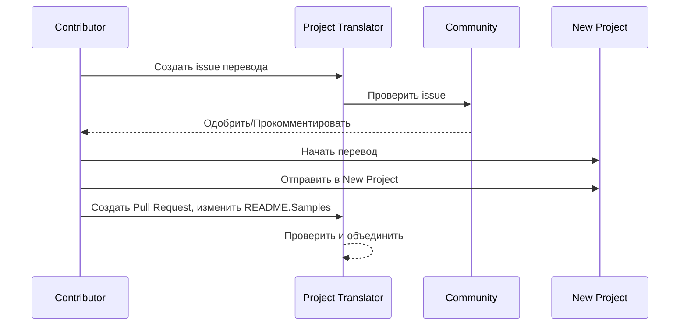

# Переводчик проектов

Простое в использовании расширение vscode для многоязычной локализации проектов.

Репозиторий проекта: `https://github.com/Project-Translation/project_translator`

<!--  -->


## Доступные переводы

Расширение поддерживает перевод на следующие языки:

- [简体中文 (zh-cn)](./README.zh-cn.md)
- [繁體中文 (zh-tw)](./README.zh-tw.md)
- [日本語 (ja-jp)](./README.ja-jp.md)
- [한국어 (ko-kr)](./README.ko-kr.md)
- [Français (fr-fr)](./README.fr-fr.md)
- [Deutsch (de-de)](./README.de-de.md)
- [Español (es-es)](./README.es-es.md)
- [Português (pt-br)](./README.pt-br.md)
- [Русский (ru-ru)](./README.ru-ru.md)
- [العربية (ar-sa)](./README.ar-sa.md)
- [العربية (ar-ae)](./README.ar-ae.md)
- [العربية (ar-eg)](./README.ar-eg.md)

## Примеры

| Проект                                                                             | Оригинальный репозиторий                                                                                       | Описание                                                                                                                                                                   | Звёзды | Теги                                                                                                                                                                                                                                                                                                                                                                                                                                                                                                                                                                                                                                                                 |
| ----------------------------------------------------------------------------------- | ------------------------------------------------------------------------------------------------------------- | ------------------------------------------------------------------------------------------------------------------------------------------------------------------------- | ------ | -------------------------------------------------------------------------------------------------------------------------------------------------------------------------------------------------------------------------------------------------------------------------------------------------------------------------------------------------------------------------------------------------------------------------------------------------------------------------------------------------------------------------------------------------------------------------------------------------------------------------------------------------------------------- |
| [algorithm-visualizer](https://github.com/Project-Translation/algorithm-visualizer) | [algorithm-visualizer/algorithm-visualizer](https://github.com/algorithm-visualizer/algorithm-visualizer)     | :fireworks:Интерактивная онлайн-платформа для визуализации алгоритмов из кода                                                                                            | 47301  | [`algorithm`](https://github.com/topics/algorithm), [`animation`](https://github.com/topics/animation), [`data-structure`](https://github.com/topics/data-structure), [`visualization`](https://github.com/topics/visualization)                                                                                                                                                                                                                                                                                                                                                                                                                                     |
| [algorithms](https://github.com/Project-Translation/algorithms)                     | [algorithm-visualizer/algorithms](https://github.com/algorithm-visualizer/algorithms)                         | :crystal_ball:Визуализация алгоритмов                                                                                                                                     | 401    | N/A                                                                                                                                                                                                                                                                                                                                                                                                                                                                                                                                                                                                                                                                  |
| [cline-docs](https://github.com/Project-Translation/cline-docs)                     | [cline/cline](https://github.com/cline/cline)                                                                 | Автономный кодовый агент прямо в вашей IDE, способный создавать/редактировать файлы, выполнять команды, использовать браузер и многое другое с вашего разрешения на каждом шаге. | 39572  | N/A                                                                                                                                                                                                                                                                                                                                                                                                                                                                                                                                                                                                                                                                  |
| [cursor-docs](https://github.com/Project-Translation/cursor-docs)                   | [getcursor/docs](https://github.com/getcursor/docs)                                                           | Открытая документация Cursor                                                                                                                                               | 309    | N/A                                                                                                                                                                                                                                                                                                                                                                                                                                                                                                                                                                                                                                                                  |
| [gobyexample](https://github.com/Project-Translation/gobyexample)                   | [mmcgrana/gobyexample](https://github.com/mmcgrana/gobyexample)                                               | Go по примерам                                                                                                                                                            | 7523   | N/A                                                                                                                                                                                                                                                                                                                                                                                                                                                                                                                                                                                                                                                                  |
| [golang-website](https://github.com/Project-Translation/golang-website)             | [golang/website](https://github.com/golang/website)                                                           | [зеркало] Дом сайтов go.dev и golang.org                                                                                                                                  | 402    | N/A                                                                                                                                                                                                                                                                                                                                                                                                                                                                                                                                                                                                                                                                  |
| [reference-en-us](https://github.com/Project-Translation/reference-en-us)           | [Fechin/reference](https://github.com/Fechin/reference)                                                       | ⭕ Поделитесь быстрыми справочными шпаргалками для разработчиков.                                                                                                        | 7808   | [`awk`](https://github.com/topics/awk), [`bash`](https://github.com/topics/bash), [`chatgpt`](https://github.com/topics/chatgpt), [`cheatsheet`](https://github.com/topics/cheatsheet), [`cheatsheets`](https://github.com/topics/cheatsheets), [`css`](https://github.com/topics/css), [`golang`](https://github.com/topics/golang), [`grep`](https://github.com/topics/grep), [`markdown`](https://github.com/topics/markdown), [`python`](https://github.com/topics/python), [`reference`](https://github.com/topics/reference), [`sed`](https://github.com/topics/sed), [`snippets`](https://github.com/topics/snippets), [`vim`](https://github.com/topics/vim) |
| [styleguide](https://github.com/Project-Translation/styleguide)                     | [google/styleguide](https://github.com/google/styleguide)                                                     | Руководства по стилю для проектов с открытым исходным кодом от Google                                                                                                    | 38055  | [`cpplint`](https://github.com/topics/cpplint), [`style-guide`](https://github.com/topics/style-guide), [`styleguide`](https://github.com/topics/styleguide)                                                                                                                                                                                                                                                                                                                                                                                                                                                                                                         |
| [vscode-docs](https://github.com/Project-Translation/vscode-docs)                   | [microsoft/vscode-docs](https://github.com/microsoft/vscode-docs)                                             | Публичная документация для Visual Studio Code                                                                                                                             | 5914   | [`vscode`](https://github.com/topics/vscode)                                                                                                                                                                                                                                                                                                                                                                                                                                                                                                                                                                                                                         |

## Запрос перевода проекта

Если вы хотите внести вклад в перевод или нуждаетесь в переводе проекта:

1. Создайте issue, используя следующий шаблон:

```md
**Проект**: [project_url]
**Целевой язык**: [target_lang]
**Описание**: Краткое описание, почему этот перевод будет ценным
```

2. Рабочий процесс:



3. После слияния PR перевод будет добавлен в раздел Примеры.

Текущие переводы в процессе: [Просмотреть Issues](https://github.com/Project-Translation/project_translator/issues)

## Функции

- 📁 Поддержка перевода на уровне папок
  - Перевод целых папок проекта на несколько языков
  - Сохранение исходной структуры папок и иерархии
  - Поддержка рекурсивного перевода подпапок
  - Автоматическое обнаружение переводимого контента
  - Пакетная обработка для эффективного перевода в большом масштабе
- 📄 Поддержка перевода на уровне файлов
  - Перевод отдельных файлов на несколько языков
  - Сохранение исходной структуры файлов и форматирования
  - Поддержка режимов перевода как папок, так и файлов
- 💡 Умный перевод с ИИ
  - Автоматически сохраняет целостность структуры кода
  - Переводит только комментарии в коде, сохраняет логику кода
  - Сохраняет форматы JSON/XML и других структур данных
  - Профессиональное качество перевода технической документации
- ⚙️ Гибкая конфигурация
  - Настройка исходной папки и нескольких целевых папок
  - Поддержка пользовательских интервалов перевода файлов
  - Установка конкретных типов файлов для игнорирования
  - Поддержка нескольких моделей ИИ
- 🚀 Удобные операции
  - Отображение прогресса перевода в реальном времени
  - Поддержка паузы/возобновления/остановки перевода
  - Автоматическое поддержание структуры целевой папки
  - Инкрементальный перевод для избежания дублирования работы
- 🔄 Дифференциальный перевод (экспериментальный)
  - Режим diff-apply для эффективного обновления существующих переводов
  - Сокращает использование API, переводя только изменённый контент
  - Сохраняет историю версий с минимальными правками
  - ⚠️ Экспериментальная функция - подробности в [Расширенных функциях](#дифференциальный-перевод-режим-diff-apply)

## Установка

1. Найдите "[Project Translator](https://marketplace.visualstudio.com/items?itemName=techfetch-dev.project-translator)" в маркетплейсе расширений VS Code
2. Нажмите установить
   
Или установите из Visual Studio Marketplace: `https://marketplace.visualstudio.com/items?itemName=techfetch-dev.project-translator` или найдите `techfetch-dev.project-translator` в представлении расширений VS Code.

## Конфигурация

Расширение поддерживает следующие параметры конфигурации:

```json
{
  "projectTranslator.specifiedFolders": [
    {
      "sourceFolder": {
        "path": "Путь к исходной папке",
        "lang": "Код исходного языка"
      },
      "targetFolders": [
        {
          "path": "Путь к целевой папке",
          "lang": "Код целевого языка"
        }
      ]
    }
  ],
  "projectTranslator.specifiedFiles": [
    {
      "sourceFile": {
        "path": "Путь к исходному файлу",
        "lang": "Код исходного языка"
      },
      "targetFiles": [
        {
          "path": "Путь к целевому файлу",
          "lang": "Код целевого языка"
        }
      ]
    }
  ],
  "projectTranslator.currentVendor": "openai",
  "projectTranslator.vendors": [
    {
      "name": "openai",
      "apiEndpoint": "URL конечной точки API",
      "apiKeyEnvVarName": "MY_OPENAI_API_KEY",
      "model": "gpt-4o",
      "rpm": "10",
      "maxTokensPerSegment": 4096,
      "timeout": 30,
      "temperature": 0.0
    }
  ],
  "projectTranslator.userPrompts": [
      "1. Should return no need translate if the markdown file has 'draft' set to 'true' in the front matter.",
      "2. './readmes/' in the sentences should replace with './'",
  ],
  "projectTranslator.ignore": {
    "paths": [
      "**/node_modules/**"
    ],
    "extensions": [
      ".log"
    ]
  },
}
```

Ключевые детали конфигурации:

| Параметр конфигурации                 | Описание                                                                                                   |
| ------------------------------------- | ---------------------------------------------------------------------------------------------------------- |
| `projectTranslator.specifiedFolders`  | Несколько исходных папок с соответствующими папками назначения для перевода                                |
| `projectTranslator.specifiedFiles`    | Несколько исходных файлов с соответствующими файлами назначения для перевода                                |
| `projectTranslator.translationIntervalDays` | Интервал перевода в днях (по умолчанию 7 дней)                                                            |
| `projectTranslator.copyOnly`          | Файлы для копирования без перевода (с массивами `paths` и `extensions`)                                   |
| `projectTranslator.ignore`            | Файлы для полного игнорирования (с массивами `paths` и `extensions`)                                       |
| `projectTranslator.skipFrontMatterMarkers` | Пропуск файлов на основе маркеров front matter (с массивами `enabled` и `markers`)                       |
| `projectTranslator.currentVendor`     | Текущий используемый поставщик API                                                                          |
| `projectTranslator.vendors`           | Список конфигураций поставщиков API (можно использовать apiKey напрямую или apiKeyEnvVarName для переменных окружения) |
| `projectTranslator.systemPrompts`     | Массив системных промптов для управления процессом перевода                                                 |
| `projectTranslator.userPrompts`       | Массив пользовательских промптов, эти промпты будут добавлены после системных во время перевода            |
| `projectTranslator.segmentationMarkers` | Маркеры сегментации, настроенные по типу файла, поддерживают регулярные выражения                         |
| `projectTranslator.debug`             | Включить режим отладки для логирования всех запросов и ответов API в выходной канал (по умолчанию: false) |
| `projectTranslator.logFile`           | Конфигурация для файлов журнала отладки (см. [Функция файла журнала](./docs/log-file-feature.md))         |
| `projectTranslator.diffApply.enabled` | Включить экспериментальный режим дифференциального перевода (по умолчанию: false)                        |

## Использование

1. Откройте палитру команд (Ctrl+Shift+P / Cmd+Shift+P)
2. Введите "Translate Project" и выберите команду
3. Если исходная папка не настроена, появится диалоговое окно выбора папки
4. Дождитесь завершения перевода

Во время перевода:

- Можно приостановить/возобновить перевод через кнопки строки состояния
- Можно остановить процесс перевода в любой момент
- Прогресс перевода отображается в области уведомлений
- Подробные журналы отображаются в выходной панели

## Разработка

### Система сборки

Это расширение использует esbuild для быстрой сборки и разработки:

#### Доступные скрипты

- `npm run build` - Сборка для продакшена с минификацией
- `npm run compile` - Сборка для разработки
- `npm run watch` - Режим наблюдения для разработки
- `npm test` - Запуск тестов

#### Задачи VS Code

- **Сборка** (Ctrl+Shift+P → "Tasks: Run Task" → "build") - Упаковывает расширение для продакшена
- **Наблюдение** (Ctrl+Shift+P → "Tasks: Run Task" → "watch") - Режим разработки с авто-пересборкой

### Настройка разработки

1. Клонируйте репозиторий
2. Запустите `npm install` для установки зависимостей
3. Нажмите `F5` для начала отладки или запустите задачу "watch" для разработки

Конфигурация esbuild:

- Упаковывает все файлы TypeScript в один `out/extension.js`
- Исключает API VS Code (отмечено как внешнее)

## Расширенные функции

### Использование переменных окружения для ключей API

Project Translator поддерживает использование переменных окружения для ключей API, что является более безопасным подходом, чем хранение ключей API непосредственно в файлах конфигурации:

1. Настройте вашего поставщика со свойством `apiKeyEnvVarName`:

```json
{
  "projectTranslator.vendors": [
    {
      "name": "openai",
      "apiEndpoint": "https://api.openai.com/v1",
      "apiKeyEnvVarName": "OPENAI_API_KEY",
      "model": "gpt-4"
    },
    {
      "name": "openrouter",
      "apiEndpoint": "https://openrouter.ai/api/v1",
      "apiKeyEnvVarName": "OPENROUTER_API_KEY",
      "model": "anthropic/claude-3-opus"
    }
  ]
}
```

2. Установите переменную окружения в вашей системе:
   - В Windows: `set OPENAI_API_KEY=your_api_key`
   - В macOS/Linux: `export OPENAI_API_KEY=your_api_key`

3. При запуске расширение будет:
   - Сначала проверять, предоставлен ли `apiKey` непосредственно в конфигурации
   - Если нет, будет искать переменную окружения, указанную в `apiKeyEnvVarName`

Этот подход сохраняет ваши ключи API вне файлов конфигурации и систем контроля версий.

### Пропуск перевода на основе Front Matter

Project Translator может пропускать перевод Markdown файлов на основе их метаданных front matter. Это полезно для черновиков или файлов, отмеченных как не требующие перевода.

Чтобы включить эту функцию, настройте опцию `projectTranslator.skipFrontMatterMarkers`:

```json
{
  "projectTranslator.skipFrontMatterMarkers": {
    "enabled": true,
    "markers": [
      {
        "key": "draft",
        "value": "true"
      },
      {
        "key": "translate",
        "value": "false"
      }
    ]
  }
}
```

С этой конфигурацией любой Markdown файл с front matter, содержащим `draft: true` или `translate: false`, будет пропущен во время перевода и напрямую скопирован в целевое расположение.

Пример Markdown файла, который будет пропущен:
```
---
draft: true
title: "Черновик документа"
---

Этот документ является черновиком и не должен переводиться.
```

### Дифференциальный перевод (режим Diff-Apply)

> **⚠️ Предупреждение об экспериментальной функции**: Режим дифференциального перевода в настоящее время является экспериментальной функцией и может иметь проблемы со стабильностью и совместимостью. Рекомендуется использовать его с осторожностью в производственных средах и всегда создавать резервные копии важных файлов.

Расширение поддерживает дополнительный режим дифференциального перевода (diff-apply). Когда включен, расширение отправляет как исходный контент, так и существующий переведённый целевой файл в модель. Модель должна вернуть один или несколько блоков SEARCH/REPLACE (простой текст, без ограждений кода). Расширение применяет эти блоки локально для минимизации изменений, сокращения использования API и лучшего сохранения истории версий.

- **Переключение**: Настройте `projectTranslator.diffApply.enabled` в настройках VS Code или `project.translation.json` (по умолчанию: `false`).
- **Опции**:
  - `validationLevel`: `normal` или `strict` (по умолчанию: `normal`). В режиме `strict` недействительные маркеры или ошибки сопоставления вызовут ошибку, и расширение вернётся к стандартному процессу перевода.
  - `autoBackup`: Если true, создать резервную копию `.bak` целевого файла перед применением правок (по умолчанию: `true`).
  - `maxOperationsPerFile`: (сохранено для совместимости) не используется новой стратегией.

Рабочий процесс:
1. Если `diffApply.enabled` равен `true` и целевой файл существует, расширение читает как исходный, так и целевой контент.
2. Оно вызывает модель с дифференциальным промптом и требует возврата блоков SEARCH/REPLACE в простом тексте.
3. Локально расширение разбирает и применяет блоки SEARCH/REPLACE. Если применение не удаётся, оно возвращается к нормальному полному переводу и перезаписывает целевой файл.

Пример SEARCH/REPLACE (разрешено несколько блоков):

```
<<<<<<< SEARCH
:start_line: 10
-------
const label = "Old"
=======
const label = "New"
>>>>>>> REPLACE

<<<<<<< SEARCH
:start_line: 25
-------
function foo() {
  return 1
}
=======
function foo() {
  return 2
}
>>>>>>> REPLACE
```

Примечания:
- Используйте точный контент, включая отступы и пробелы в разделах SEARCH. Если не уверены, используйте последний контент файла.
- Держите одну строку `=======` между SEARCH и REPLACE.
- Если изменение не нужно, модель должна вернуть пустую строку.

Почему дифференциальный перевод в настоящее время работает плохо (объяснение)

- **Проблемы межъязыкового выравнивания и сравнения**: Дифференциальный перевод требует отправки как исходного документа, так и существующего переведённого документа в модель, и модель должна сравнивать их на разных языках, чтобы решить, какие части перевода нужно изменить. Это фундаментально более сложная задача, чем изменение одного документа на месте, потому что модель должна точно выравнивать сегменты на разных языках и оценивать семантические различия.

- **Сложность сохранения формата и границ**: Многие документы содержат блоки кода, таблицы, маркеры front matter или специальные заполнители. Надёжный рабочий процесс diff должен сохранять эти структуры при внесении текстовых правок. Если модель не может последовательно производить результаты, строго следующие формату SEARCH/REPLACE, автоматическое применение правок может внести регрессии форматирования или структурные ошибки.

- **Проблемы согласованности контекста и терминологии**: Небольшие локализованные правки часто зависят от более широкого контекста и существующего глоссария терминологии/стиля. Когда просят произвести минимальные правки, модель может пренебречь глобальной согласованностью (терминология, стиль, комментарии, имена переменных), что приводит к несогласованным или семантически сдвинутым переводам.

- **Компромисс стабильности и стоимости модели**: Для достижения надёжного дифференциального перевода требуются модели с сильными сравнительными рассуждениями и стабильным, предсказуемым форматом вывода. Текущие основные модели не надёжно обеспечивают как надёжное межъязычное выравнивание, так и строго форматированные выводы по разумной цене, поэтому системы часто возвращаются к полному перепереводу для обеспечения правильности.

Поэтому, хотя дифференциальный перевод теоретически может сократить дорогие выходные токены и лучше сохранить историю версий, он в настоящее время ограничен возможностями моделей межъязыкового сравнения и стабильностью вывода. Эта функция остаётся экспериментальной; рекомендуемые меры смягчения включают сохранение автоматических резервных копий (`autoBackup: true`), использование терпимого уровня проверки (`validationLevel: "normal"`) и возврат к полному перепереводу при ошибках сопоставления или форматирования. В будущем специализированные постпроцессоры двуязычного выравнивания или пользовательские меньшие модели могут улучшить стабильность подхода diff.

Экономия затрат и почему это помогает

- **Стоимость входных и выходных токенов**: API больших моделей часто взимают разную плату за входные (промпт) и выходные (завершение) токены. Часто выходные токены значительно дороже, потому что модель генерирует более длинный текст. Diff-apply помогает, потому что мы отправляем **обновлённый источник (вход)** и **существующий переведённый файл (вход)** в модель и просим компактный JSON правок. Ответ модели - это небольшой JSON (мало выходных токенов) вместо полного переведённого файла (много выходных токенов), поэтому вы платите гораздо меньше за дорогую выходную часть.

- **Отправлять только изменённое**: Вместо переперевода всего файла при небольших изменениях, diff-apply указывает модели вычислить минимальные операции редактирования для обновления существующего перевода. Это особенно эффективно для файлов, которые были ранее переведены и получают только инкрементальные правки.

- **Лучше всего для форматированных файлов**: Файлы со строгим форматированием (JSON, XML, Markdown с блоками кода) значительно выигрывают, потому что diff-apply сохраняет структуру и изменяет только текстовые части, нуждающиеся в переводе. Это сокращает вероятность регрессий форматирования и дополнительных выходных токенов, вызванных переформатированием модели.

- **Базовая единица, ориентированная на строки, умное агрегирование**: Инструмент рассматривает базовую единицу перевода как "строку", и стратегия SEARCH/REPLACE применяет точное или нечёткое сопоставление рядом с `:start_line:`. Используйте `validationLevel: "normal"` для терпимого поведения и `"strict"` когда нужны консервативные, точные правки.

Когда использовать diff-apply:

- Используйте, когда целевой файл уже существует и был ранее переведён.
- Используйте для больших форматированных документов, где полный переперевод файла будет дорогим.
- Избегайте для совершенно новых файлов без предыдущего перевода, или когда вы хотите свежий переперевод.


### Документация по дизайну

- Генерирует source maps для сборок разработки
- Минифицирует код для сборок продакшена
- Предоставляет интеграцию problem matcher для VS Code

## Примечания

- Убедитесь в достаточной квоте использования API
- Рекомендуется сначала протестировать на небольших проектах
- Используйте выделенные ключи API и удалите их после завершения

## Лицензия

[Лицензия](LICENSE)