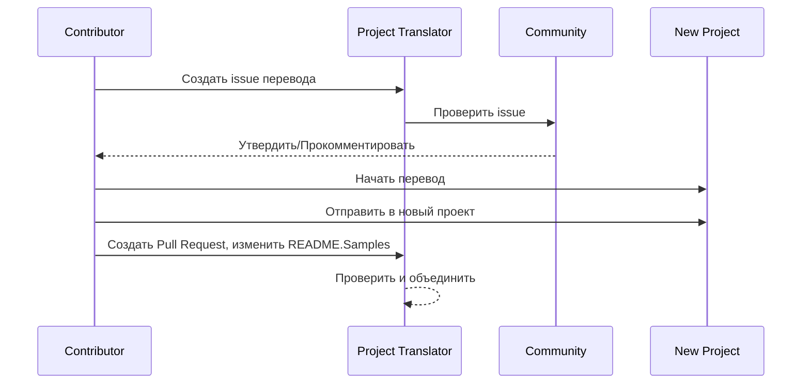

# Переводчик проектов

Удобное расширение VS Code для многоязычной локализации проектов.

Репозиторий проекта: `https://github.com/Project-Translation/project_translator`


## Установка

1. Marketplace:
   - VS Code Extensions Marketplace: [https://marketplace.visualstudio.com/items?itemName=techfetch-dev.project-translator](https://marketplace.visualstudio.com/items?itemName=techfetch-dev.project-translator)
   - Open VSX Registry: [https://open-vsx.org/extension/techfetch-dev/project-translator](https://open-vsx.org/extension/techfetch-dev/project-translator)
2. Найдите `techfetch-dev.project-translator` в представлении расширений VS Code и нажмите "установить"


<!--  -->


## Доступные переводы

Расширение поддерживает перевод на следующие языки:

- [简体中文 (zh-cn)](./README.zh-cn.md)
- [繁體中文 (zh-tw)](./README.zh-tw.md)
- [日本語 (ja-jp)](./README.ja-jp.md)
- [한국어 (ko-kr)](./README.ko-kr.md)
- [Français (fr-fr)](./README.fr-fr.md)
- [Deutsch (de-de)](./README.de-de.md)
- [Español (es-es)](./README.es-es.md)
- [Português (pt-br)](./README.pt-br.md)
- [Русский (ru-ru)](./README.ru-ru.md)
- [العربية (ar-sa)](./README.ar-sa.md)
- [العربية (ar-ae)](./README.ar-ae.md)
- [العربية (ar-eg)](./README.ar-eg.md)

## Примеры

| Проект                                                                             | Оригинальный репозиторий                                                                                       | Описание                                                                                                                                                               | Звёзды | Теги                                                                                                                                                                                                                                                                                                                                                                                                                                                                                                                                                                                                                                                                 |
| ----------------------------------------------------------------------------------- | --------------------------------------------------------------------------------------------------------- | ------------------------------------------------------------------------------------------------------------------------------------------------------------------------- | ----- | -------------------------------------------------------------------------------------------------------------------------------------------------------------------------------------------------------------------------------------------------------------------------------------------------------------------------------------------------------------------------------------------------------------------------------------------------------------------------------------------------------------------------------------------------------------------------------------------------------------------------------------------------------------------- |
| [algorithm-visualizer](https://github.com/Project-Translation/algorithm-visualizer) | [algorithm-visualizer/algorithm-visualizer](https://github.com/algorithm-visualizer/algorithm-visualizer) | :fireworks:Интерактивная онлайн-платформа, визуализирующая алгоритмы из кода                                                                                               | 47301 | [`algorithm`](https://github.com/topics/algorithm), [`animation`](https://github.com/topics/animation), [`data-structure`](https://github.com/topics/data-structure), [`visualization`](https://github.com/topics/visualization)                                                                                                                                                                                                                                                                                                                                                                                                                                     |
| [algorithms](https://github.com/Project-Translation/algorithms)                     | [algorithm-visualizer/algorithms](https://github.com/algorithm-visualizer/algorithms)                     | :crystal_ball:Визуализации алгоритмов                                                                                                                                    | 401   | N/A                                                                                                                                                                                                                                                                                                                                                                                                                                                                                                                                                                                                                                                                  |
| [cline-docs](https://github.com/Project-Translation/cline-docs)                     | [cline/cline](https://github.com/cline/cline)                                                             | Автономный агент программирования прямо в вашем IDE, способный создавать/редактировать файлы, выполнять команды, использовать браузер и многое другое с вашего разрешения на каждом шаге. | 39572 | N/A                                                                                                                                                                                                                                                                                                                                                                                                                                                                                                                                                                                                                                                                  |
| [cursor-docs](https://github.com/Project-Translation/cursor-docs)                   | [getcursor/docs](https://github.com/getcursor/docs)                                                       | Открытая документация Cursor                                                                                                                                        | 309   | N/A                                                                                                                                                                                                                                                                                                                                                                                                                                                                                                                                                                                                                                                                  |
| [gobyexample](https://github.com/Project-Translation/gobyexample)                   | [mmcgrana/gobyexample](https://github.com/mmcgrana/gobyexample)                                           | Go by Example                                                                                                                                                             | 7523  | N/A                                                                                                                                                                                                                                                                                                                                                                                                                                                                                                                                                                                                                                                                  |
| [golang-website](https://github.com/Project-Translation/golang-website)             | [golang/website](https://github.com/golang/website)                                                       | [зеркало] Домашняя страница сайтов go.dev и golang.org                                                                                                                       | 402   | N/A                                                                                                                                                                                                                                                                                                                                                                                                                                                                                                                                                                                                                                                                  |
| [reference-en-us](https://github.com/Project-Translation/reference-en-us)           | [Fechin/reference](https://github.com/Fechin/reference)                                                   | ⭕ Поделитесь шпаргалкой быстрой справки для разработчиков.                                                                                                                      | 7808  | [`awk`](https://github.com/topics/awk), [`bash`](https://github.com/topics/bash), [`chatgpt`](https://github.com/topics/chatgpt), [`cheatsheet`](https://github.com/topics/cheatsheet), [`cheatsheets`](https://github.com/topics/cheatsheets), [`css`](https://github.com/topics/css), [`golang`](https://github.com/topics/golang), [`grep`](https://github.com/topics/grep), [`markdown`](https://github.com/topics/markdown), [`python`](https://github.com/topics/python), [`reference`](https://github.com/topics/reference), [`sed`](https://github.com/topics/sed), [`snippets`](https://github.com/topics/snippets), [`vim`](https://github.com/topics/vim) |
| [styleguide](https://github.com/Project-Translation/styleguide)                     | [google/styleguide](https://github.com/google/styleguide)                                                 | Руководства по стилю для open-source проектов, originated в Google                                                                                                                   | 38055 | [`cpplint`](https://github.com/topics/cpplint), [`style-guide`](https://github.com/topics/style-guide), [`styleguide`](https://github.com/topics/styleguide)                                                                                                                                                                                                                                                                                                                                                                                                                                                                                                         |
| [vscode-docs](https://github.com/Project-Translation/vscode-docs)                   | [microsoft/vscode-docs](https://github.com/microsoft/vscode-docs)                                         | Публичная документация для Visual Studio Code                                                                                                                               | 5914  | [`vscode`](https://github.com/topics/vscode)                                                                                                                                                                                                                                                                                                                                                                                                                                                                                                                                                                                                                         |

## Запрос перевода проекта

Если вы хотите внести вклад в перевод или нуждаетесь в переводе проекта:

1. Создайте issue, используя следующий шаблон:

```md
**Project**: [project_url]
**Target Language**: [target_lang]
**Description**: Краткое описание, почему этот перевод будет ценен
```

2. Рабочий процесс:


```mermaid
sequenceDiagram
  Contributor->>Project Translator: Создать issue перевода
  Project Translator->>Community: Проверить issue
  Community-->>Contributor: Утвердить/Прокомментировать
  Contributor->>New Project: Начать перевод
  Contributor->>New Project: Отправить в новый проект
  Contributor->>Project Translator: Создать Pull Request, изменить README.Samples
  Project Translator-->>Project Translator: Проверить и объединить
```

3. После слияния PR перевод будет добавлен в раздел Samples.

Текущие переводы в процессе: [Просмотреть Issues](https://github.com/Project-Translation/project_translator/issues)

## Возможности

- 📁 Поддержка перевода на уровне папок
  - Переводите целые папки проектов на несколько языков
  - Сохраняйте исходную структуру папок и иерархию
  - Поддержка рекурсивного перевода подпапок
  - Автоматическое обнаружение translatable контента
  - Пакетная обработка для эффективного перевода больших объёмов
- 📄 Поддержка перевода на уровне файлов
  - Переводите отдельные файлы на несколько языков
  - Сохраняйте исходную структуру файлов и форматирование
  - Поддержка как режима перевода папок, так и файлов
- 💡 Умный перевод с ИИ
  - Автоматически поддерживает целостность структуры кода
  - Переводит только комментарии к коду, сохраняет логику кода
  - Поддерживает форматы JSON/XML и других структур данных
  - Качество профессионального перевода технической документации
- ⚙️ Гибкая конфигурация
  - Настройте исходную папку и несколько целевых папок
  - Поддержка пользовательских интервалов перевода файлов
  - Укажите конкретные типы файлов для игнорирования
  - Поддержка нескольких вариантов AI моделей
- 🚀 Удобные операции
  - Отображение прогресса перевода в реальном времени
  - Поддержка паузы/возобновления/остановки перевода
  - Автоматическое поддержание структуры целевой папки
  - Инкрементальный перевод для избежания дублирования работы
- 🔄 Дифференциальный перевод (Экспериментальный)
  - Режим diff-apply для эффективного обновления существующих переводов
  - Снижает использование API, переводя только изменённый контент
  - Сохраняет историю версий с минимальными правками
  - ⚠️ Экспериментальная функция - см. [Расширенные возможности](#дифференциальный-перевод-режим-diff-apply) для подробностей

## Конфигурация

Расширение поддерживает следующие параметры конфигурации:

```json
{
  "projectTranslator.specifiedFolders": [
    {
      "sourceFolder": {
        "path": "Путь к исходной папке",
        "lang": "Код исходного языка"
      },
      "targetFolders": [
        {
          "path": "Путь к целевой папке",
          "lang": "Код целевого языка"
        }
      ]
    }
  ],
  "projectTranslator.specifiedFiles": [
    {
      "sourceFile": {
        "path": "Путь к исходному файлу",
        "lang": "Код исходного языка"
      },
      "targetFiles": [
        {
          "path": "Путь к целевому файлу",
          "lang": "Код целевого языка"
        }
      ]
    }
  ],
  "projectTranslator.currentVendor": "openai",
  "projectTranslator.vendors": [
    {
      "name": "openai",
      "apiEndpoint": "URL конечной точки API",
      "apiKeyEnvVarName": "MY_OPENAI_API_KEY",
      "model": "gpt-4o",
      "rpm": "10",
      "maxTokensPerSegment": 4096,
      "timeout": 180,
      "temperature": 0.1
    }
  ],
  "projectTranslator.userPrompts": [
      "1. Должен возвращать 'не нужно переводить', если в front matter файла markdown установлен 'draft' в 'true'.",
      "2. './readmes/' в предложениях следует заменить на './'",
  ],
  "projectTranslator.ignore": {
    "paths": [
      "**/node_modules/**"
    ],
    "extensions": [
      ".log"
    ]
  },
}
```

Ключевые детали конфигурации:

| Параметр конфигурации                        | Описание                                                                                    |
| ------------------------------------------- | ---------------------------------------------------------------------------------------------- |
| `projectTranslator.specifiedFolders`        | Несколько исходных папок с соответствующими целевыми папками для перевода                   |
| `projectTranslator.specifiedFiles`          | Несколько исходных файлов с соответствующими целевыми файлами для перевода                   |
| `projectTranslator.translationIntervalDays` | Интервал перевода в днях (по умолчанию 7 дней)                                                |
| `projectTranslator.copyOnly`                | Файлы для копирования без перевода (с массивами `paths` и `extensions`)                      |
| `projectTranslator.ignore`                  | Файлы для полного игнорирования (с массивами `paths` и `extensions`)                          |
| `projectTranslator.skipFrontMatterMarkers`  | Пропускать файлы на основе маркеров front matter (с массивами `enabled` и `markers`)         |
| `projectTranslator.currentVendor`           | Текущий используемый API вендор                                                               |
| `projectTranslator.vendors`                 | Список конфигураций API вендоров (можно использовать apiKey напрямую или apiKeyEnvVarName для переменных окружения) |
| `projectTranslator.systemPromptLanguage`    | Язык, используемый для встроенных системных промптов (по умолчанию: en). Влияет на то, как модель получает инструкции, а не на язык интерфейса |
| `projectTranslator.systemPrompts`           | Массив системных промптов для управления процессом перевода                                   |
| `projectTranslator.userPrompts`             | Массив пользовательских промптов, эти промпты будут добавлены после системных промптов во время перевода |
| `projectTranslator.segmentationMarkers`     | Маркеры сегментации, настроенные по типу файла, поддерживают регулярные выражения            |
| `projectTranslator.debug`                   | Включить режим отладки для логирования всех запросов и ответов API в канал вывода (по умолчанию: false) |
| `projectTranslator.logFile`                 | Конфигурация для файлов логов отладки (см. [Функция файла логов](./docs/log-file-feature.md)) |
| `projectTranslator.diffApply.enabled`       | Включить экспериментальный режим дифференциального перевода (по умолчанию: false)             |

## Использование

1. Откройте палитру команд (Ctrl+Shift+P / Cmd+Shift+P)
2. Введите "Translate Project" и выберите команду
3. Если исходная папка не настроена, появится диалог выбора папки
4. Дождитесь завершения перевода

Во время перевода:

- Можно приостановить/возобновить перевод с помощью кнопок в строке состояния
- Можно остановить процесс перевода в любой момент
- Прогресс перевода отображается в области уведомлений
- Подробные логи отображаются в панели вывода

### Автоматический перевод при открытии рабочей области

Вы можете включить задачу автоматического перевода, которая запускается при открытии рабочей области:

1. Запустите команду: `Enable Auto Translate On Open`
2. Расширение обновит `.vscode/tasks.json`
3. Это вступит в силу при следующем открытии рабочей области (расширение не запускает перезагрузку окна)

Чтобы отключить, запустите: `Disable Auto Translate On Open`.

## Использование CLI

Проект теперь поддерживает выполнение через CLI в дополнение к расширению VS Code.

Сборка CLI:

```bash
npm run compile
```

Запуск перевода:

```bash
# Язык по умолчанию: en-us
npx project-translator translate project --workspace . --config project.translation.json

# Указать целевой язык
npx project-translator translate project --workspace . --config project.translation.json --lang ja-jp
```

Управление конфигурацией:

```bash
npx project-translator config list --workspace . --config project.translation.json --json
npx project-translator config set currentVendor deepseek --workspace . --config project.translation.json
npx project-translator config schema --workspace .
npx project-translator config validate --workspace . --config project.translation.json
```

`config schema` по умолчанию экспортирует `project.translation.schema.json`.  
`config validate` выполняет валидацию JSON Schema для файла конфигурации и возвращает ненулевой код выхода при невалидности.

## Разработка

### Система сборки

Это расширение использует esbuild для быстрой сборки и разработки:

#### Доступные скрипты

- `npm run build` - Продакшен-сборка с минификацией
- `npm run compile` - Сборка для разработки
- `npm run watch` - Режим наблюдения для разработки
- `npm test` - Запуск тестов

#### Задачи VS Code

- **Build** (Ctrl+Shift+P → "Tasks: Run Task" → "build") - Собирает расширение для продакшена
- **Watch** (Ctrl+Shift+P → "Tasks: Run Task" → "watch") - Режим разработки с автоматической пересборкой

### Настройка разработки

1. Клонируйте репозиторий
2. Запустите `npm install` для установки зависимостей
3. Нажмите `F5` для начала отладки или запустите задачу "watch" для разработки

Конфигурация esbuild:

- Собирает все TypeScript файлы в единый `out/extension.js`
- Исключает VS Code API (помечен как external)

## Расширенные возможности

### Использование переменных окружения для API ключей

Project Translator поддерживает использование переменных окружения для API ключей, что является более безопасным подходом, чем хранение API ключей непосредственно в файлах конфигурации:

1. Настройте вашего вендора с свойством `apiKeyEnvVarName`:

```json
{
  "projectTranslator.vendors": [
    {
      "name": "openai",
      "apiEndpoint": "https://api.openai.com/v1",
      "apiKeyEnvVarName": "OPENAI_API_KEY",
      "model": "gpt-4"
    },
    {
      "name": "openrouter",
      "apiEndpoint": "https://openrouter.ai/api/v1",
      "apiKeyEnvVarName": "OPENROUTER_API_KEY",
      "model": "anthropic/claude-3-opus"
    }
  ]
}
```

2. Установите переменную окружения в вашей системе:
   - На Windows: `set OPENAI_API_KEY=your_api_key`
   - На macOS/Linux: `export OPENAI_API_KEY=your_api_key`

3. Когда расширение запускается, оно:
   - Сначала проверяет, предоставлен ли `apiKey` напрямую в конфигурации
   - Если нет, оно ищет переменную окружения, указанную в `apiKeyEnvVarName`

Этот подход сохраняет ваши API ключи вне файлов конфигурации и систем контроля версий.

### Пропуск перевода на основе Front Matter

Project Translator может пропускать перевод Markdown файлов на основе их метаданных front matter. Это полезно для черновиков или файлов, помеченных как не требующих перевода.

Чтобы включить эту функцию, настройте параметр `projectTranslator.skipFrontMatterMarkers`:

```json
{
  "projectTranslator.skipFrontMatterMarkers": {
    "enabled": true,
    "markers": [
      {
        "key": "draft",
        "value": "true"
      },
      {
        "key": "translate",
        "value": "false"
      }
    ]
  }
}
```

С этой конфигурацией любой Markdown файл с front matter, содержащим `draft: true` или `translate: false`, будет пропущен во время перевода и напрямую скопирован в целевое расположение.

Пример Markdown файла, который будет пропущен:
```
---
draft: true
title: "Draft Document"
---

This document is a draft and should not be translated.
```

### Дифференциальный перевод (Diff-Apply) режим

> **⚠️ Предупреждение об экспериментальной функции**: Режим дифференциального перевода в настоящее время является экспериментальной функцией и может иметь проблемы стабильности и совместимости. Рекомендуется использовать с осторожностью в продакшн-средах и всегда создавать резервные копии важных файлов.

Расширение поддерживает опциональный режим дифференциального перевода (diff-apply). Когда он включен, расширение отправляет модели как исходное содержимое, так и существующий переведённый целевой файл. Модель должна вернуть один или несколько блоков SEARCH/REPLACE (plain text, без code fences). Расширение применяет эти блоки локально, чтобы минимизировать изменения, снизить использование API и лучше сохранить историю версий.

- **Переключение**: Настройте `projectTranslator.diffApply.enabled` в настройках VS Code или `project.translation.json` (по умолчанию: `false`).
- **Опции**:
  - `validationLevel`: `normal` или `strict` (по умолчанию: `normal`). В режиме `strict` невалидные маркеры или сбои сопоставления вызовут ошибку, и расширение вернётся к стандартному потоку перевода.
  - `autoBackup`: Если true, создаёт резервную копию `.bak` целевого файла перед применением правок (по умолчанию: `true`).
  - `maxOperationsPerFile`: (сохраняется для совместимости) не используется новой стратегией.

Рабочий процесс:
1. Если `diffApply.enabled` равен `true` и целевой файл существует, расширение читает оба содержимых (исходное и целевое).
2. Оно вызывает модель с дифференциальным промптом и требует возврата plain-text блоков SEARCH/REPLACE.
3. Локально расширение разбирает и применяет блоки SEARCH/REPLACE. Если применение не удаётся, оно возвращается к обычному полному переводу и перезаписывает целевой файл.

Пример SEARCH/REPLACE (разрешено несколько блоков):

```
<<<<<<< SEARCH
:start_line: 10
-------
const label = "Old"
=======
const label = "New"
>>>>>>> REPLACE

<<<<<<< SEARCH
:start_line: 25
-------
function foo() {
  return 1
}
=======
function foo() {
  return 2
}
>>>>>>> REPLACE
```

Примечания:
- Используйте точное содержимое, включая отступы и пробелы, в SEARCH разделах. Если не уверены, используйте последнее содержимое файла.
- Держите одну строку `=======` между SEARCH и REPLACE.
- Если изменение не нужно, модель должна вернуть пустую строку.

Почему дифференциальный перевод в настоящее время плохо работает (объяснение)

- **Проблемы выравнивания и сравнения на разных языках**: Дифференциальный перевод требует отправки модели как исходного документа, так и существующего переведённого документа, и модель должна сравнить их на разных языках, чтобы решить, какие части перевода нужно изменить. Это фундаментально более сложная задача, чем изменение одного документа на месте, потому что модель должна точно выровнять сегменты на разных языках и судить о семантических различиях.

- **Сложность сохранения формата и границ**: Многие документы содержат блоки кода, таблицы, фронтенд-маркеры или специальные плейсхолдеры. Надёжный рабочий процесс diff должен сохранять эти структуры, внося текстовые правки. Если модель не может последовательно выдавать результаты, которые строго следуют формату SEARCH/REPLACE, автоматическое применение правок может привести к регрессии форматирования или структурным ошибкам.

- **Проблемы контекста и терминологической согласованности**: Небольшие локализованные правки часто зависят от более широкого контекста и существующего глоссария терминов/стиля. Когда модель просят производить минимальные правки, она может пренебрегать глобальной согласованностью (терминология, стиль, комментарии, имена переменных), что приводит к несогласованным или семантически смещённым переводам.

- **Компромисс стабильности модели и стоимости**: Достижение надёжного дифференциального перевода требует моделей с сильными сравнительными рассуждениями и стабильным, предсказуемым форматом вывода. Текущие мейнстрим-модели не обеспечивают одновременно надёжное перекрёстное языковое выравнивание и строго форматированные выводы по разумной цене, поэтому системы часто возвращаются к полному повторному переводу для обеспечения корректности.

Таким образом, хотя дифференциальный перевод может теоретически снизить дорогостоящие выходные токены и лучше сохранить историю версий, он в настоящее время ограничен способностями моделей к перекрёстному языковому сравнению и стабильностью вывода. Эта функция остаётся экспериментальной; рекомендуемые смягчающие меры включают автоматическое создание резервных копий (`autoBackup: true`), использование толерантного уровня валидации (`validationLevel: "normal"`) и возврат к полному повторному переводу при сбоях сопоставления или форматирования. В будущем специализированные пост-процессоры двуязычного выравнивания или пользовательские более мелкие модели могут улучшить стабильность подхода diff.

Экономия затрат и почему это помогает

- **Стоимость входных и выходных токенов**: API больших моделей обычно по-разному тарифицируют входные (prompt) и выходные (completion) токены. Часто выходные токены значительно дороже, потому что модель генерирует более длинный текст. Diff-apply помогает, потому что мы отправляем **обновлённый исходник (вход)** и **существующий переведённый файл (вход)** модели и просим компактный JSON правок. Ответ модели — это небольшой JSON (несколько выходных токенов), а не полностью переведённый файл (много выходных токенов), поэтому вы платите гораздо меньше за дорогую выходную часть.

- **Отправляем только то, что изменилось**: Вместо повторного перевода всего файла при небольших изменениях diff-apply инструктирует модель вычислять минимальные операции правок для обновления существующего перевода. Это особенно эффективно для файлов, которые ранее были переведены и получают только инкрементальные правки.

- **Лучше всего для форматированных файлов**: Файлы со строгим форматированием (JSON, XML, Markdown с блоками кода) получают большую выгоду, потому что diff-apply сохраняет структуру и изменяет только текстовые части, требующие перевода. Это снижает вероятность регрессий, связанных с форматом, и дополнительных выходных токенов, вызванных переформатированием моделью.

- **Базовый единица ориентирована на строки, умная агрегация**: Инструмент рассматривает базовую единицу перевода как "строку", и стратегия SEARCH/REPLACE применяет точное или нечёткое сопоставление около `:start_line:`. Используйте `validationLevel: "normal"` для толерантного поведения и `"strict"`, когда нужны консервативные, точные правки.

Когда использовать diff-apply:

- Используйте, когда целевой файл уже существует и был ранее переведён.
- Используйте для больших, форматированных документов, где повторный перевод всего файла был бы дорогим.
- Избегайте для совершенно новых файлов без предыдущего перевода или когда нужен свежий повторный перевод.

### Документация по дизайну

- Генерирует source maps для сборок разработки
- Минифицирует код для продакшен-сборок
- Предоставляет интеграцию problem matcher для VS Code

## Примечания

- Убедитесь в достаточном квоте использования API
- Рекомендуется сначала протестировать на небольших проектах
- Используйте выделенные API ключи и удаляйте их после завершения

## Лицензия

[Лицензия](LICENSE)