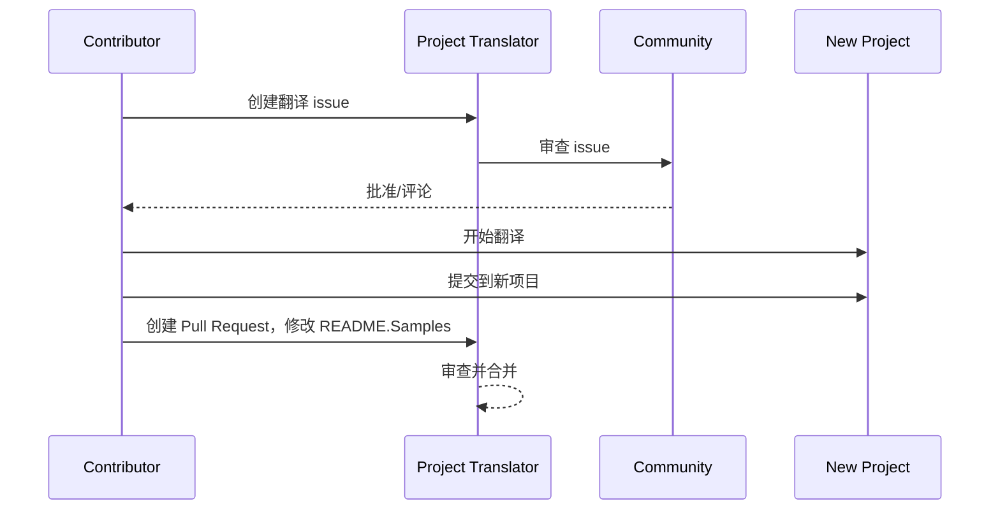

# 项目翻译器

一个易于使用的 vscode 扩展，用于项目的多语言本地化。

项目仓库：`https://github.com/Project-Translation/project_translator`

<!--  -->


## 可用翻译

该扩展支持翻译为以下语言：

- [简体中文 (zh-cn)](./readmes/README.zh-cn.md)
- [繁體中文 (zh-tw)](./readmes/README.zh-tw.md)
- [日本語 (ja-jp)](./readmes/README.ja-jp.md)
- [한국어 (ko-kr)](./readmes/README.ko-kr.md)
- [Français (fr-fr)](./readmes/README.fr-fr.md)
- [Deutsch (de-de)](./readmes/README.de-de.md)
- [Español (es-es)](./readmes/README.es-es.md)
- [Português (pt-br)](./readmes/README.pt-br.md)
- [Русский (ru-ru)](./readmes/README.ru-ru.md)
- [العربية (ar-sa)](./readmes/README.ar-sa.md)
- [العربية (ar-ae)](./readmes/README.ar-ae.md)
- [العربية (ar-eg)](./readmes/README.ar-eg.md)

## 示例

| 项目                                                                                 | 原始仓库                                                                                                   | 描述                                                                                                                                                                      | 星标数 | 标签                                                                                                                                                                                                                                                                                                                                                                                                                                                                                                                                                                                                                                                                 |
| ----------------------------------------------------------------------------------- | --------------------------------------------------------------------------------------------------------- | ------------------------------------------------------------------------------------------------------------------------------------------------------------------------- | ----- | -------------------------------------------------------------------------------------------------------------------------------------------------------------------------------------------------------------------------------------------------------------------------------------------------------------------------------------------------------------------------------------------------------------------------------------------------------------------------------------------------------------------------------------------------------------------------------------------------------------------------------------------------------------------- |
| [algorithm-visualizer](https://github.com/Project-Translation/algorithm-visualizer) | [algorithm-visualizer/algorithm-visualizer](https://github.com/algorithm-visualizer/algorithm-visualizer) | :fireworks: 可视化代码算法的交互式在线平台                                                                                                                                | 47301 | [`algorithm`](https://github.com/topics/algorithm), [`animation`](https://github.com/topics/animation), [`data-structure`](https://github.com/topics/data-structure), [`visualization`](https://github.com/topics/visualization)                                                                                                                                                                                                                                                                                                                                                                                                                                     |
| [algorithms](https://github.com/Project-Translation/algorithms)                     | [algorithm-visualizer/algorithms](https://github.com/algorithm-visualizer/algorithms)                     | :crystal_ball: 算法可视化                                                                                                                                                 | 401   | N/A                                                                                                                                                                                                                                                                                                                                                                                                                                                                                                                                                                                                                                                                  |
| [cline-docs](https://github.com/Project-Translation/cline-docs)                     | [cline/cline](https://github.com/cline/cline)                                                             | 直接在您的 IDE 中的自主编码代理，能够在每一步都获得您的许可的情况下创建/编辑文件、执行命令、使用浏览器等。                                                                 | 39572 | N/A                                                                                                                                                                                                                                                                                                                                                                                                                                                                                                                                                                                                                                                                  |
| [cursor-docs](https://github.com/Project-Translation/cursor-docs)                   | [getcursor/docs](https://github.com/getcursor/docs)                                                       | Cursor 的开源文档                                                                                                                                                         | 309   | N/A                                                                                                                                                                                                                                                                                                                                                                                                                                                                                                                                                                                                                                                                  |
| [gobyexample](https://github.com/Project-Translation/gobyexample)                   | [mmcgrana/gobyexample](https://github.com/mmcgrana/gobyexample)                                           | Go 示例                                                                                                                                                                   | 7523  | N/A                                                                                                                                                                                                                                                                                                                                                                                                                                                                                                                                                                                                                                                                  |
| [golang-website](https://github.com/Project-Translation/golang-website)             | [golang/website](https://github.com/golang/website)                                                       | [镜像] go.dev 和 golang.org 网站的家园                                                                                                                                    | 402   | N/A                                                                                                                                                                                                                                                                                                                                                                                                                                                                                                                                                                                                                                                                  |
| [reference-en-us](https://github.com/Project-Translation/reference-en-us)           | [Fechin/reference](https://github.com/Fechin/reference)                                                   | ⭕ 分享开发人员的快速参考备忘单。                                                                                                                                          | 7808  | [`awk`](https://github.com/topics/awk), [`bash`](https://github.com/topics/bash), [`chatgpt`](https://github.com/topics/chatgpt), [`cheatsheet`](https://github.com/topics/cheatsheet), [`cheatsheets`](https://github.com/topics/cheatsheets), [`css`](https://github.com/topics/css), [`golang`](https://github.com/topics/golang), [`grep`](https://github.com/topics/grep), [`markdown`](https://github.com/topics/markdown), [`python`](https://github.com/topics/python), [`reference`](https://github.com/topics/reference), [`sed`](https://github.com/topics/sed), [`snippets`](https://github.com/topics/snippets), [`vim`](https://github.com/topics/vim) |
| [styleguide](https://github.com/Project-Translation/styleguide)                     | [google/styleguide](https://github.com/google/styleguide)                                                 | Google 起源的开源项目的样式指南                                                                                                                                           | 38055 | [`cpplint`](https://github.com/topics/cpplint), [`style-guide`](https://github.com/topics/style-guide), [`styleguide`](https://github.com/topics/styleguide)                                                                                                                                                                                                                                                                                                                                                                                                                                                                                                         |
| [vscode-docs](https://github.com/Project-Translation/vscode-docs)                   | [microsoft/vscode-docs](https://github.com/microsoft/vscode-docs)                                         | Visual Studio Code 的公共文档                                                                                                                                             | 5914  | [`vscode`](https://github.com/topics/vscode)                                                                                                                                                                                                                                                                                                                                                                                                                                                                                                                                                                                                                         |

## 请求项目翻译

如果您想贡献翻译或需要翻译某个项目：

1. 使用以下模板创建 issue：

```md
**项目**: [project_url]
**目标语言**: [target_lang]
**描述**: 简要说明为什么这个翻译有价值
```

2. 工作流程：



3. PR 合并后，翻译将被添加到示例部分。

当前进行中的翻译：[查看 Issues](https://github.com/Project-Translation/project_translator/issues)

## 功能

- 📁 文件夹级翻译支持
  - 将整个项目文件夹翻译为多种语言
  - 保持原始文件夹结构和层次
  - 支持子文件夹的递归翻译
  - 自动检测可翻译内容
  - 批处理以实现高效的大规模翻译
- 📄 文件级翻译支持
  - 将单个文件翻译为多种语言
  - 保持原始文件结构和格式
  - 支持文件夹和文件两种翻译模式
- 💡 AI 智能翻译
  - 自动维护代码结构完整性
  - 仅翻译代码注释，保留代码逻辑
  - 维护 JSON/XML 和其他数据结构格式
  - 专业的技术文档翻译质量
- ⚙️ 灵活配置
  - 配置源文件夹和多个目标文件夹
  - 支持自定义文件翻译间隔
  - 设置要忽略的特定文件类型
  - 支持多种 AI 模型选项
- 🚀 用户友好的操作
  - 实时翻译进度显示
  - 支持暂停/恢复/停止翻译
  - 自动维护目标文件夹结构
  - 增量翻译以避免重复工作
- 🔄 差异翻译（实验性）
  - 差异应用模式，用于高效更新现有翻译
  - 仅翻译更改的内容，减少 API 使用
  - 以最少编辑保留版本历史
  - ⚠️ 实验性功能 - 详情请参阅[高级功能](#differential-translation-diff-apply-mode)

## 安装

1. 在 VS Code 扩展市场中搜索"[Project Translator](https://marketplace.visualstudio.com/items?itemName=techfetch-dev.project-translator)"
2. 点击安装
   
或者，从 Visual Studio Marketplace 安装：`https://marketplace.visualstudio.com/items?itemName=techfetch-dev.project-translator` 或在 VS Code 扩展视图中搜索 `techfetch-dev.project-translator`。

## 配置

该扩展支持以下配置选项：

```json
{
  "projectTranslator.specifiedFolders": [
    {
      "sourceFolder": {
        "path": "源文件夹路径",
        "lang": "源语言代码"
      },
      "targetFolders": [
        {
          "path": "目标文件夹路径",
          "lang": "目标语言代码"
        }
      ]
    }
  ],
  "projectTranslator.specifiedFiles": [
    {
      "sourceFile": {
        "path": "源文件路径",
        "lang": "源语言代码"
      },
      "targetFiles": [
        {
          "path": "目标文件路径",
          "lang": "目标语言代码"
        }
      ]
    }
  ],
  "projectTranslator.currentVendor": "openai",
  "projectTranslator.vendors": [
    {
      "name": "openai",
      "apiEndpoint": "API 端点 URL",
      "apiKeyEnvVarName": "MY_OPENAI_API_KEY",
      "model": "gpt-4o",
      "rpm": "10",
      "maxTokensPerSegment": 4096,
      "timeout": 30,
      "temperature": 0.0
    }
  ],
  "projectTranslator.userPrompts": [
      "1. 如果 markdown 文件在前置元数据中将 'draft' 设置为 'true'，则应返回无需翻译。",
      "2. 句子中的 './readmes/' 应替换为 './'",
  ],
  "projectTranslator.ignore": {
    "paths": [
      "**/node_modules/**"
    ],
    "extensions": [
      ".log"
    ]
  },
}
```

关键配置详情：

| 配置选项                               | 描述                                                                                             |
| -------------------------------------- | ------------------------------------------------------------------------------------------------ |
| `projectTranslator.specifiedFolders`   | 多个源文件夹及其对应的目标文件夹用于翻译                                                         |
| `projectTranslator.specifiedFiles`     | 多个源文件及其对应的目标文件用于翻译                                                             |
| `projectTranslator.translationIntervalDays` | 翻译间隔天数（默认 7 天）                                                                        |
| `projectTranslator.copyOnly`           | 只复制不翻译的文件（包含 `paths` 和 `extensions` 数组）                                          |
| `projectTranslator.ignore`             | 完全忽略的文件（包含 `paths` 和 `extensions` 数组）                                              |
| `projectTranslator.skipFrontMatterMarkers` | 基于前置元数据标记跳过文件（包含 `enabled` 和 `markers` 数组）                                  |
| `projectTranslator.currentVendor`      | 当前使用的 API 供应商                                                                            |
| `projectTranslator.vendors`            | API 供应商配置列表（可以直接使用 apiKey 或使用 apiKeyEnvVarName 来使用环境变量）                 |
| `projectTranslator.systemPrompts`       | 用于指导翻译过程的系统提示数组                                                                   |
| `projectTranslator.userPrompts`         | 用户定义的提示数组，这些提示将在翻译时添加到系统提示之后                                          |
| `projectTranslator.segmentationMarkers` | 按文件类型配置的分段标记，支持正则表达式                                                         |
| `projectTranslator.debug`               | 启用调试模式以将所有 API 请求和响应记录到输出通道（默认：false）                                 |
| `projectTranslator.logFile`             | 调试日志文件的配置（参见[日志文件功能](./docs/log-file-feature.md)）                              |
| `projectTranslator.diffApply.enabled`   | 启用实验性差异翻译模式（默认：false）                                                             |

## 使用方法

1. 打开命令面板（Ctrl+Shift+P / Cmd+Shift+P）
2. 输入"Translate Project"并选择命令
3. 如果未配置源文件夹，将出现文件夹选择对话框
4. 等待翻译完成

翻译期间：

- 可以通过状态栏按钮暂停/恢复翻译
- 可以随时停止翻译过程
- 翻译进度显示在通知区域
- 详细日志显示在输出面板中

## 开发

### 构建系统

此扩展使用 esbuild 进行快速打包和开发：

#### 可用脚本

- `npm run build` - 带压缩的生产构建
- `npm run compile` - 开发构建
- `npm run watch` - 开发监视模式
- `npm test` - 运行测试

#### VS Code 任务

- **构建**（Ctrl+Shift+P → "Tasks: Run Task" → "build"） - 为生产环境打包扩展
- **监视**（Ctrl+Shift+P → "Tasks: Run Task" → "watch"） - 开发模式，自动重新构建

### 开发设置

1. 克隆仓库
2. 运行 `npm install` 安装依赖
3. 按 `F5` 开始调试或运行"watch"任务进行开发

esbuild 配置：

- 将所有 TypeScript 文件打包到单个 `out/extension.js` 中
- 排除 VS Code API（标记为外部）

## 高级功能

### 使用环境变量存储 API 密钥

项目翻译器支持使用环境变量存储 API 密钥，这比直接在配置文件中存储 API 密钥更安全：

1. 使用 `apiKeyEnvVarName` 属性配置您的供应商：

```json
{
  "projectTranslator.vendors": [
    {
      "name": "openai",
      "apiEndpoint": "https://api.openai.com/v1",
      "apiKeyEnvVarName": "OPENAI_API_KEY",
      "model": "gpt-4"
    },
    {
      "name": "openrouter",
      "apiEndpoint": "https://openrouter.ai/api/v1",
      "apiKeyEnvVarName": "OPENROUTER_API_KEY",
      "model": "anthropic/claude-3-opus"
    }
  ]
}
```

2. 在系统中设置环境变量：
   - 在 Windows 上：`set OPENAI_API_KEY=your_api_key`
   - 在 macOS/Linux 上：`export OPENAI_API_KEY=your_api_key`

3. 当扩展运行时，它将：
   - 首先检查配置中是否直接提供了 `apiKey`
   - 如果没有，它将查找 `apiKeyEnvVarName` 指定的环境变量

这种方法使您的 API 密钥不在配置文件和版本控制系统中。

### 基于前置元数据跳过翻译

项目翻译器可以根据 Markdown 文件的前置元数据跳过翻译。这对于草稿文档或标记为不需要翻译的文件很有用。

要启用此功能，配置 `projectTranslator.skipFrontMatterMarkers` 选项：

```json
{
  "projectTranslator.skipFrontMatterMarkers": {
    "enabled": true,
    "markers": [
      {
        "key": "draft",
        "value": "true"
      },
      {
        "key": "translate",
        "value": "false"
      }
    ]
  }
}
```

使用此配置，任何包含 `draft: true` 或 `translate: false` 前置元数据的 Markdown 文件将在翻译期间被跳过，并直接复制到目标位置。

将被跳过的示例 Markdown 文件：
```
---
draft: true
title: "草稿文档"
---

本文档是草稿，不应被翻译。
```

### 差异翻译（Diff-Apply）模式

> **⚠️ 实验性功能警告**：差异翻译模式目前是实验性功能，可能存在稳定性和兼容性问题。建议在生产环境中谨慎使用，并始终备份重要文件。

该扩展支持可选的差异翻译模式（diff-apply）。启用后，扩展会将源内容和现有翻译的目标文件发送给模型。模型应返回一个或多个 SEARCH/REPLACE 块（纯文本，无代码围栏）。扩展在本地应用这些块以最小化更改、减少 API 使用并更好地保留版本历史。

- **切换**：在 VS Code 设置或 `project.translation.json` 中配置 `projectTranslator.diffApply.enabled`（默认：`false`）。
- **选项**：
  - `validationLevel`：`normal` 或 `strict`（默认：`normal`）。在 `strict` 模式下，无效标记或匹配失败将导致错误，扩展将回退到标准翻译流程。
  - `autoBackup`：如果为 true，在应用编辑前创建目标文件的 `.bak` 备份（默认：`true`）。
  - `maxOperationsPerFile`：（为兼容性保留）新策略不使用。

工作流程：
1. 如果 `diffApply.enabled` 为 `true` 且目标文件存在，扩展会读取源和目标内容。
2. 它使用差异提示调用模型，并要求返回纯文本 SEARCH/REPLACE 块。
3. 本地，扩展解析并应用 SEARCH/REPLACE 块。如果应用失败，它会回退到正常的完整翻译并覆盖目标文件。

示例 SEARCH/REPLACE（允许多个块）：

```
<<<<<<< SEARCH
:start_line: 10
-------
const label = "Old"
=======
const label = "New"
>>>>>>> REPLACE

<<<<<<< SEARCH
:start_line: 25
-------
function foo() {
  return 1
}
=======
function foo() {
  return 2
}
>>>>>>> REPLACE
```

注意事项：
- 在 SEARCH 部分使用确切的内容，包括缩进和空格。如果不确定，请使用最新文件内容。
- 在 SEARCH 和 REPLACE 之间保持单行 `=======`。
- 如果不需要更改，模型应返回空字符串。

为什么差异翻译目前表现不佳（解释）

- **跨语言对齐和比较挑战**：差异翻译需要将原始源文档和现有翻译文档发送给模型，模型必须跨语言比较它们以决定翻译的哪些部分需要更改。这比就地修改单个文档是根本上更困难的任务，因为模型必须准确对齐不同语言的片段并判断语义差异。

- **格式和边界保持的复杂性**：许多文档包含代码块、表格、前端标记或特殊占位符。可靠的差异工作流程必须在进行文本编辑时保留这些结构。如果模型不能持续产生严格遵循 SEARCH/REPLACE 格式的结果，自动应用编辑可能会引入格式回归或结构错误。

- **上下文和术语一致性问题**：小的本地化编辑通常依赖于更广泛的上下文和现有的术语/样式词汇表。当被要求产生最小编辑时，模型可能忽略全局一致性（术语、样式、注释、变量名），导致不一致或语义偏移的翻译。

- **模型稳定性和成本权衡**：实现可靠的差异翻译需要具有强比较推理能力和稳定、可预测输出格式的模型。当前主流模型无法在合理成本下可靠提供强大的跨语言对齐和严格格式化输出，因此系统通常回退到完整重新翻译以确保正确性。

因此，虽然差异翻译理论上可以减少昂贵的输出标记并更好地保留版本历史，但它目前受限于模型的跨语言比较能力和输出稳定性。此功能仍然是实验性的；建议的缓解措施包括保持自动备份（`autoBackup: true`）、使用宽容的验证级别（`validationLevel: "normal"`），以及在匹配或格式化失败时回退到完整重新翻译。未来，专门的双语对齐后处理器或定制的小型模型可能会提高差异方法的稳定性。

成本节省及其帮助原因

- **输入与输出标记成本**：大型模型 API 通常对输入（提示）和输出（完成）标记收费不同。通常，输出标记明显更昂贵，因为模型生成更长的文本。差异应用有帮助，因为我们向模型发送**更新的源（输入）**和**现有翻译文件（输入）**，并要求一个紧凑的编辑 JSON。模型的响应是一个小的 JSON（少量输出标记），而不是完整的重新翻译文件（许多输出标记），因此您为昂贵的输出部分支付更少。

- **仅发送更改的内容**：而不是每当发生小更改时重新翻译整个文件，差异应用指示模型计算最小编辑操作来更新现有翻译。这对于以前翻译过且仅接收增量编辑的文件特别有效。

- **最适合格式化文件**：具有严格格式的文件（JSON、XML、带有代码块的 Markdown）受益很大，因为差异应用保留结构并仅更改需要翻译的文本部分。这减少了格式相关回归和模型重新格式化引起的额外输出标记的机会。

- **面向行的基本单位，更智能的聚合**：工具将基本翻译单元视为"行"，SEARCH/REPLACE 策略在 `:start_line:` 附近应用精确或模糊匹配。使用 `validationLevel: "normal"` 获得宽容行为，使用 `"strict"` 当您需要保守、精确的编辑时。

何时使用差异应用：

- 当目标文件已存在且以前翻译过时使用。
- 对于重新翻译整个文件会很昂贵的大型格式化文档使用。
- 对于没有任何先前翻译的全新文件避免使用，或者当您想要全新的重新翻译时避免使用。


### 设计文档

- 为开发构建生成源映射
- 为生产构建压缩代码
- 为 VS Code 提供问题匹配器集成

## 注意事项

- 确保有足够的 API 使用配额
- 建议先用小项目测试
- 使用专用 API 密钥并在完成后删除

## 许可证

[许可证](LICENSE)