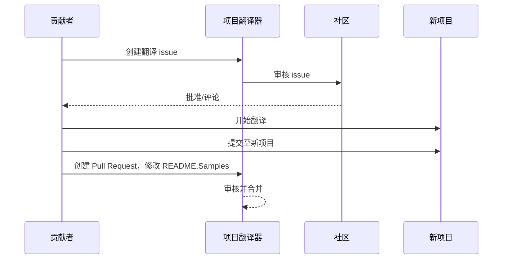

# 项目翻译器

一款 VSCode 扩展：用于项目多语言本地化的易用工具。

## 可用翻译

该扩展支持翻译为以下语言：

- [简体中文 (zh-cn)](./README.zh-cn.md)
- [繁體中文 (zh-tw)](./README.zh-tw.md)
- [日本語 (ja-jp)](./README.ja-jp.md)
- [한국어 (ko-kr)](./README.ko-kr.md)
- [Français (fr-fr)](./README.fr-fr.md)
- [Deutsch (de-de)](./README.de-de.md)
- [Español (es-es)](./README.es-es.md)
- [Português (pt-br)](./README.pt-br.md)
- [Русский (ru-ru)](./README.ru-ru.md)
- [العربية (ar-sa)](./README.ar-sa.md)
- [العربية (ar-ae)](./README.ar-ae.md)
- [العربية (ar-eg)](./README.ar-eg.md)

## 示例

| 项目                                                                             | 原始仓库                                                                                       | 描述                                                                                                                                                               | 星标数 | 标签                                                                                                                                                                                                                                                                                                                                                                                                                                                                                                                                                                                                 |
| ----------------------------------------------------------------------------------- | --------------------------------------------------------------------------------------------------------- | ------------------------------------------------------------------------------------------------------------------------------------------------------------------------- | ----- | ---------------------------------------------------------------------------------------------------------------------------------------------------------------------------------------------------------------------------------------------------------------------------------------------------------------------------------------------------------------------------------------------------------------------------------------------------------------------------------------------------------------------------------------------------------------------------------------------------- |
| [algorithm-visualizer](https://github.com/Project-Translation/algorithm-visualizer) | [algorithm-visualizer/algorithm-visualizer](https://github.com/algorithm-visualizer/algorithm-visualizer) | :fireworks: 可视化代码算法的交互式在线平台                                                                                               | 47301 | [`algorithm`](https://github.com/topics/algorithm), [`animation`](https://github.com/topics/animation), [`data-structure`](https://github.com/topics/data-structure), [`visualization`](https://github.com/topics/visualization)                                                                                                                                                                                                                                                                                                                                                                                                                                     |
| [algorithms](https://github.com/Project-Translation/algorithms)                     | [algorithm-visualizer/algorithms](https://github.com/algorithm-visualizer/algorithms)                     | :crystal_ball: 算法可视化                                                                                                                                    | 401   | N/A                                                                                                                                                                                                                                                                                                                                                                                                                                                                                                                                                                                                                                                                  |
| [cline-docs](https://github.com/Project-Translation/cline-docs)                     | [cline/cline](https://github.com/cline/cline)                                                             | 自主编码代理，直接集成在您的 IDE 中，可在您授权的每一步中创建/编辑文件、执行命令、使用浏览器等。 | 39572 | N/A                                                                                                                                                                                                                                                                                                                                                                                                                                                                                                                                                                                                                                                                  |
| [cursor-docs](https://github.com/Project-Translation/cursor-docs)                   | [getcursor/docs](https://github.com/getcursor/docs)                                                       | Cursor 的开源文档                                                                                                                                        | 309   | N/A                                                                                                                                                                                                                                                                                                                                                                                                                                                                                                                                                                                                                                                                  |
| [gobyexample](https://github.com/Project-Translation/gobyexample)                   | [mmcgrana/gobyexample](https://github.com/mmcgrana/gobyexample)                                           | Go by Example                                                                                                                                                             | 7523  | N/A                                                                                                                                                                                                                                                                                                                                                                                                                                                                                                                                                                                                                                                                  |
| [golang-website](https://github.com/Project-Translation/golang-website)             | [golang/website](https://github.com/golang/website)                                                       | [mirror] go.dev 和 golang.org 网站的主页                                                                                                                       | 402   | N/A                                                                                                                                                                                                                                                                                                                                                                                                                                                                                                                                                                                                                                                                  |
| [reference-en-us](https://github.com/Project-Translation/reference-en-us)           | [Fechin/reference](https://github.com/Fechin/reference)                                                   | ⭕ 为开发者分享快速参考备忘单。                                                                                                                      | 7808  | [`awk`](https://github.com/topics/awk), [`bash`](https://github.com/topics/bash), [`chatgpt`](https://github.com/topics/chatgpt), [`cheatsheet`](https://github.com/topics/cheatsheet), [`cheatsheets`](https://github.com/topics/cheatsheets), [`css`](https://github.com/topics/css), [`golang`](https://github.com/topics/golang), [`grep`](https://github.com/topics/grep), [`markdown`](https://github.com/topics/markdown), [`python`](https://github.com/topics/python), [`reference`](https://github.com/topics/reference), [`sed`](https://github.com/topics/sed), [`snippets`](https://github.com/topics/snippets), [`vim`](https://github.com/topics/vim) |
| [styleguide](https://github.com/Project-Translation/styleguide)                     | [google/styleguide](https://github.com/google/styleguide)                                                 | Google 开源项目的代码风格指南                                                                                                                   | 38055 | [`cpplint`](https://github.com/topics/cpplint), [`style-guide`](https://github.com/topics/style-guide), [`styleguide`](https://github.com/topics/styleguide)                                                                                                                                                                                                                                                                                                                                                                                                                                                                                                         |
| [vscode-docs](https://github.com/Project-Translation/vscode-docs)                   | [microsoft/vscode-docs](https://github.com/microsoft/vscode-docs)                                         | Visual Studio Code 的公开文档                                                                                                                               | 5914  | [`vscode`](https://github.com/topics/vscode)                                                                                                                                                                                                                                                                                                                                                                                                                                                                                                                                                                                                                         |

## 请求项目翻译

如果您想贡献翻译或需要翻译某个项目：

1. 使用以下模板创建 issue：

```md
**项目**: [project_url]
**目标语言**: [target_lang]
**描述**: 简要说明此翻译的价值
```

2. 工作流程：



3. PR 合并后，翻译将被添加到“示例”部分。

正在进行的翻译：[查看 Issues](https://github.com/Project-Translation/project_translator/issues)

## 功能

- 📁 文件夹级翻译支持
  - 将整个项目文件夹翻译为多种语言
  - 保持原始文件夹结构和层级
  - 支持子文件夹的递归翻译
  - 自动检测可翻译内容
  - 批量处理，高效完成大规模翻译
- 📄 文件级翻译支持
  - 将单个文件翻译为多种语言
  - 保留原始文件结构和格式
  - 支持文件夹和文件翻译模式
- 💡 基于 AI 的智能翻译
  - 自动保持代码结构完整性
  - 仅翻译代码注释，保留代码逻辑
  - 维护 JSON/XML 等数据结构格式
  - 专业级技术文档翻译质量
- ⚙️ 灵活配置
  - 配置源文件夹和多个目标文件夹
  - 支持自定义文件翻译间隔
  - 设置特定文件类型忽略
  - 支持多种 AI 模型选项
- 🚀 用户友好操作
  - 实时显示翻译进度
  - 支持暂停/恢复/停止翻译
  - 自动维护目标文件夹结构
  - 增量翻译避免重复工作

## 安装

1. 在 VS Code 扩展市场中搜索 "[Project Translator](https://marketplace.visualstudio.com/items?itemName=techfetch-dev.project-translator)"
2. 点击安装

## 配置

该扩展支持以下配置选项：

```json
{
  "projectTranslator.specifiedFolders": [
    {
      "sourceFolder": {
        "path": "源文件夹路径",
        "lang": "源语言代码"
      },
      "targetFolders": [
        {
          "path": "目标文件夹路径",
          "lang": "目标语言代码"
        }
      ]
    }
  ],
  "projectTranslator.specifiedFiles": [
    {
      "sourceFile": {
        "path": "源文件路径",
        "lang": "源语言代码"
      },
      "targetFiles": [
        {
          "path": "目标文件路径",
          "lang": "目标语言代码"
        }
      ]
    }
  ],
  "projectTranslator.currentVendor": "openai",
  "projectTranslator.vendors": [
    {
      "name": "openai",
      "apiEndpoint": "API 端点 URL",
      "apiKey": "API 认证密钥",
      "apiKeyEnvVarName": "API 密钥的环境变量名",
      "model": "使用的模型名称",
      "rpm": "每分钟最大请求数",
      "maxTokensPerSegment": 4096,
      "timeout": 30,
      "temperature": 0.0
    }
  ]
}
```

关键配置说明：

| 配置选项                                   | 描述                                                                                       |
| ------------------------------------------ | ----------------------------------------------------------------------------------------- |
| `projectTranslator.specifiedFolders`       | 用于翻译的多个源文件夹及其对应的目​​标文件夹                                                |
| `projectTranslator.specifiedFiles`         | 用于翻译的多个源文件及其对应的目​​标文件                                                    |
| `projectTranslator.translationIntervalDays` | 翻译间隔天数（默认 7 天）                                                                  |
| `projectTranslator.copyOnly`               | 仅复制但不翻译的文件（包含 `paths` 和 `extensions` 数组）                                   |
| `projectTranslator.ignore`                 | 完全忽略的文件（包含 `paths` 和 `extensions` 数组）                                         |
| `projectTranslator.skipFrontMatterMarkers` | 根据前置元数据标记跳过文件（包含 `enabled` 和 `markers` 数组）                              |
| `projectTranslator.currentVendor`          | 当前使用的 API 服务商                                                                       |
| `projectTranslator.vendors`                | API 服务商配置列表（可直接使用 apiKey 或通过 apiKeyEnvVarName 引用环境变量）               |
| `projectTranslator.systemPrompts`          | 用于引导翻译过程的系统提示词数组                                                           |
| `projectTranslator.userPrompts`            | 用户自定义提示词数组，这些提示将在翻译时添加到系统提示之后                                 |
| `projectTranslator.segmentationMarkers`    | 按文件类型配置的分段标记，支持正则表达式                                                   |
| `projectTranslator.debug`                  | 启用调试模式，将所有 API 请求和响应日志输出到输出通道（默认：false）                       |
| `projectTranslator.logFile`                | 调试日志文件配置（参见 [日志文件功能](./docs/log-file-feature.md)）                         |

## 使用方法

1. 打开命令面板（Ctrl+Shift+P / Cmd+Shift+P）
2. 输入 "Translate Project" 并选择对应命令
3. 如果未配置源文件夹，将弹出文件夹选择对话框
4. 等待翻译完成

翻译过程中：

- 可通过状态栏按钮暂停/恢复翻译
- 可随时停止翻译进程
- 翻译进度显示在通知区域
- 详细日志显示在输出面板中

## 开发

### 构建系统

该扩展使用 esbuild 实现快速打包和开发：

#### 可用脚本

- `npm run build` - 生成环境构建，包含代码压缩
- `npm run compile` - 开发环境构建
- `npm run watch` - 开发模式下的监听构建
- `npm test` - 运行测试

#### VS Code 任务

- **Build**（Ctrl+Shift+P → "Tasks: Run Task" → "build"）- 为生产环境打包扩展
- **Watch**（Ctrl+Shift+P → "Tasks: Run Task" → "watch"）- 开发模式，自动重新构建

### 开发环境设置

1. 克隆仓库
2. 运行 `npm install` 安装依赖
3. 按 `F5` 启动调试，或运行 "watch" 任务进行开发

esbuild 配置说明：

- 将所有 TypeScript 文件打包为单个 `out/extension.js`
- 排除 VS Code API（标记为 external）

## 高级功能

### 使用环境变量管理 API 密钥

Project Translator 支持使用环境变量存储 API 密钥，相比直接写入配置文件更安全：

1. 在服务商配置中使用 `apiKeyEnvVarName` 属性：

```json
{
  "projectTranslator.vendors": [
    {
      "name": "openai",
      "apiEndpoint": "https://api.openai.com/v1",
      "apiKeyEnvVarName": "OPENAI_API_KEY",
      "model": "gpt-4"
    },
    {
      "name": "openrouter",
      "apiEndpoint": "https://openrouter.ai/api/v1",
      "apiKeyEnvVarName": "OPENROUTER_API_KEY",
      "model": "anthropic/claude-3-opus"
    }
  ]
}
```

2. 在系统中设置环境变量：
   - Windows: `set OPENAI_API_KEY=your_api_key`
   - macOS/Linux: `export OPENAI_API_KEY=your_api_key`

3. 扩展运行时会：
   - 首先检查配置中是否直接提供了 `apiKey`
   - 若无，则查找 `apiKeyEnvVarName` 指定的环境变量

此方法可避免将 API 密钥暴露在配置文件和版本控制系统中。

### 根据前置元数据跳过翻译

Project Translator 可根据 Markdown 文件的前置元数据决定是否跳过翻译。适用于草稿文档或标记为无需翻译的文件。

启用此功能需配置 `projectTranslator.skipFrontMatterMarkers` 选项：

```json
{
  "projectTranslator.skipFrontMatterMarkers": {
    "enabled": true,
    "markers": [
      {
        "key": "draft",
        "value": "true"
      },
      {
        "key": "translate",
        "value": "false"
      }
    ]
  }
}
```

配置后，任何前置元数据包含 `draft: true` 或 `translate: false` 的 Markdown 文件都将在翻译过程中被跳过，并直接复制到目标位置。

示例（将被跳过的 Markdown 文件）：
```
---
draft: true
title: "草稿文档"
---

本文档为草稿，不应被翻译。
```


### 设计文档

- 为开发构建生成 source maps
- 为生产构建进行代码压缩
- 提供 VS Code 的问题匹配器集成

## 注意事项

- 确保有足够的 API 调用配额
- 建议先用小型项目测试
- 使用专用 API 密钥，并在使用后及时删除

## 许可证

[许可证](LICENSE)