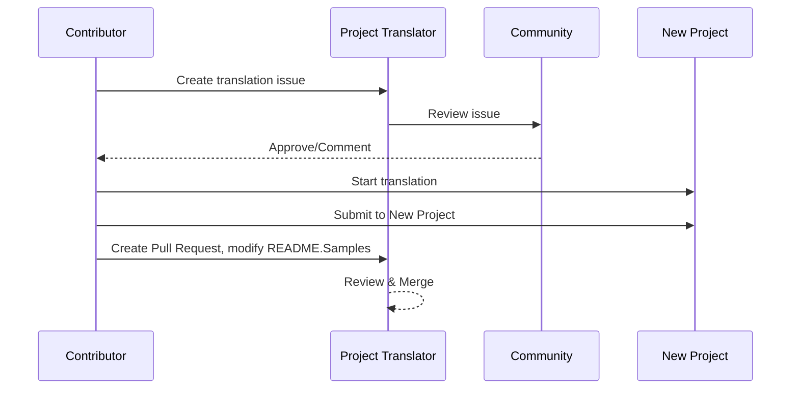

# 项目翻译器

A VSCode 扩展：一个易于使用的工具，用于项目的多语言本地化。

<!--
## 可用翻译

扩展支持翻译到这些语言：

- [简体中文 (zh-cn)](./README.zh-cn.md)
- [繁體中文 (zh-tw)](./README.zh-tw.md)
- [日本語 (ja-jp)](./README.ja-jp.md)
- [한국어 (ko-kr)](./README.ko-kr.md)
- [Français (fr-fr)](./README.fr-fr.md)
- [Deutsch (de-de)](./README.de-de.md)
- [Español (es-es)](./README.es-es.md)
- [Português (pt-br)](./README.pt-br.md)
- [Русский (ru-ru)](./README.ru-ru.md)
- [العربية (ar-sa)](./README.ar-sa.md)
- [العربية (ar-ae)](./README.ar-ae.md)
- [العربية (ar-eg)](./README.ar-eg.md) -->

## 示例

| 项目                                                                             | 原始仓库                                                                                       | 描述                                                                                                                                                               | 星数 | 标签                                                                                                                                                                                                                                                                                                                                                                                                                                                                                                                                                                                                                                                                 |
| -------------------------------------------------------------------------------- | ------------------------------------------------------------------------------------------------- | ----------------------------------------------------------------------------------------------------------------------------------------------------------------- | ------ | -------------------------------------------------------------------------------------------------------------------------------------------------------------------------------------------------------------------------------------------------------------------------------------------------------------------------------------------------------------------------------------------------------------------------------------------------------------------------------------------------------------------------------------------------------------------------------------------------------------------------------------------------------------------- |
| [algorithm-visualizer](https://github.com/Project-Translation/algorithm-visualizer) | [algorithm-visualizer/algorithm-visualizer](https://github.com/algorithm-visualizer/algorithm-visualizer) | :fireworks:从代码可视化算法的交互式在线平台                                                                                               | 47301 | [`algorithm`](https://github.com/topics/algorithm), [`animation`](https://github.com/topics/animation), [`data-structure`](https://github.com/topics/data-structure), [`visualization`](https://github.com/topics/visualization)                                                                                                                                                                                                                                                                                                                                                                                                                                     |
| [algorithms](https://github.com/Project-Translation/algorithms)                     | [algorithm-visualizer/algorithms](https://github.com/algorithm-visualizer/algorithms)                     | :crystal_ball:算法可视化                                                                                                                                    | 401   | N/A                                                                                                                                                                                                                                                                                                                                                                                                                                                                                                                                                                                                                                                                  |
| [cline-docs](https://github.com/Project-Translation/cline-docs)                     | [cline/cline](https://github.com/cline/cline)                                                             | 在您的 IDE 中自主编码代理，能够在每一步获得您的权限后创建/编辑文件、执行命令、使用浏览器等。 | 39572 | N/A                                                                                                                                                                                                                                                                                                                                                                                                                                                                                                                                                                                                                                                                  |
| [cursor-docs](https://github.com/Project-Translation/cursor-docs)                   | [getcursor/docs](https://github.com/getcursor/docs)                                                       | Cursor 的开源文档                                                                                                                                        | 309   | N/A                                                                                                                                                                                                                                                                                                                                                                                                                                                                                                                                                                                                                                                                  |
| [gobyexample](https://github.com/Project-Translation/gobyexample)                   | [mmcgrana/gobyexample](https://github.com/mmcgrana/gobyexample)                                           | Go by Example                                                                                                                                                             | 7523  | N/A                                                                                                                                                                                                                                                                                                                                                                                                                                                                                                                                                                                                                                                                  |
| [golang-website](https://github.com/Project-Translation/golang-website)             | [golang/website](https://github.com/golang/website)                                                       | [镜像] go.dev 和 golang.org 网站的首页                                                                                                                       | 402   | N/A                                                                                                                                                                                                                                                                                                                                                                                                                                                                                                                                                                                                                                                                  |
| [reference-en-us](https://github.com/Project-Translation/reference-en-us)           | [Fechin/reference](https://github.com/Fechin/reference)                                                   | ⭕ 分享开发人员的快速参考备忘单                                                                                                                      | 7808  | [`awk`](https://github.com/topics/awk), [`bash`](https://github.com/topics/bash), [`chatgpt`](https://github.com/topics/chatgpt), [`cheatsheet`](https://github.com/topics/cheatsheet), [`cheatsheets`](https://github.com/topics/cheatsheets), [`css`](https://github.com/topics/css), [`golang`](https://github.com/topics/golang), [`grep`](https://github.com/topics/grep), [`markdown`](https://github.com/topics/markdown), [`python`](https://github.com/topics/python), [`reference`](https://github.com/topics/reference), [`sed`](https://github.com/topics/sed), [`snippets`](https://github.com/topics/snippets), [`vim`](https://github.com/topics/vim) |
| [styleguide](https://github.com/Project-Translation/styleguide)                     | [google/styleguide](https://github.com/google/styleguide)                                                 | Google 起源的开源项目的风格指南                                                                                                                   | 38055 | [`cpplint`](https://github.com/topics/cpplint), [`style-guide`](https://github.com/topics/style-guide), [`styleguide`](https://github.com/topics/styleguide)                                                                                                                                                                                                                                                                                                                                                                                                                                                                                                         |
| [vscode-docs](https://github.com/Project-Translation/vscode-docs)                   | [microsoft/vscode-docs](https://github.com/microsoft/vscode-docs)                                         | Visual Studio Code 的公共文档                                                                                                                               | 5914  | [`vscode`](https://github.com/topics/vscode)                                                                                                                                                                                                                                                                                                                                                                                                                                                                                                                                                                                                                         |

## 请求项目翻译

如果您想贡献翻译或需要翻译某个项目：

1. 使用以下模板创建问题：

```md
**Project**: [project_url]
**Target Language**: [target_lang]
**Description**: 简要描述此翻译为什么有价值
```

2. 工作流程：



3. PR 合并后，翻译将添加到示例部分。

当前翻译进行中：[查看问题](https://github.com/Project-Translation/project_translator/issues)

## 功能

- 📁 文件夹级翻译支持
  - 将整个项目文件夹翻译到多种语言
  - 维护原始文件夹结构和层次
  - 支持子文件夹的递归翻译
  - 自动检测可翻译内容
  - 批量处理以实现高效的大规模翻译
- 📄 文件级翻译支持
  - 将单个文件翻译到多种语言
  - 保留原始文件结构和格式
  - 支持文件夹和文件翻译模式
- 💡 智能 AI 翻译
  - 自动维护代码结构完整性
  - 仅翻译代码注释，保留代码逻辑
  - 维护 JSON/XML 等数据结构格式
  - 专业的技术文档翻译质量
- ⚙️ 灵活配置
  - 配置源文件夹和多个目标文件夹
  - 支持自定义文件翻译间隔
  - 设置特定文件类型忽略
  - 支持多种 AI 模型选项
- 🚀 用户友好操作
  - 实时显示翻译进度
  - 支持暂停/恢复/停止翻译
  - 自动维护目标文件夹结构
  - 增量翻译以避免重复工作

## 安装

1. 在 VS Code 扩展市场搜索 "[Project Translator](https://marketplace.visualstudio.com/items?itemName=techfetch-dev.project-translator)"
2. 点击安装

## 配置

扩展支持以下配置选项：

```json
{
  "projectTranslator.specifiedFolders": [
    {
      "sourceFolder": {
        "path": "Source folder path",
        "lang": "Source language code"
      },
      "destFolders": [
        {
          "path": "Target folder path",
          "lang": "Target language code"
        }
      ]
    }
  ],
  "projectTranslator.specifiedFiles": [
    {
      "sourceFile": {
        "path": "Source file path",
        "lang": "Source language code"
      },
      "destFiles": [
        {
          "path": "Target file path",
          "lang": "Target language code"
        }
      ]
    }
  ],
  "projectTranslator.currentVendor": "openai",
  "projectTranslator.vendors": [
    {
      "name": "openai",
      "apiEndpoint": "API endpoint URL",
      "apiKey": "API authentication key",
      "model": "Model name to use",
      "rpm": "Maximum requests per minute",
      "maxTokensPerSegment": 4096,
      "timeout": 30,
      "temperature": 0.0
    }
  ]
}
```

关键配置细节：

| 配置选项                            | 描述                                                                                    |
| ----------------------------------- | ------------------------------------------------------------------------------------ |
| `projectTranslator.specifiedFolders`            | 多个源文件夹及其对应的目标文件夹，用于翻译                                           |
| `projectTranslator.specifiedFiles`              | 多个源文件及其对应的目标文件，用于翻译                                               |
| `projectTranslator.translationIntervalDays`     | 翻译间隔天数（默认 7 天）                                                            |
| `projectTranslator.ignoreTranslationExtensions` | 不需要翻译的文本文件扩展名列表，这些文件将直接复制                                    |
| `projectTranslator.ignorePaths`                 | 使用 glob 语法的忽略路径模式列表，这些文件不会被复制                                 |
| `projectTranslator.currentVendor`               | 当前使用的 API 供应商                                                                    |
| `projectTranslator.vendors`                     | API 供应商配置列表                                                                    |
| `projectTranslator.systemPrompts`               | 系统提示数组，用于指导翻译过程                                                        |
| `projectTranslator.userPrompts`                 | 用户定义的提示数组，这些提示将在翻译过程中添加到系统提示之后                         |
| `projectTranslator.segmentationMarkers`         | 按文件类型配置的分段标记，支持正则表达式                                             |

## 使用

1. 打开命令面板 (Ctrl+Shift+P / Cmd+Shift+P)
2. 输入 "Translate Project" 并选择命令
3. 如果未配置源文件夹，将出现文件夹选择对话框
4. 等待翻译完成

翻译过程中：

- 可以通过状态栏按钮暂停/恢复翻译
- 随时停止翻译过程
- 翻译进度显示在通知区域
- 详细日志显示在输出面板

## 注意

- 确保有足够的 API 使用配额
- 建议先用小项目测试
- 使用专用的 API 密钥，并在完成后删除

## 许可证

[许可证](LICENSE)