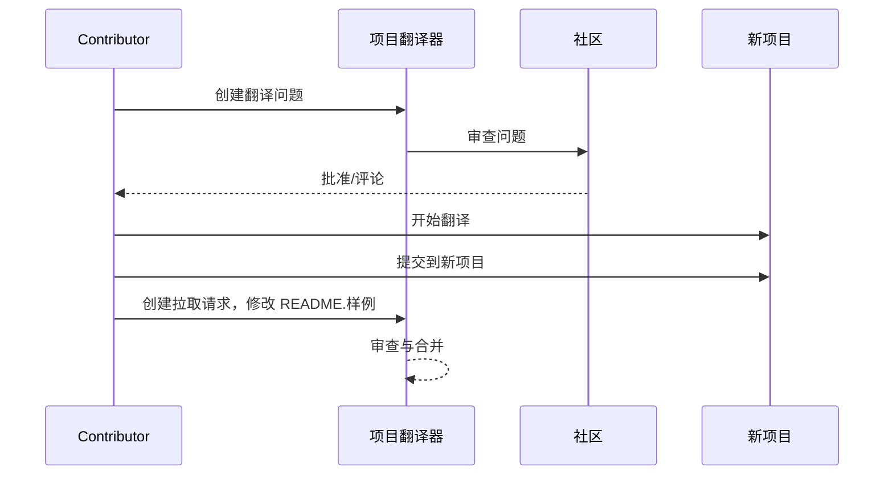

# 项目翻译器

一个 VSCode 扩展：一个用于项目多语言本地化的易用工具。

## 可用翻译

该扩展支持翻译成以下语言：

- [简体中文 (zh-cn)](./readmes/README.zh-cn.md)
- [繁體中文 (zh-tw)](./readmes/README.zh-tw.md)
- [日本語 (ja-jp)](./readmes/README.ja-jp.md)
- [한국어 (ko-kr)](./readmes/README.ko-kr.md)
- [Français (fr-fr)](./readmes/README.fr-fr.md)
- [Deutsch (de-de)](./readmes/README.de-de.md)
- [Español (es-es)](./readmes/README.es-es.md)
- [Português (pt-br)](./readmes/README.pt-br.md)
- [Русский (ru-ru)](./readmes/README.ru-ru.md)
- [العربية (ar-sa)](./readmes/README.ar-sa.md)
- [العربية (ar-ae)](./readmes/README.ar-ae.md)
- [العربية (ar-eg)](./readmes/README.ar-eg.md)

## 样例

| 项目                                                   | 语言                                                                                                                                                 |
| --------------------------------------------------------- | --------------------------------------------------------------------------------------------------------------------------------------------------------- |
| [google/styleguide](https://github.com/google/styleguide) | [en-us](https://github.com/google/styleguide) 原始由 @google<br>[zh-cn](https://github.com/Project-Translation/styleguide-zh-cn) 翻译由 @jqknono |

## 请求项目翻译

如果您想贡献翻译或需要翻译一个项目：

1. 使用以下模板创建一个问题：

```md
**项目**: [project_url]
**目标语言**: [target_lang]
**描述**: 简要说明为什么这个翻译是有价值的
```

2. 工作流程：



3. PR 合并后，翻译将被添加到样例部分。

当前正在进行的翻译：[查看问题](https://github.com/Project-Translation/project_translator/issues)

## 功能
- 📁 文件夹级翻译支持
  - 翻译整个项目文件夹到多种语言
  - 保持原始文件夹结构和层次
  - 支持子文件夹的递归翻译
  - 自动检测可翻译内容
  - 批处理以高效进行大规模翻译
- 📄 文件级翻译支持
  - 翻译单个文件到多种语言
  - 保留原始文件结构和格式
  - 支持文件夹和文件两种翻译模式
- 💡 智能AI翻译
  - 自动保持代码结构完整性
  - 仅翻译代码注释，保留代码逻辑
  - 保持JSON/XML等数据结构格式
  - 专业技术文档翻译质量
- ⚙️ 灵活配置
  - 配置源文件夹和多个目标文件夹
  - 支持自定义文件翻译间隔
  - 设置特定文件类型以忽略
  - 支持多种AI模型选项
- 🚀 用户友好操作
  - 实时显示翻译进度
  - 支持暂停/恢复/停止翻译
  - 自动维护目标文件夹结构
  - 增量翻译以避免重复工作

## 安装

1. 在VS Code扩展市场中搜索"[Project Translator](https://marketplace.visualstudio.com/items?itemName=techfetch-dev.project-translator)"
2. 点击安装

## 配置

该扩展支持以下配置选项：

```json
{
  "projectTranslator.specifiedFolders": [
    {
      "sourceFolder": {
        "path": "源文件夹路径",
        "lang": "源语言代码"
      },
      "destFolders": [
        {
          "path": "目标文件夹路径",
          "lang": "目标语言代码"
        }
      ]
    }
  ],
  "projectTranslator.specifiedFiles": [
    {
      "sourceFile": {
        "path": "源文件路径",
        "lang": "源语言代码"
      },
      "destFiles": [
        {
          "path": "目标文件路径",
          "lang": "目标语言代码"
        }
      ]
    }
  ],
  "projectTranslator.currentVendor": "openai",
  "projectTranslator.vendors": [
    {
      "name": "openai",
      "apiEndpoint": "API端点URL",
      "apiKey": "API认证密钥",
      "model": "使用的模型名称",
      "rpm": "每分钟最大请求数",
      "maxTokensPerSegment": 4096,
      "timeout": 30,
      "temperature": 0.0
    }
  ]
}
```

关键配置详情：
| 配置选项                                        | 描述                                                                                          |
| ----------------------------------------------- | -------------------------------------------------------------------------------------------- |
| `projectTranslator.specifiedFolders`            | 多个源文件夹及其对应的目标文件夹用于翻译                                                       |
| `projectTranslator.specifiedFiles`              | 多个源文件及其对应的目标文件用于翻译                                                           |
| `projectTranslator.translationIntervalDays`     | 翻译间隔天数（默认7天）                                                                        |
| `projectTranslator.ignoreTranslationExtensions` | 不需要翻译的文本文件扩展名列表，这些文件将被直接复制                                            |
| `projectTranslator.ignorePaths`                 | 使用通配符的忽略路径模式列表，这些文件不会被复制                                               |
| `projectTranslator.currentVendor`               | 当前使用的API供应商                                                                            |
| `projectTranslator.vendors`                     | API供应商配置列表                                                                              |
| `projectTranslator.systemPrompts`               | 用于指导翻译过程的系统提示数组                                                                  |
| `projectTranslator.userPrompts`                 | 用户定义的提示数组，这些提示将在翻译过程中添加在系统提示之后                                    |
| `projectTranslator.segmentationMarkers`         | 按文件类型配置的分割标记，支持正则表达式                                                        |

## 使用

1. 打开命令面板（Ctrl+Shift+P / Cmd+Shift+P）
2. 输入“翻译项目”并选择命令
3. 如果未配置源文件夹，将出现文件夹选择对话框
4. 等待翻译完成

在翻译过程中：

- 可以通过状态栏按钮暂停/恢复翻译
- 可以随时停止翻译过程
- 翻译进度显示在通知区域
- 详细日志显示在输出面板

## 注意事项

- 确保有足够的API使用配额
- 建议先用小项目进行测试
- 使用专用API密钥并在完成后移除它们

## 许可证

[许可证](LICENSE)