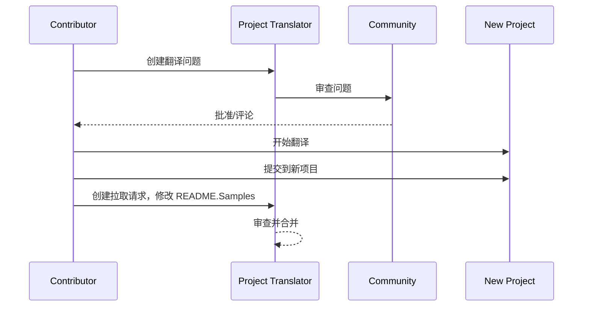

# 项目翻译器

一个 VSCode 扩展：一个易于使用的项目多语言本地化工具。

<!--
## 可用翻译

该扩展支持翻译为以下语言：

- [简体中文 (zh-cn)](./readmes/README.zh-cn.md)
- [繁體中文 (zh-tw)](./readmes/README.zh-tw.md)
- [日本語 (ja-jp)](./readmes/README.ja-jp.md)
- [한국어 (ko-kr)](./readmes/README.ko-kr.md)
- [Français (fr-fr)](./readmes/README.fr-fr.md)
- [Deutsch (de-de)](./readmes/README.de-de.md)
- [Español (es-es)](./readmes/README.es-es.md)
- [Português (pt-br)](./readmes/README.pt-br.md)
- [Русский (ru-ru)](./readmes/README.ru-ru.md)
- [العربية (ar-sa)](./readmes/README.ar-sa.md)
- [العربية (ar-ae)](./readmes/README.ar-ae.md)
- [العربية (ar-eg)](./readmes/README.ar-eg.md) -->

## 示例

| 项目                                                                             | 原始仓库                                                                                       | 描述                                                                                                                                                               | 星标 | 标签                                                                                                                                                                                                                                                                                                                                                                                                                                                                                                                                                                                                                                                                 |
| ----------------------------------------------------------------------------------- | --------------------------------------------------------------------------------------------------------- | ------------------------------------------------------------------------------------------------------------------------------------------------------------------------- | ----- | -------------------------------------------------------------------------------------------------------------------------------------------------------------------------------------------------------------------------------------------------------------------------------------------------------------------------------------------------------------------------------------------------------------------------------------------------------------------------------------------------------------------------------------------------------------------------------------------------------------------------------------------------------------------- |
| [algorithm-visualizer](https://github.com/Project-Translation/algorithm-visualizer) | [algorithm-visualizer/algorithm-visualizer](https://github.com/algorithm-visualizer/algorithm-visualizer) | :fireworks:交互式在线平台，可视化代码中的算法                                                                                               | 47301 | [`algorithm`](https://github.com/topics/algorithm), [`animation`](https://github.com/topics/animation), [`data-structure`](https://github.com/topics/data-structure), [`visualization`](https://github.com/topics/visualization)                                                                                                                                                                                                                                                                                                                                                                                                                                     |
| [algorithms](https://github.com/Project-Translation/algorithms)                     | [algorithm-visualizer/algorithms](https://github.com/algorithm-visualizer/algorithms)                     | :crystal_ball:算法可视化                                                                                                                                    | 401   | N/A                                                                                                                                                                                                                                                                                                                                                                                                                                                                                                                                                                                                                                                                  |
| [cline-docs](https://github.com/Project-Translation/cline-docs)                     | [cline/cline](https://github.com/cline/cline)                                                             | 在您的 IDE 中的自主编码代理，能够创建/编辑文件、执行命令、使用浏览器等，并在每一步都获得您的许可。 | 39572 | N/A                                                                                                                                                                                                                                                                                                                                                                                                                                                                                                                                                                                                                                                                  |
| [cursor-docs](https://github.com/Project-Translation/cursor-docs)                   | [getcursor/docs](https://github.com/getcursor/docs)                                                       | Cursor 的开源文档                                                                                                                                        | 309   | N/A                                                                                                                                                                                                                                                                                                                                                                                                                                                                                                                                                                                                                                                                  |
| [gobyexample](https://github.com/Project-Translation/gobyexample)                   | [mmcgrana/gobyexample](https://github.com/mmcgrana/gobyexample)                                           | Go 示例                                                                                                                                                             | 7523  | N/A                                                                                                                                                                                                                                                                                                                                                                                                                                                                                                                                                                                                                                                                  |
| [golang-website](https://github.com/Project-Translation/golang-website)             | [golang/website](https://github.com/golang/website)                                                       | [镜像] go.dev 和 golang.org 网站的主页                                                                                                                       | 402   | N/A                                                                                                                                                                                                                                                                                                                                                                                                                                                                                                                                                                                                                                                                  |
| [reference-en-us](https://github.com/Project-Translation/reference-en-us)           | [Fechin/reference](https://github.com/Fechin/reference)                                                   | ⭕ 分享开发者的快速参考备忘单。                                                                                                                      | 7808  | [`awk`](https://github.com/topics/awk), [`bash`](https://github.com/topics/bash), [`chatgpt`](https://github.com/topics/chatgpt), [`cheatsheet`](https://github.com/topics/cheatsheet), [`cheatsheets`](https://github.com/topics/cheatsheets), [`css`](https://github.com/topics/css), [`golang`](https://github.com/topics/golang), [`grep`](https://github.com/topics/grep), [`markdown`](https://github.com/topics/markdown), [`python`](https://github.com/topics/python), [`reference`](https://github.com/topics/reference), [`sed`](https://github.com/topics/sed), [`snippets`](https://github.com/topics/snippets), [`vim`](https://github.com/topics/vim) |
| [styleguide](https://github.com/Project-Translation/styleguide)                     | [google/styleguide](https://github.com/google/styleguide)                                                 | Google 开源项目的风格指南                                                                                                                   | 38055 | [`cpplint`](https://github.com/topics/cpplint), [`style-guide`](https://github.com/topics/style-guide), [`styleguide`](https://github.com/topics/styleguide)                                                                                                                                                                                                                                                                                                                                                                                                                                                                                                         |
| [vscode-docs](https://github.com/Project-Translation/vscode-docs)                   | [microsoft/vscode-docs](https://github.com/microsoft/vscode-docs)                                         | Visual Studio Code 的公共文档                                                                                                                               | 5914  | [`vscode`](https://github.com/topics/vscode)                                                                                                                                                                                                                                                                                                                                                                                                                                                                                                                                                                                                                         |

## 请求项目翻译

如果您想贡献翻译或需要翻译项目：

1. 使用以下模板创建问题：

```md
**项目**: [project_url]
**目标语言**: [target_lang]
**描述**: 简要说明为什么这个翻译有价值
```

2. 工作流程：



3. PR 合并后，翻译将添加到示例部分。

当前正在进行的翻译：[查看问题](https://github.com/Project-Translation/project_translator/issues)

## 功能

- 📁 文件夹级翻译支持
  - 将整个项目文件夹翻译为多种语言
  - 保持原始文件夹结构和层次
  - 支持递归翻译子文件夹
  - 自动检测可翻译内容
  - 批量处理以提高大规模翻译效率
- 📄 文件级翻译支持
  - 将单个文件翻译为多种语言
  - 保留原始文件结构和格式
  - 支持文件夹和文件翻译模式
- 💡 智能 AI 翻译
  - 自动维护代码结构完整性
  - 仅翻译代码注释，保留代码逻辑
  - 维护 JSON/XML 和其他数据结构格式
  - 专业的技术文档翻译质量
- ⚙️ 灵活配置
  - 配置源文件夹和多个目标文件夹
  - 支持自定义文件翻译间隔
  - 设置特定文件类型以忽略
  - 支持多种 AI 模型选项
- 🚀 用户友好操作
  - 实时显示翻译进度
  - 支持暂停/恢复/停止翻译
  - 自动维护目标文件夹结构
  - 增量翻译以避免重复工作
- 🔄 高级差异应用翻译
  - **精确更新**：仅翻译实际更改的内容
  - **逐行控制**：保持精确的格式和结构
  - **增量翻译**：非常适合维护翻译文档
  - **版本控制友好**：生成最小、有针对性的更改
  - **成本高效**：通过仅翻译差异减少 API 调用
  - **自动备份**：在应用更改前自动创建备份文件

## 安装

1. 在 VS Code 扩展市场中搜索 "[Project Translator](https://marketplace.visualstudio.com/items?itemName=techfetch-dev.project-translator)"
2. 点击安装

## 配置

该扩展支持以下配置选项：

```json
{
  "projectTranslator.specifiedFolders": [
    {
      "sourceFolder": {
        "path": "源文件夹路径",
        "lang": "源语言代码"
      },
      "targetFolders": [
        {
          "path": "目标文件夹路径",
          "lang": "目标语言代码"
        }
      ]
    }
  ],
  "projectTranslator.diffApply": {
    "enabled": true,
    "validationLevel": "normal",
    "autoBackup": true,
    "maxOperationsPerFile": 100
  },
  "projectTranslator.specifiedFiles": [
    {
      "sourceFile": {
        "path": "源文件路径",
        "lang": "源语言代码"
      },
      "targetFiles": [
        {
          "path": "目标文件路径",
          "lang": "目标语言代码"
        }
      ]
    }
  ],
  "projectTranslator.currentVendor": "openai",
  "projectTranslator.vendors": [
    {
      "name": "openai",
      "apiEndpoint": "API 端点 URL",
      "apiKey": "API 认证密钥",
      "model": "使用的模型名称",
      "rpm": "每分钟最大请求数",
      "maxTokensPerSegment": 4096,
      "timeout": 30,
      "temperature": 0.0
    }
  ]
}
```

关键配置详情：

| 配置选项                        | 描述                                                                                    |
| ------------------------------------------- | ---------------------------------------------------------------------------------------------- |
| `projectTranslator.specifiedFolders`        | 多个源文件夹及其对应的目标文件夹进行翻译           |
| `projectTranslator.specifiedFiles`          | 多个源文件及其对应的目标文件进行翻译               |
| `projectTranslator.translationIntervalDays` | 翻译间隔天数（默认 7 天）                                                  |
| `projectTranslator.copyOnly`                | 仅复制但不翻译的文件（带有 `paths` 和 `extensions` 数组）                         |
| `projectTranslator.ignore`                  | 完全忽略的文件（带有 `paths` 和 `extensions` 数组）                              |
| `projectTranslator.currentVendor`           | 当前使用的 API 供应商                                                                      |
| `projectTranslator.vendors`                 | API 供应商配置列表                                                                  |
| `projectTranslator.systemPrompts`           | 系统提示数组，用于指导翻译过程                                        |
| `projectTranslator.userPrompts`             | 用户定义的提示数组，这些提示将在翻译过程中添加到系统提示之后 |
| `projectTranslator.segmentationMarkers`     | 按文件类型配置的分段标记，支持正则表达式                     |
| `projectTranslator.debug`                   | 启用调试模式以将所有 API 请求和响应记录到输出通道（默认：false）    |
| `projectTranslator.logFile`                 | 调试日志文件的配置（参见 [日志文件功能](./docs/log-file-feature.md)）        |

## 使用

1. 打开命令面板 (Ctrl+Shift+P / Cmd+Shift+P)
2. 输入 "Translate Project" 并选择命令
3. 如果未配置源文件夹，将出现文件夹选择对话框
4. 等待翻译完成

翻译过程中：

- 可以通过状态栏按钮暂停/恢复翻译
- 可以随时停止翻译过程
- 翻译进度显示在通知区域
- 详细日志显示在输出面板中

## 开发

### 构建系统

该扩展使用 esbuild 进行快速打包和开发：

#### 可用脚本

- `npm run build` - 生产构建，带压缩
- `npm run compile` - 开发构建
- `npm run watch` - 开发模式的监视模式
- `npm test` - 运行测试

#### VS Code 任务

- **构建** (Ctrl+Shift+P → "Tasks: Run Task" → "build") - 为生产打包扩展
- **监视** (Ctrl+Shift+P → "Tasks: Run Task" → "watch") - 开发模式，带自动重建

### 开发设置

1. 克隆仓库
2. 运行 `npm install` 安装依赖
3. 按 `F5` 开始调试或运行 "watch" 任务进行开发

esbuild 配置：

- 将所有 TypeScript 文件打包到单个 `out/extension.js`
- 排除 VS Code API（标记为外部）

## 高级功能

### 差异应用翻译

有关高级差异应用翻译模式的详细信息，请参阅 [差异应用使用指南](./docs/diff-apply-usage.md)。

此功能支持：
- 精确的逐行翻译更新
- 减少大文件的 API 成本
- 更好的版本控制集成
- 保留文档格式

### 设计文档

有关差异应用实现的技术细节，请参阅 [差异应用翻译设计](./docs/diff-apply-translation-design.md)。
- 为开发构建生成源映射
- 为生产构建压缩代码
- 提供问题匹配器集成以支持 VS Code

## 注意事项

- 确保有足够的 API 使用配额
- 建议先使用小项目进行测试
- 使用专用 API 密钥并在完成后删除

## 许可证

[许可证](LICENSE)