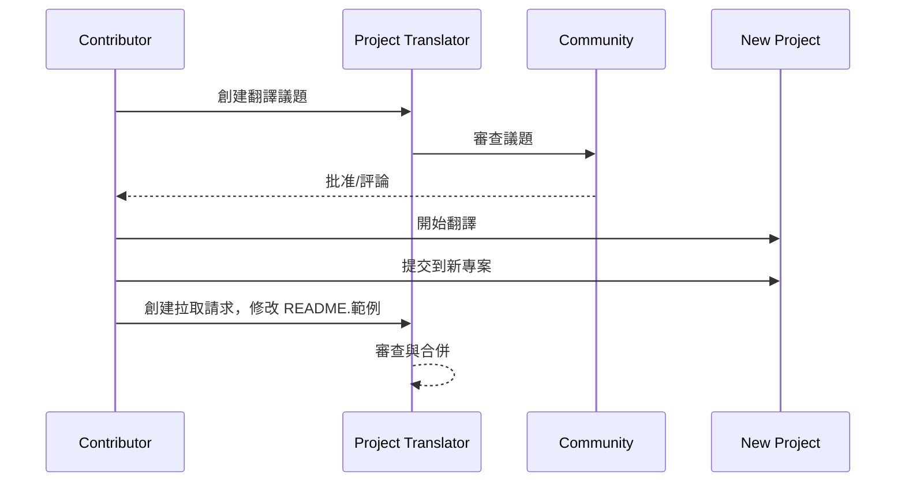

# 專案翻譯器

一個 VSCode 擴充功能：一個用於專案多語言本地化的易用工具。

## 可用的翻譯

該擴充功能支援翻譯成以下語言：

- [简体中文 (zh-cn)](./readmes/README.zh-cn.md)
- [繁體中文 (zh-tw)](./readmes/README.zh-tw.md)
- [日本語 (ja-jp)](./readmes/README.ja-jp.md)
- [한국어 (ko-kr)](./readmes/README.ko-kr.md)
- [Français (fr-fr)](./readmes/README.fr-fr.md)
- [Deutsch (de-de)](./readmes/README.de-de.md)
- [Español (es-es)](./readmes/README.es-es.md)
- [Português (pt-br)](./readmes/README.pt-br.md)
- [Русский (ru-ru)](./readmes/README.ru-ru.md)
- [العربية (ar-sa)](./readmes/README.ar-sa.md)
- [العربية (ar-ae)](./readmes/README.ar-ae.md)
- [العربية (ar-eg)](./readmes/README.ar-eg.md)

## 範例

| 專案                                                   | 語言                                                                                                                                                 |
| --------------------------------------------------------- | --------------------------------------------------------------------------------------------------------------------------------------------------------- |
| [google/styleguide](https://github.com/google/styleguide) | [en-us](https://github.com/google/styleguide) 原始由 @google<br>[zh-cn](https://github.com/Project-Translation/styleguide-zh-cn) 翻譯由 @jqknono |

## 請求專案翻譯

如果您想貢獻翻譯或需要翻譯一個專案：

1. 使用以下模板創建一個議題：

```md
**專案**: [project_url]
**目標語言**: [target_lang]
**描述**: 簡要描述為何這次翻譯會有價值
```

2. 工作流程：



3. PR 合併後，翻譯將被添加到範例部分。

目前正在進行的翻譯：[查看議題](https://github.com/Project-Translation/project_translator/issues)

## 功能
- 📁 資料夾層級翻譯支援
  - 將整個專案資料夾翻譯成多種語言
  - 維持原始資料夾結構和層級
  - 支援子資料夾的遞迴翻譯
  - 自動偵測可翻譯內容
  - 批次處理以有效進行大規模翻譯
- 📄 檔案層級翻譯支援
  - 將個別檔案翻譯成多種語言
  - 保留原始檔案結構和格式
  - 支援資料夾和檔案翻譯模式
- 💡 智能翻譯與AI
  - 自動維持程式碼結構完整性
  - 僅翻譯程式碼註解，保留程式碼邏輯
  - 維持JSON/XML和其他資料結構格式
  - 專業技術文件翻譯品質
- ⚙️ 靈活配置
  - 配置來源資料夾和多個目標資料夾
  - 支援自定義檔案翻譯間隔
  - 設定特定檔案類型忽略
  - 支援多種AI模型選項
- 🚀 使用者友好操作
  - 實時顯示翻譯進度
  - 支援暫停/恢復/停止翻譯
  - 自動維護目標資料夾結構
  - 增量翻譯以避免重複工作

## 安裝

1. 在VS Code擴充功能市場中搜尋"[Project Translator](https://marketplace.visualstudio.com/items?itemName=techfetch-dev.project-translator)"
2. 點擊安裝

## 配置

該擴充功能支援以下配置選項：

```json
{
  "projectTranslator.specifiedFolders": [
    {
      "sourceFolder": {
        "path": "來源資料夾路徑",
        "lang": "來源語言代碼"
      },
      "destFolders": [
        {
          "path": "目標資料夾路徑",
          "lang": "目標語言代碼"
        }
      ]
    }
  ],
  "projectTranslator.specifiedFiles": [
    {
      "sourceFile": {
        "path": "來源檔案路徑",
        "lang": "來源語言代碼"
      },
      "destFiles": [
        {
          "path": "目標檔案路徑",
          "lang": "目標語言代碼"
        }
      ]
    }
  ],
  "projectTranslator.currentVendor": "openai",
  "projectTranslator.vendors": [
    {
      "name": "openai",
      "apiEndpoint": "API端點URL",
      "apiKey": "API驗證密鑰",
      "model": "使用模型名稱",
      "rpm": "每分鐘最大請求數",
      "maxTokensPerSegment": 4096,
      "timeout": 30,
      "temperature": 0.0
    }
  ]
}
```

關鍵配置詳情：
| 配置選項                                        | 描述                                                                                          |
| ----------------------------------------------- | -------------------------------------------------------------------------------------------- |
| `projectTranslator.specifiedFolders`            | 多個來源資料夾及其對應的目標資料夾用於翻譯                                                     |
| `projectTranslator.specifiedFiles`              | 多個來源檔案及其對應的目標檔案用於翻譯                                                         |
| `projectTranslator.translationIntervalDays`     | 翻譯間隔天數（預設7天）                                                                        |
| `projectTranslator.ignoreTranslationExtensions` | 不需要翻譯的文本檔案擴展名清單，這些檔案將直接複製                                              |
| `projectTranslator.ignorePaths`                 | 使用通配符的忽略路徑模式清單，這些檔案不會被複製                                               |
| `projectTranslator.currentVendor`               | 目前使用的API供應商                                                                            |
| `projectTranslator.vendors`                     | API供應商配置清單                                                                              |
| `projectTranslator.systemPrompts`               | 用於指導翻譯過程的系統提示陣列                                                                  |
| `projectTranslator.userPrompts`                 | 使用者定義的提示陣列，這些提示將在翻譯過程中添加在系統提示之後                                  |
| `projectTranslator.segmentationMarkers`         | 按檔案類型配置的分割標記，支援正則表達式                                                        |

## 使用方法

1. 開啟命令選擇面板 (Ctrl+Shift+P / Cmd+Shift+P)
2. 輸入「翻譯專案」並選擇該命令
3. 如果未配置來源資料夾，將會出現資料夾選擇對話框
4. 等待翻譯完成

在翻譯期間：

- 可透過狀態欄按鈕暫停/繼續翻譯
- 可隨時停止翻譯過程
- 翻譯進度顯示在通知區域
- 詳細日誌顯示在輸出面板

## 注意事項

- 確保有足夠的API使用配額
- 建議先用小型專案進行測試
- 使用專用的API金鑰並在完成後移除

## 授權

[授權](LICENSE)