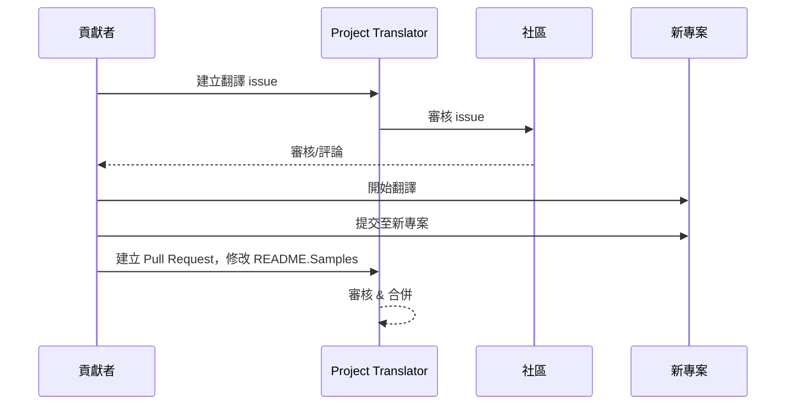

# 專案翻譯器

一個 VSCode 擴充功能：專案多語言本地化的輕鬆使用工具。

## 可用翻譯

此擴充功能支援以下語言的翻譯：

- [簡體中文 (zh-cn)](./README.zh-cn.md)
- [繁體中文 (zh-tw)](./README.zh-tw.md)
- [日本語 (ja-jp)](./README.ja-jp.md)
- [한국어 (ko-kr)](./README.ko-kr.md)
- [Français (fr-fr)](./README.fr-fr.md)
- [Deutsch (de-de)](./README.de-de.md)
- [Español (es-es)](./README.es-es.md)
- [Português (pt-br)](./README.pt-br.md)
- [Русский (ru-ru)](./README.ru-ru.md)
- [العربية (ar-sa)](./README.ar-sa.md)
- [العربية (ar-ae)](./README.ar-ae.md)
- [العربية (ar-eg)](./README.ar-eg.md)

## 範例

| 專案                                                       | 語言                                                                                                                                                 |
| --------------------------------------------------------- | --------------------------------------------------------------------------------------------------------------------------------------------------------- |
| [google/styleguide](https://github.com/google/styleguide) | [en-us](https://github.com/google/styleguide) 來源於 @google<br>[zh-cn](https://github.com/Project-Translation/styleguide-zh-cn) 翻譯於 @jqknono |

## 要求專案翻譯

如需貢獻翻譯或需要翻譯特定專案：

1. 使用以下範本建立 issue：

```md
**Project**: [project_url]
**Target Language**: [target_lang]
**Description**: 簡要說明此翻譯的價值
```

2. 工作流程：



3. PR 合併後，翻譯將被加入範例區塊。

目前進行中的翻譯：[查看 Issues](https://github.com/Project-Translation/project_translator/issues)

## 功能

- 📁 資料夾級別翻譯支援
  - 將整個專案資料夾翻譯為多語言
  - 保留原始資料夾結構與層級
  - 支援子資料夾的遞迴翻譯
  - 自動偵測可翻譯內容
  - 批次處理實現大量翻譯效率
- 📄 檔案級別翻譯支援
  - 單獨翻譯個別檔案為多語言
  - 保留原始檔案結構與格式
  - 支援資料夾與檔案雙翻譯模式
- 💡 智慧 AI 翻譯
  - 自動維護程式碼結構完整性
  - 僅翻譯程式碼註解，保留邏輯
  - 維護 JSON/XML 等資料結構格式
  - 專業技術文件翻譯品質
- ⚙️ 灵活配置
  - 設定原始資料夾與多目標資料夾
  - 支援自定義檔案翻譯間隔
  - 設定需忽略的特定檔案類型
  - 支援多種 AI 模型選項
- 🚀 使用者友善操作
  - 實時翻譯進度顯示
  - 支援暫停/恢復/停止翻譯
  - 自動維護目標資料夾結構
  - 增量翻譯避免重複工作

## 安裝

1. 在 VS Code 擴充市場搜尋 "[專案翻譯器](https://marketplace.visualstudio.com/items?itemName=techfetch-dev.project-translator)"
2. 點擊安裝

## 設定

此擴充功能支援以下設定選項：

```json
{
  "projectTranslator.specifiedFolders": [
    {
      "sourceFolder": {
        "path": "原始資料夾路徑",
        "lang": "原始語言代碼"
      },
      "destFolders": [
        {
          "path": "目標資料夾路徑",
          "lang": "目標語言代碼"
        }
      ]
    }
  ],
  "projectTranslator.specifiedFiles": [
    {
      "sourceFile": {
        "path": "原始檔案路徑",
        "lang": "原始語言代碼"
      },
      "destFiles": [
        {
          "path": "目標檔案路徑",
          "lang": "目標語言代碼"
        }
      ]
    }
  ],
  "projectTranslator.currentVendor": "openai",
  "projectTranslator.vendors": [
    {
      "name": "openai",
      "apiEndpoint": "API 端點 URL",
      "apiKey": "API 認證金鑰",
      "model": "要使用的模型名稱",
      "rpm": "每分鐘最大請求次數",
      "maxTokensPerSegment": 4096,
      "timeout": 30,
      "temperature": 0.0
    }
  ]
}
```

關鍵設定說明：

| 設定選項                              | 說明                                                                                          |
| ------------------------------------- | --------------------------------------------------------------------------------------------- |
| `projectTranslator.specifiedFolders`  | 多個需翻譯的原始資料夾及其對應目標資料夾清單                                               |
| `projectTranslator.specifiedFiles`    | 多個需翻譯的原始檔案及其對應目標檔案清單                                                     |
| `projectTranslator.translationIntervalDays` | 翻譯間隔天數（預設 7 天）                                                                   |
| `projectTranslator.ignoreTranslationExtensions` | 無需翻譯的文本檔案擴展名列表，這些檔案將直接複製                                         |
| `projectTranslator.ignorePaths`       | 使用萬用字元的忽略路徑模式清單，這些檔案不會被複製                                           |
| `projectTranslator.currentVendor`     | 目前使用的 API 提供商                                                                       |
| `projectTranslator.vendors`           | API 提供商配置清單                                                                          |
| `projectTranslator.systemPrompts`     | 引導翻譯流程的系統提示詞清單                                                               |
| `projectTranslator.userPrompts`       | 使用者自定義提示詞清單，這些提示詞將在翻譯時接在系統提示詞後                                |
| `projectTranslator.segmentationMarkers` | 按檔案類型配置的分段標記，支援正則表達式                                                   |

## 使用方法

1. 開啟指令面板（Ctrl+Shift+P / Cmd+Shift+P）
2. 輸入 "Translate Project" 並選擇指令
3. 若未配置原始資料夾，將出現資料夾選擇對話框
4. 等待翻譯完成

翻譯期間：

- 可通過狀態列按鈕暫停/恢復翻譯
- 可隨時停止翻譯流程
- 翻譯進度顯示在通知區域
- 詳細日誌顯示在輸出面板

## 注意事項

- 確保有足夠的 API 使用配額
- 建議先測試小型專案
- 使用專用 API 金鑰並在完成後移除

## 授權

[授權條款](LICENSE)