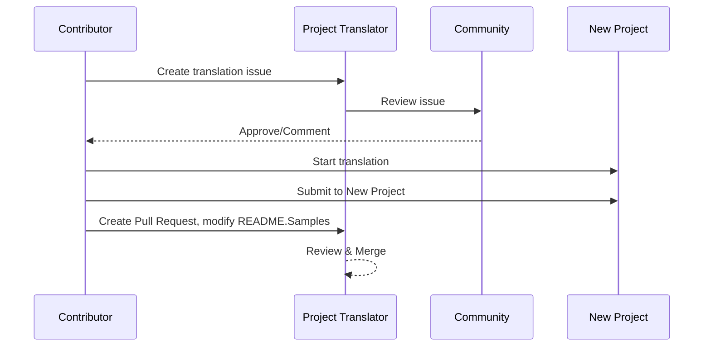

# 專案翻譯器

A VSCode extension: An easy-to-use tool for multi-language localization of projects.

<!--
## 可用的翻譯

The extension supports translation to these languages:

- [簡體中文 (zh-cn)](./README.zh-cn.md)
- [繁體中文 (zh-tw)](./README.zh-tw.md)
- [日本語 (ja-jp)](./README.ja-jp.md)
- [한국어 (ko-kr)](./README.ko-kr.md)
- [Français (fr-fr)](./README.fr-fr.md)
- [Deutsch (de-de)](./README.de-de.md)
- [Español (es-es)](./README.es-es.md)
- [Português (pt-br)](./README.pt-br.md)
- [Русский (ru-ru)](./README.ru-ru.md)
- [العربية (ar-sa)](./README.ar-sa.md)
- [العربية (ar-ae)](./README.ar-ae.md)
- [العربية (ar-eg)](./README.ar-eg.md) --> 

## 樣本
| 專案                                                                             | 原倉庫                                                                                       | 描述                                                                                                                                                               | 星標 | 標籤                                                                                                                                                                                                                                                                                                                                                                                                                                                                                                                                                                                                                                                                 |
| ----------------------------------------------------------------------------------- | --------------------------------------------------------------------------------------------------------- | ------------------------------------------------------------------------------------------------------------------------------------------------------------------------- | ----- | -------------------------------------------------------------------------------------------------------------------------------------------------------------------------------------------------------------------------------------------------------------------------------------------------------------------------------------------------------------------------------------------------------------------------------------------------------------------------------------------------------------------------------------------------------------------------------------------------------------------------------------------------------------------- |
| [algorithm-visualizer](https://github.com/Project-Translation/algorithm-visualizer) | [algorithm-visualizer/algorithm-visualizer](https://github.com/algorithm-visualizer/algorithm-visualizer) | :fireworks:從程式碼視覺化演算法的互動線上平台                                                                                               | 47301 | [`演算法`](https://github.com/topics/algorithm), [`動畫`](https://github.com/topics/animation), [`資料結構`](https://github.com/topics/data-structure), [`視覺化`](https://github.com/topics/visualization)                                                                                                                                                                                                                                                                                                                                                                                                                                     |
| [algorithms](https://github.com/Project-Translation/algorithms)                     | [algorithm-visualizer/algorithms](https://github.com/algorithm-visualizer/algorithms)                     | :crystal_ball:演算法視覺化                                                                                                                                    | 401   | N/A                                                                                                                                                                                                                                                                                                                                                                                                                                                                                                                                                                                                                                                                  |
| [cline-docs](https://github.com/Project-Translation/cline-docs)                     | [cline/cline](https://github.com/cline/cline)                                                             | 在您的 IDE 中，具備每一步都需要您的許可來建立/編輯檔案、執行命令、使用瀏覽器等功能的自主編碼代理程式。 | 39572 | N/A                                                                                                                                                                                                                                                                                                                                                                                                                                                                                                                                                                                                                                                                  |
| [cursor-docs](https://github.com/Project-Translation/cursor-docs)                   | [getcursor/docs](https://github.com/getcursor/docs)                                                       | Cursor 的開放原始碼文件                                                                                                                                        | 309   | N/A                                                                                                                                                                                                                                                                                                                                                                                                                                                                                                                                                                                                                                                                  |
| [gobyexample](https://github.com/Project-Translation/gobyexample)                   | [mmcgrana/gobyexample](https://github.com/mmcgrana/gobyexample)                                           | Go by Example                                                                                                                                                             | 7523  | N/A                                                                                                                                                                                                                                                                                                                                                                                                                                                                                                                                                                                                                                                                  |
| [golang-website](https://github.com/Project-Translation/golang-website)             | [golang/website](https://github.com/golang/website)                                                       | [鏡像] go.dev 和 golang.org 網站的家                                                                                                                       | 402   | N/A                                                                                                                                                                                                                                                                                                                                                                                                                                                                                                                                                                                                                                                                  |
| [reference-en-us](https://github.com/Project-Translation/reference-en-us)           | [Fechin/reference](https://github.com/Fechin/reference)                                                   | ⭕ 分享開發人員的快速參考備忘單                                                                                                                      | 7808  | [`awk`](https://github.com/topics/awk), [`bash`](https://github.com/topics/bash), [`chatgpt`](https://github.com/topics/chatgpt), [`cheatsheet`](https://github.com/topics/cheatsheet), [`cheatsheets`](https://github.com/topics/cheatsheets), [`css`](https://github.com/topics/css), [`golang`](https://github.com/topics/golang), [`grep`](https://github.com/topics/grep), [`markdown`](https://github.com/topics/markdown), [`python`](https://github.com/topics/python), [`reference`](https://github.com/topics/reference), [`sed`](https://github.com/topics/sed), [`snippets`](https://github.com/topics/snippets), [`vim`](https://github.com/topics/vim) |
| [styleguide](https://github.com/Project-Translation/styleguide)                     | [google/styleguide](https://github.com/google/styleguide)                                                 | Google 起源的開放原始碼專案的風格指南                                                                                                                   | 38055 | [`cpplint`](https://github.com/topics/cpplint), [`style-guide`](https://github.com/topics/style-guide), [`styleguide`](https://github.com/topics/styleguide)                                                                                                                                                                                                                                                                                                                                                                                                                                                                                                         |
| [vscode-docs](https://github.com/Project-Translation/vscode-docs)                   | [microsoft/vscode-docs](https://github.com/microsoft/vscode-docs)                                         | Visual Studio Code 的公開文件                                                                                                                               | 5914  | [`vscode`](https://github.com/topics/vscode)                                                                                                                                                                                                                                                                                                                                                                                                                                                                                                                                                                                                                         |

## 請求專案翻譯

如果您想貢獻翻譯或需要翻譯一個專案：

1. 使用以下範本建立一個議題：

```md
**Project**: [project_url]
**Target Language**: [target_lang]
**Description**: Brief description of why this translation would be valuable
```

2. 工作流程：


3. PR 合併後，翻譯將被新增至 Samples 區段。

目前翻譯進行中：[檢視 Issues](https://github.com/Project-Translation/project_translator/issues)

## 功能

- 📁 資料夾層級翻譯支援
  - 將整個專案資料夾翻譯成多種語言
  - 維持原資料夾結構和層級
  - 支援遞迴翻譯子資料夾
  - 自動偵測可翻譯內容
  - 批次處理以有效處理大型翻譯
- 📄 檔案層級翻譯支援
  - 將個別檔案翻譯成多種語言
  - 保留原檔案結構和格式
  - 支援資料夾和檔案翻譯模式
- 💡 智慧型 AI 翻譯
  - 自動維持程式碼結構完整性
  - 僅翻譯程式碼註解，保留程式邏輯
  - 維持 JSON/XML 等資料結構格式
  - 專業技術文件翻譯品質
- ⚙️ 靈活配置
  - 配置來源資料夾和多個目標資料夾
  - 支援自訂檔案翻譯間隔
  - 設定特定檔案類型忽略
  - 支援多個 AI 模型選項
- 🚀 使用者友善操作
  - 即時顯示翻譯進度
  - 支援暫停/繼續/停止翻譯
  - 自動維護目標資料夾結構
  - 遞增翻譯以避免重複工作

## 安裝

1. 在 VS Code 擴充功能市集搜尋 "[Project Translator](https://marketplace.visualstudio.com/items?itemName=techfetch-dev.project-translator)"
2. 點擊安裝

## 配置

擴充功能支援以下配置選項：

```json
{
  "projectTranslator.specifiedFolders": [
    {
      "sourceFolder": {
        "path": "Source folder path",
        "lang": "Source language code"
      },
      "destFolders": [
        {
          "path": "Target folder path",
          "lang": "Target language code"
        }
      ]
    }
  ],
  "projectTranslator.specifiedFiles": [
    {
      "sourceFile": {
        "path": "Source file path",
        "lang": "Source language code"
      },
      "destFiles": [
        {
          "path": "Target file path",
          "lang": "Target language code"
        }
      ]
    }
  ],
  "projectTranslator.currentVendor": "openai",
  "projectTranslator.vendors": [
    {
      "name": "openai",
      "apiEndpoint": "API endpoint URL",
      "apiKey": "API authentication key",
      "model": "Model name to use",
      "rpm": "Maximum requests per minute",
      "maxTokensPerSegment": 4096,
      "timeout": 30,
      "temperature": 0.0
    }
  ]
}
```

關鍵配置細節：

| Configuration Option                        | Description                                                                                    |
| ------------------------------------------- | ---------------------------------------------------------------------------------------------- |
| `projectTranslator.specifiedFolders`        | 多個來源資料夾及其對應的目標資料夾，用於翻譯                                                   |
| `projectTranslator.specifiedFiles`          | 多個來源檔案及其對應的目標檔案，用於翻譯                                                      |
| `projectTranslator.translationIntervalDays` | 翻譯間隔天數（預設 7 天）                                                                     |
| `projectTranslator.copyOnly`                | 要複製但不翻譯的檔案（包含 `paths` 和 `extensions` 陣列）                                    |
| `projectTranslator.ignore`                  | 要完全忽略的檔案（包含 `paths` 和 `extensions` 陣列）                                         |
| `projectTranslator.currentVendor`           | 目前使用的 API 供應商                                                                         |
| `projectTranslator.vendors`                 | API 供應商配置清單                                                                            |
| `projectTranslator.systemPrompts`           | 系統提示陣列，用於引導翻譯過程                                                                |
| `projectTranslator.userPrompts`             | 使用者定義的提示陣列，這些提示會在翻譯期間新增至系統提示之後                                  |
| `projectTranslator.segmentationMarkers`     | 依檔案類型配置的分段標記，支援正規表示式                                                      |

## 使用方式

1. 開啟命令選單 (Ctrl+Shift+P / Cmd+Shift+P)
2. 輸入 "Translate Project" 並選取命令
3. 如果來源資料夾未配置，會出現資料夾選取對話框
4. 等待翻譯完成

翻譯期間：

- 可以通过狀態列按鈕暫停/繼續翻譯
- 隨時可以停止翻譯過程
- 翻譯進度顯示在通知區域
- 詳細日誌顯示在輸出面板

## 注意事項
- 確保足夠的 API 使用配額
- 建議先使用小專案測試
- 使用專用的 API 金鑰並在完成後移除它們

## 授權

[授權](LICENSE)