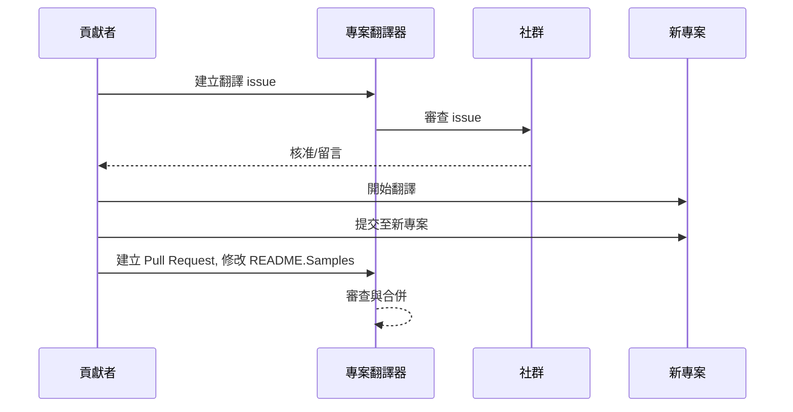

# 專案翻譯器

一個易於使用的 VS Code 擴充功能，用於專案的多語言本地化。

專案儲存庫: `https://github.com/Project-Translation/project_translator`

<!--  -->


## 可用翻譯

此擴充功能支援翻譯至以下語言：

- [简体中文 (zh-cn)](./README.zh-cn.md)
- [繁體中文 (zh-tw)](./README.zh-tw.md)
- [日本語 (ja-jp)](./README.ja-jp.md)
- [한국어 (ko-kr)](./README.ko-kr.md)
- [Français (fr-fr)](./README.fr-fr.md)
- [Deutsch (de-de)](./README.de-de.md)
- [Español (es-es)](./README.es-es.md)
- [Português (pt-br)](./README.pt-br.md)
- [Русский (ru-ru)](./README.ru-ru.md)
- [العربية (ar-sa)](./README.ar-sa.md)
- [العربية (ar-ae)](./README.ar-ae.md)
- [العربية (ar-eg)](./README.ar-eg.md)

## 範例

| 專案                                                                                | 原始儲存庫                                                                                                    | 描述                                                                                                                                                                      | Stars | 標籤                                                                                                                                                                                                                                                                                                                                                                                                                                                                                                                                                                                                                                                                 |
| ----------------------------------------------------------------------------------- | ------------------------------------------------------------------------------------------------------------- | ------------------------------------------------------------------------------------------------------------------------------------------------------------------------- | ----- | -------------------------------------------------------------------------------------------------------------------------------------------------------------------------------------------------------------------------------------------------------------------------------------------------------------------------------------------------------------------------------------------------------------------------------------------------------------------------------------------------------------------------------------------------------------------------------------------------------------------------------------------------------------------- |
| [algorithm-visualizer](https://github.com/Project-Translation/algorithm-visualizer) | [algorithm-visualizer/algorithm-visualizer](https://github.com/algorithm-visualizer/algorithm-visualizer) | :fireworks:可視化程式碼演算法的互動式線上平台                                                                                                                            | 47301 | [`algorithm`](https://github.com/topics/algorithm), [`animation`](https://github.com/topics/animation), [`data-structure`](https://github.com/topics/data-structure), [`visualization`](https://github.com/topics/visualization)                                                                                                                                                                                                                                                                                                                                                                                                                                     |
| [algorithms](https://github.com/Project-Translation/algorithms)                     | [algorithm-visualizer/algorithms](https://github.com/algorithm-visualizer/algorithms)                     | :crystal_ball:演算法視覺化                                                                                                                                               | 401   | N/A                                                                                                                                                                                                                                                                                                                                                                                                                                                                                                                                                                                                                                                                  |
| [cline-docs](https://github.com/Project-Translation/cline-docs)                     | [cline/cline](https://github.com/cline/cline)                                                                 | 在您的 IDE 中直接運行的自主編程代理，能夠建立/編輯檔案、執行指令、使用瀏覽器，並在每一步都徵求您的許可。                                                                   | 39572 | N/A                                                                                                                                                                                                                                                                                                                                                                                                                                                                                                                                                                                                                                                                  |
| [cursor-docs](https://github.com/Project-Translation/cursor-docs)                   | [getcursor/docs](https://github.com/getcursor/docs)                                                           | Cursor 的開源文件                                                                                                                                                         | 309   | N/A                                                                                                                                                                                                                                                                                                                                                                                                                                                                                                                                                                                                                                                                  |
| [gobyexample](https://github.com/Project-Translation/gobyexample)                   | [mmcgrana/gobyexample](https://github.com/mmcgrana/gobyexample)                                             | Go by Example                                                                                                                                                             | 7523  | N/A                                                                                                                                                                                                                                                                                                                                                                                                                                                                                                                                                                                                                                                                  |
| [golang-website](https://github.com/Project-Translation/golang-website)             | [golang/website](https://github.com/golang/website)                                                           | [mirror] go.dev 和 golang.org 網站的首頁                                                                                                                                  | 402   | N/A                                                                                                                                                                                                                                                                                                                                                                                                                                                                                                                                                                                                                                                                  |
| [reference-en-us](https://github.com/Project-Translation/reference-en-us)           | [Fechin/reference](https://github.com/Fechin/reference)                                                       | ⭕ 為開發者分享快速參考小抄。                                                                                                                                             | 7808  | [`awk`](https://github.com/topics/awk), [`bash`](https://github.com/topics/bash), [`chatgpt`](https://github.com/topics/chatgpt), [`cheatsheet`](https://github.com/topics/cheatsheet), [`cheatsheets`](https://github.com/topics/cheatsheets), [`css`](https://github.com/topics/css), [`golang`](https://github.com/topics/golang), [`grep`](https://github.com/topics/grep), [`markdown`](https://github.com/topics/markdown), [`python`](https://github.com/topics/python), [`reference`](https://github.com/topics/reference), [`sed`](https://github.com/topics/sed), [`snippets`](https://github.com/topics/snippets), [`vim`](https://github.com/topics/vim) |
| [styleguide](https://github.com/Project-Translation/styleguide)                     | [google/styleguide](https://github.com/google/styleguide)                                                     | Google 起源的開源專案樣式指南                                                                                                                                               | 38055 | [`cpplint`](https://github.com/topics/cpplint), [`style-guide`](https://github.com/topics/style-guide), [`styleguide`](https://github.com/topics/styleguide)                                                                                                                                                                                                                                                                                                                                                                                                                                                                                                         |
| [vscode-docs](https://github.com/Project-Translation/vscode-docs)                   | [microsoft/vscode-docs](https://github.com/microsoft/vscode-docs)                                             | Visual Studio Code 的公開文件                                                                                                                                             | 5914  | [`vscode`](https://github.com/topics/vscode)                                                                                                                                                                                                                                                                                                                                                                                                                                                                                                                                                                                                                         |

## 請求專案翻譯

如果您想貢獻翻譯或需要翻譯專案：

1. 使用以下範本建立一個 issue：

```md
**專案**: [專案網址]
**目標語言**: [目標語言]
**描述**: 簡要說明此翻譯的價值
```

2. 工作流程：



3. 在 PR 合併後，該翻譯將被新增至範例區塊。

目前進行中的翻譯：[檢視 Issues](https://github.com/Project-Translation/project_translator/issues)

## 功能

- 📁 資料夾層級翻譯支援
  - 將整個專案資料夾翻譯成多種語言
  - 維護原始資料夾結構和階層
  - 支援子資料夾的遞迴翻譯
  - 自動偵測可翻譯的內容
  - 針對大型專案進行高效的批次處理
- 📄 檔案層級翻譯支援
  - 將單一檔案翻譯成多種語言
  - 保留原始檔案結構和格式
  - 同時支援資料夾和檔案翻譯模式
- 💡 AI 智慧翻譯
  - 自動維護程式碼結構完整性
  - 僅翻譯程式碼註解，保留程式碼邏輯
  - 維護 JSON/XML 和其他資料結構格式
  - 專業的技術文件翻譯品質
- ⚙️ 彈性配置
  - 配置來源資料夾和多個目標資料夾
  - 支援自訂檔案翻譯間隔
  - 設定要忽略的特定檔案類型
  - 支援多種 AI 模型選項
- 🚀 友善使用者操作
  - 即時顯示翻譯進度
  - 支援暫停/繼續/停止翻譯
  - 自動維護目標資料夾結構
  - 增量翻譯以避免重複工作
- 🔄 差異化翻譯 (實驗性)
  - Diff-apply 模式，用於高效更新現有翻譯
  - 僅翻譯變更內容，減少 API 使用量
  - 以最少編輯保留版本歷史
  - ⚠️ 實驗性功能 - 詳情請參閱 [進階功能](#差異化翻譯-diff-apply-模式)

## 安裝

1. 在 VS Code 擴充功能市場中搜尋 "[Project Translator](https://marketplace.visualstudio.com/items?itemName=techfetch-dev.project-translator)"
2. 點擊安裝
   
或者，從 Visual Studio Marketplace 安裝：`https://marketplace.visualstudio.com/items?itemName=techfetch-dev.project-translator` 或在 VS Code 擴充功能檢視中搜尋 `techfetch-dev.project-translator`。

## 配置

此擴充功能支援以下配置選項：

```json
{
  "projectTranslator.specifiedFolders": [
    {
      "sourceFolder": {
        "path": "來源資料夾路徑",
        "lang": "來源語言代碼"
      },
      "targetFolders": [
        {
          "path": "目標資料夾路徑",
          "lang": "目標語言代碼"
        }
      ]
    }
  ],
  "projectTranslator.specifiedFiles": [
    {
      "sourceFile": {
        "path": "來源檔案路徑",
        "lang": "來源語言代碼"
      },
      "targetFiles": [
        {
          "path": "目標檔案路徑",
          "lang": "目標語言代碼"
        }
      ]
    }
  ],
  "projectTranslator.currentVendor": "openai",
  "projectTranslator.vendors": [
    {
      "name": "openai",
      "apiEndpoint": "API 端點 URL",
      "apiKeyEnvVarName": "MY_OPENAI_API_KEY",
      "model": "gpt-4o",
      "rpm": "10",
      "maxTokensPerSegment": 4096,
      "timeout": 30,
      "temperature": 0.0
    }
  ],
  "projectTranslator.userPrompts": [
      "1. Should return no need translate if the markdown file has 'draft' set to 'true' in the front matter.",
      "2. './readmes/' in the sentences should replace with './'",
  ],
  "projectTranslator.ignore": {
    "paths": [
      "**/node_modules/**"
    ],
    "extensions": [
      ".log"
    ]
  },
}
```

主要配置詳情：

| 配置選項                                   | 描述                                                                                               |
| ------------------------------------------ | ------------------------------------------------------------------------------------------------- |
| `projectTranslator.specifiedFolders`       | 多個來源資料夾及其對應的翻譯目標資料夔                                                             |
| `projectTranslator.specifiedFiles`         | 多個來源檔案及其對應的翻譯目標檔案                                                                 |
| `projectTranslator.translationIntervalDays` | 翻譯間隔天數 (預設 7 天)                                                                           |
| `projectTranslator.copyOnly`               | 僅複製不翻譯的檔案 (包含 `paths` 和 `extensions` 陣列)                                             |
| `projectTranslator.ignore`                 | 完全忽略的檔案 (包含 `paths` 和 `extensions` 陣列)                                                 |
| `projectTranslator.skipFrontMatterMarkers` | 根據 Front Matter 標記跳過檔案 (包含 `enabled` 和 `markers` 陣列)                                 |
| `projectTranslator.currentVendor`          | 目前使用的 API 供應商                                                                              |
| `projectTranslator.vendors`                | API 供應商配置列表 (可直接使用 apiKey 或使用 apiKeyEnvVarName 設定環境變數)                       |
| `projectTranslator.systemPrompts`          | 用於指導翻譯過程的系統提示詞陣列                                                                   |
| `projectTranslator.userPrompts`            | 使用者定義的提示詞陣列，這些提示詞會在翻譯時附加在系統提示詞之後                                   |
| `projectTranslator.segmentationMarkers`    | 依檔案類型設定的分段標記，支援正規表示式                                                           |
| `projectTranslator.debug`                  | 啟用偵錯模式，將所有 API 請求和回應記錄到輸出通道 (預設: false)                                   |
| `projectTranslator.logFile`                | 偵錯日誌檔案的配置 (請參閱 [日誌檔案功能](./docs/log-file-feature.md))                              |
| `projectTranslator.diffApply.enabled`      | 啟用實驗性的差異化翻譯模式 (預設: false)                                                           |

## 使用方式

1. 開啟命令面板 (Ctrl+Shift+P / Cmd+Shift+P)
2. 輸入 "Translate Project" 並選擇該指令
3. 如果未設定來源資料夾，將會出現資料夾選擇對話框
4. 等待翻譯完成

翻譯期間：

- 可透過狀態列按鈕暫停/繼續翻譯
- 可隨時停止翻譯過程
- 翻譯進度顯示在通知區域
- 詳細日誌顯示在輸出面板中

## 開發

### 建置系統

此擴充功能使用 esbuild 進行快速打包和開發：

#### 可用腳本

- `npm run build` - 生產環境建置，包含壓縮
- `npm run compile` - 開發環境建置
- `npm run watch` - 開發用的監看模式
- `npm test` - 執行測試

#### VS Code 任務

- **建置** (Ctrl+Shift+P → "Tasks: Run Task" → "build") - 為生產環境打包擴充功能
- **監看** (Ctrl+Shift+P → "Tasks: Run Task" → "watch") - 開發模式，自動重建

### 開發環境設定

1. 複製儲存庫
2. 執行 `npm install` 安裝相依套件
3. 按下 `F5` 開始偵錯，或執行 "watch" 任務進行開發

esbuild 配置：

- 將所有 TypeScript 檔案打包到單一 `out/extension.js` 檔案中
- 排除 VS Code API (標記為外部)

## 進階功能

### 使用環境變數設定 API 金鑰

專案翻譯器支援使用環境變數來設定 API 金鑰，這是比直接在配置檔案中儲存 API 金鑰更安全的方法：

1. 使用 `apiKeyEnvVarName` 屬性配置您的供應商：

```json
{
  "projectTranslator.vendors": [
    {
      "name": "openai",
      "apiEndpoint": "https://api.openai.com/v1",
      "apiKeyEnvVarName": "OPENAI_API_KEY",
      "model": "gpt-4"
    },
    {
      "name": "openrouter",
      "apiEndpoint": "https://openrouter.ai/api/v1",
      "apiKeyEnvVarName": "OPENROUTER_API_KEY",
      "model": "anthropic/claude-3-opus"
    }
  ]
}
```

2. 在您的系統中設定環境變數：
   - 在 Windows 上: `set OPENAI_API_KEY=your_api_key`
   - 在 macOS/Linux 上: `export OPENAI_API_KEY=your_api_key`

3. 當擴充功能執行時，它將會：
   - 首先檢查配置中是否直接提供了 `apiKey`
   - 如果沒有，它將尋找由 `apiKeyEnvVarName` 指定的環境變數

這種方法可以讓您的 API 金鑰遠離配置檔案和版本控制系統。

### 根據 Front Matter 跳過翻譯

專案翻譯器可以根據 Markdown 檔案的 Front Matter 元資料跳過翻譯。這對於草稿文件或標記為不需要翻譯的檔案很有用。

要啟用此功能，請配置 `projectTranslator.skipFrontMatterMarkers` 選項：

```json
{
  "projectTranslator.skipFrontMatterMarkers": {
    "enabled": true,
    "markers": [
      {
        "key": "draft",
        "value": "true"
      },
      {
        "key": "translate",
        "value": "false"
      }
    ]
  }
}
```

使用此配置，任何 Front Matter 包含 `draft: true` 或 `translate: false` 的 Markdown 檔案都將在翻譯期間被跳過，並直接複製到目標位置。

會被跳過的 Markdown 檔案範例：
```
---
draft: true
title: "草稿文件"
---

此文件為草稿，不應被翻譯。
```

### 差異化翻譯 (Diff-Apply) 模式

> **⚠️ 實驗性功能警告**：差異化翻譯模式目前為實驗性功能，可能存在穩定性和相容性問題。建議在生產環境中謹慎使用，並始終備份重要檔案。

此擴充功能支援一個可選的差異化翻譯模式。啟用後，擴充功能會將來源內容和現有的翻譯目標檔案一起發送給模型。模型應該回傳一個或多個 SEARCH/REPLACE 區塊 (純文字，無程式碼圍欄)。擴充功能會在本地應用這些區塊，以最小化變更、減少 API 使用量，並更好地保留版本歷史。

- **切換**：在 VS Code 設定或 `project.translation.json` 中配置 `projectTranslator.diffApply.enabled` (預設: `false`)。
- **選項**：
  - `validationLevel`: `normal` 或 `strict` (預設: `normal`)。在 `strict` 模式下，無效的標記或匹配失敗將導致錯誤，擴充功能將回退到標準翻譯流程。
  - `autoBackup`: 如果為 true，在套用編輯前建立目標檔案的 `.bak` 備份 (預設: `true`)。
  - `maxOperationsPerFile`: (為相容性保留) 新策略未使用。

工作流程：
1. 如果 `diffApply.enabled` 為 `true` 且目標檔案存在，擴充功能會讀取來源和目標內容。
2. 它使用差異化提示詞呼叫模型，並要求回傳純文字的 SEARCH/REPLACE 區塊。
3. 在本地，擴充功能會解析並應用 SEARCH/REPLACE 區塊。如果應用失敗，它將回退到正常的完整翻譯並覆寫目標檔案。

SEARCH/REPLACE 範例 (允許多個區塊)：

```
<<<<<<< SEARCH
:start_line: 10
-------
const label = "Old"
=======
const label = "New"
>>>>>>> REPLACE

<<<<<<< SEARCH
:start_line: 25
-------
function foo() {
  return 1
}
=======
function foo() {
  return 2
}
>>>>>>> REPLACE
```

注意事項：
- 在 SEARCH 區塊中使用包含縮排和空白字元的確切內容。如果不確定，請使用最新的檔案內容。
- 在 SEARCH 和 REPLACE 之間保持一行 `=======`。
- 如果不需要變更，模型應回傳空字串。

為何差異化翻譯目前表現不佳 (解釋)

- **跨語言對齊和比較的挑戰**：差異化翻譯需要將原始的來源文件和現有的翻譯文件一起發送給模型，模型必須跨語言比較它們，以決定翻譯的哪些部分需要變更。這是一項比就地修改單一文件根本困難得多的任務，因為模型必須準確對齊不同語言的片段並判斷語義差異。

- **格式和邊界保留的複雜性**：許多文件包含程式碼區塊、表格、前端標記或特殊佔位符。一個可靠的差異化工作流程必須在進行文字編輯的同時保留這些結構。如果模型無法一致地產生嚴格遵循 SEARCH/REPLACE 格式的結果，自動套用編輯可能會引入格式回歸或結構錯誤。

- **上下文和術語一致性問題**：小的、本地化的編輯通常依賴於更廣泛的上下文和現有的術語/風格詞彙表。當被要求產生最小編輯時，模型可能會忽略全局一致性 (術語、風格、註解、變數名稱)，導致翻譯不一致或語義偏移。

- **模型穩定性和成本權衡**：實現可靠的差異化翻譯需要具有強大比較推理能力和穩定、可預測輸出格式的模型。目前主流模型無法以合理的成本可靠地同時提供強大的跨語言對齊和嚴格格式的輸出，因此系統通常會回退到完整重新翻譯以確保正確性。

因此，雖然差異化翻譯理論上可以減少昂貴的輸出 token 並更好地保留版本歷史，但它目前受到模型的跨語言比較能力和輸出穩定性的限制。此功能仍為實驗性；建議的緩解措施包括保持自動備份 (`autoBackup: true`)、使用寬鬆的驗證級別 (`validationLevel: "normal"`)，以及在匹配或格式失敗時回退到完整重新翻譯。未來，專門的雙語對齊後處理器或自訂的小型模型可能會提高差異化方法的穩定性。

成本節省及其幫助的原因

- **輸入與輸出 token 成本**：大型模型 API 通常對輸入 (提示詞) 和輸出 (完成) token 收取不同的費用。通常，輸出 token 顯著更昂貴，因為模型會產生較長的文字。Diff-apply 有幫助，因為我們將**更新的來源 (輸入)**和**現有的翻譯檔案 (輸入)**發送給模型，並要求一個緊湊的編輯 JSON。模型的回應是一個小的 JSON (少量輸出 token)，而不是完整的重新翻譯檔案 (大量輸出 token)，因此您為昂貴的輸出部分支付的費用要少得多。

- **僅發送已變更的內容**：差異化翻譯指示模型計算最小的編輯操作來更新現有翻譯，而不是在小變更發生時重新翻譯整個檔案。這對於先前已翻譯且僅接收增量編輯的檔案特別有效。

- **最適合格式化檔案**：具有嚴格格式的檔案 (JSON, XML, 包含程式碼區塊的 Markdown) 大有裨益，因為 diff-apply 保留了結構，且僅變更需要翻譯的文字部分。這減少了格式相關回歸和模型重新格式化引起的額外輸出 token 的機會。

- **以行為導向的基本單元，更智慧的聚合**：該工具將基本翻譯單元視為「行」，SEARCH/REPLACE 策略在 `:start_line:` 附近應用精確或模糊匹配。使用 `validationLevel: "normal"` 進行寬鬆行為，使用 `"strict"` 在需要保守、精確編輯時使用。

何時使用 diff-apply：

- 當目標檔案已存在且先前已翻譯時使用。
- 用於大型、格式化的文件，重新翻譯整個檔案會很昂貴。
- 對於沒有任何先前翻譯的全新檔案，或當您想要全新的重新翻譯時，請避免使用。


### 設計文件

- 為開發建置產生 source maps
- 為生產建置壓縮程式碼
- 為 VS Code 提供問題匹配器整合

## 注意事項

- 確保足夠的 API 使用配額
- 建議先從小型專案開始測試
- 使用專用的 API 金鑰並在完成後移除

## 授權

[授權](LICENSE)