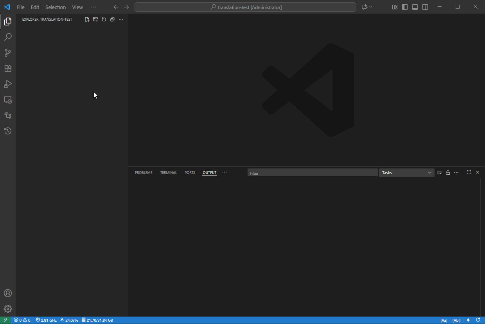

# 專案翻譯器

一個易於使用的 VS Code 擴充功能，用於專案的多語言在地化。

專案儲存庫：`https://github.com/Project-Translation/project_translator`

## 安裝

1. 市集：
   - VS Code 擴充功能市集：[https://marketplace.visualstudio.com/items?itemName=techfetch-dev.project-translator](https://marketplace.visualstudio.com/items?itemName=techfetch-dev.project-translator)
   - Open VSX 註冊表：[https://open-vsx.org/extension/techfetch-dev/project-translator](https://open-vsx.org/extension/techfetch-dev/project-translator)
2. 在 VS Code 擴充功能視圖中搜尋 `techfetch-dev.project-translator` 並點擊安裝

<!--  -->


## 可用翻譯

本擴充功能支援翻譯至以下語言：

- [简体中文 (zh-cn)](./README.zh-cn.md)
- [繁體中文 (zh-tw)](./README.zh-tw.md)
- [日本語 (ja-jp)](./README.ja-jp.md)
- [한국어 (ko-kr)](./README.ko-kr.md)
- [Français (fr-fr)](./README.fr-fr.md)
- [Deutsch (de-de)](./README.de-de.md)
- [Español (es-es)](./README.es-es.md)
- [Português (pt-br)](./README.pt-br.md)
- [Русский (ru-ru)](./README.ru-ru.md)
- [العربية (ar-sa)](./README.ar-sa.md)
- [العربية (ar-ae)](./README.ar-ae.md)
- [العربية (ar-eg)](./README.ar-eg.md)

## 範例

| 專案                                                                             | 原始儲存庫                                                                                       | 描述                                                                                                                                                               | 星數 | 標籤                                                                                                                                                                                                                                                                                                                                                                                                                                                                                                                                                                                                                                                                 |
| ----------------------------------------------------------------------------------- | --------------------------------------------------------------------------------------------------------- | ------------------------------------------------------------------------------------------------------------------------------------------------------------------------- | ----- | -------------------------------------------------------------------------------------------------------------------------------------------------------------------------------------------------------------------------------------------------------------------------------------------------------------------------------------------------------------------------------------------------------------------------------------------------------------------------------------------------------------------------------------------------------------------------------------------------------------------------------------------------------------------- |
| [algorithm-visualizer](https://github.com/Project-Translation/algorithm-visualizer) | [algorithm-visualizer/algorithm-visualizer](https://github.com/algorithm-visualizer/algorithm-visualizer) | :fireworks:互動式線上平台，可視化程式碼中的演算法                                                                                               | 47301 | [`algorithm`](https://github.com/topics/algorithm), [`animation`](https://github.com/topics/animation), [`data-structure`](https://github.com/topics/data-structure), [`visualization`](https://github.com/topics/visualization)                                                                                                                                                                                                                                                                                                                                                                                                                                     |
| [algorithms](https://github.com/Project-Translation/algorithms)                     | [algorithm-visualizer/algorithms](https://github.com/algorithm-visualizer/algorithms)                     | :crystal_ball:演算法可視化                                                                                                                                    | 401   | N/A                                                                                                                                                                                                                                                                                                                                                                                                                                                                                                                                                                                                                                                                  |
| [cline-docs](https://github.com/Project-Translation/cline-docs)                     | [cline/cline](https://github.com/cline/cline)                                                             | 在您的 IDE 中運行的自主編碼代理，能夠創建/編輯檔案、執行命令、使用瀏覽器，並在每個步驟獲得您的許可。 | 39572 | N/A                                                                                                                                                                                                                                                                                                                                                                                                                                                                                                                                                                                                                                                                  |
| [cursor-docs](https://github.com/Project-Translation/cursor-docs)                   | [getcursor/docs](https://github.com/getcursor/docs)                                                       | Cursor 的開源文件                                                                                                                                        | 309   | N/A                                                                                                                                                                                                                                                                                                                                                                                                                                                                                                                                                                                                                                                                  |
| [gobyexample](https://github.com/Project-Translation/gobyexample)                   | [mmcgrana/gobyexample](https://github.com/mmcgrana/gobyexample)                                           | Go 語言範例                                                                                                                                                             | 7523  | N/A                                                                                                                                                                                                                                                                                                                                                                                                                                                                                                                                                                                                                                                                  |
| [golang-website](https://github.com/Project-Translation/golang-website)             | [golang/website](https://github.com/golang/website)                                                       | [鏡像] go.dev 和 golang.org 網站的所在地                                                                                                                       | 402   | N/A                                                                                                                                                                                                                                                                                                                                                                                                                                                                                                                                                                                                                                                                  |
| [reference-en-us](https://github.com/Project-Translation/reference-en-us)           | [Fechin/reference](https://github.com/Fechin/reference)                                                   | ⭕ 分享開發者的快速參考速查表                                                                                                                      | 7808  | [`awk`](https://github.com/topics/awk), [`bash`](https://github.com/topics/bash), [`chatgpt`](https://github.com/topics/chatgpt), [`cheatsheet`](https://github.com/topics/cheatsheet), [`cheatsheets`](https://github.com/topics/cheatsheets), [`css`](https://github.com/topics/css), [`golang`](https://github.com/topics/golang), [`grep`](https://github.com/topics/grep), [`markdown`](https://github.com/topics/markdown), [`python`](https://github.com/topics/python), [`reference`](https://github.com/topics/reference), [`sed`](https://github.com/topics/sed), [`snippets`](https://github.com/topics/snippets), [`vim`](https://github.com/topics/vim) |
| [styleguide](https://github.com/Project-Translation/styleguide)                     | [google/styleguide](https://github.com/google/styleguide)                                                 | Google 開源專案的風格指南                                                                                                                   | 38055 | [`cpplint`](https://github.com/topics/cpplint), [`style-guide`](https://github.com/topics/style-guide), [`styleguide`](https://github.com/topics/styleguide)                                                                                                                                                                                                                                                                                                                                                                                                                                                                                                         |
| [vscode-docs](https://github.com/Project-Translation/vscode-docs)                   | [microsoft/vscode-docs](https://github.com/microsoft/vscode-docs)                                         | Visual Studio Code 的公開文件                                                                                                                               | 5914  | [`vscode`](https://github.com/topics/vscode)                                                                                                                                                                                                                                                                                                                                                                                                                                                                                                                                                                                                                         |

## 請求專案翻譯

如果您想貢獻翻譯或需要翻譯某個專案：

1. 使用以下模板建立議題：

```md
**專案**：[project_url]
**目標語言**：[target_lang]
**描述**：簡要說明此翻譯的價值
```

2. 工作流程：

```mermaid
sequenceDiagram
  貢獻者->>專案翻譯器：建立翻譯議題
  專案翻譯器->>社群：審查議題
  社群-->>貢獻者：核准/評論
  貢獻者->>新專案：開始翻譯
  貢獻者->>新專案：提交至新專案
  貢獻者->>專案翻譯器：建立 Pull Request，修改 README.Samples
  專案翻譯器-->>專案翻譯器：審查與合併
```

3. PR 合併後，翻譯將被加入範例區塊。

目前進行中的翻譯：[查看議題](https://github.com/Project-Translation/project_translator/issues)

## 功能特色

- 📁 資料夾層級翻譯支援
  - 將整個專案資料夾翻譯為多種語言
  - 保持原始資料夾結構與層級
  - 支援子資料夾遞迴翻譯
  - 自動偵測可翻譯內容
  - 批次處理大規模翻譯
- 📄 檔案層級翻譯支援
  - 將單一檔案翻譯為多種語言
  - 保持原始檔案結構與格式
  - 同時支援資料夾與檔案翻譯模式
- 💡 智慧 AI 翻譯
  - 自動維護程式碼結構完整性
  - 僅翻譯程式註解，保留程式邏輯
  - 維護 JSON/XML 等資料結構格式
  - 專業技術文件翻譯品質
- ⚙️ 靈活配置
  - 配置來源資料夾與多個目標資料夾
  - 支援自訂檔案翻譯間隔
  - 設定特定檔案類型忽略
  - 支援多種 AI 模型選項
- 🚀 使用者友善操作
  - 即時顯示翻譯進度
  - 支援暫停/繼續/停止翻譯
  - 自動維護目標資料夾結構
  - 增量翻譯避免重複工作
- 🔄 差異化翻譯 (實驗性)
  - Diff-apply 模式高效更新現有翻譯
  - 僅翻譯變更內容減少 API 用量
  - 最小化編輯保留版本歷史
  - ⚠️ 實驗性功能 - 詳見[進階功能](#差異化翻譯-diff-apply-模式)

## 配置

本擴充功能支援以下配置選項：

```json
{
  "projectTranslator.specifiedFolders": [
    {
      "sourceFolder": {
        "path": "來源資料夾路徑",
        "lang": "來源語言代碼"
      },
      "targetFolders": [
        {
          "path": "目標資料夾路徑",
          "lang": "目標語言代碼"
        }
      ]
    }
  ],
  "projectTranslator.specifiedFiles": [
    {
      "sourceFile": {
        "path": "來源檔案路徑",
        "lang": "來源語言代碼"
      },
      "targetFiles": [
        {
          "path": "目標檔案路徑",
          "lang": "目標語言代碼"
        }
      ]
    }
  ],
  "projectTranslator.currentVendor": "openai",
  "projectTranslator.vendors": [
    {
      "name": "openai",
      "apiEndpoint": "API 端點 URL",
      "apiKeyEnvVarName": "MY_OPENAI_API_KEY",
      "model": "gpt-4o",
      "rpm": "10",
      "maxTokensPerSegment": 4096,
      "timeout": 180,
      "temperature": 0.1
    }
  ],
  "projectTranslator.userPrompts": [
      "1. 如果 Markdown 文件的前置數據（front matter）中 'draft' 設置為 'true'，則應返回無需翻譯。",
      "2. './readmes/' 在句子中應替換為 './'",
  ],
  "projectTranslator.ignore": {
    "paths": [
      "**/node_modules/**"
    ],
    "extensions": [
      ".log"
    ]
  },
}
```

關鍵配置細節：

| 配置選項                        | 描述                                                                                    |
| ------------------------------------------- | ---------------------------------------------------------------------------------------------- |
| `projectTranslator.specifiedFolders`        | 多個來源資料夾及其對應的目標資料夾用於翻譯           |
| `projectTranslator.specifiedFiles`          | 多個來源檔案及其對應的目標檔案用於翻譯               |
| `projectTranslator.translationIntervalDays` | 翻譯間隔天數 (預設 7 天)                                                  |
| `projectTranslator.copyOnly`                | 僅複製不翻譯的檔案 (包含 `paths` 和 `extensions` 陣列)                         |
| `projectTranslator.ignore`                  |