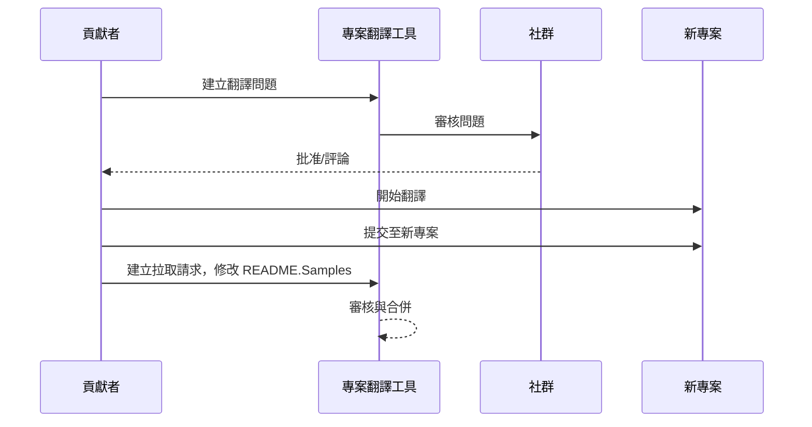

# 專案翻譯工具

一個 VSCode 擴充功能：易於使用的專案多語言本地化工具。

## 可用翻譯

此擴充功能支援翻譯至以下語言：

- [简体中文 (zh-cn)](./README.zh-cn.md)
- [繁體中文 (zh-tw)](./README.zh-tw.md)
- [日本語 (ja-jp)](./README.ja-jp.md)
- [한국어 (ko-kr)](./README.ko-kr.md)
- [Français (fr-fr)](./README.fr-fr.md)
- [Deutsch (de-de)](./README.de-de.md)
- [Español (es-es)](./README.es-es.md)
- [Português (pt-br)](./README.pt-br.md)
- [Русский (ru-ru)](./README.ru-ru.md)
- [العربية (ar-sa)](./README.ar-sa.md)
- [العربية (ar-ae)](./README.ar-ae.md)
- [العربية (ar-eg)](./README.ar-eg.md)

## 範例

| 專案                                                                             | 原始儲存庫                                                                                       | 描述                                                                                                                                                               | 星星數 | 標籤                                                                                                                                                                                                                                                                                                                                                                                                                                                                                                                                                                                                                                                                 |
| ----------------------------------------------------------------------------------- | --------------------------------------------------------------------------------------------------------- | ------------------------------------------------------------------------------------------------------------------------------------------------------------------------- | ----- | -------------------------------------------------------------------------------------------------------------------------------------------------------------------------------------------------------------------------------------------------------------------------------------------------------------------------------------------------------------------------------------------------------------------------------------------------------------------------------------------------------------------------------------------------------------------------------------------------------------------------------------------------------------------- |
| [algorithm-visualizer](https://github.com/Project-Translation/algorithm-visualizer) | [algorithm-visualizer/algorithm-visualizer](https://github.com/algorithm-visualizer/algorithm-visualizer) | :fireworks:可視化程式碼演算法的互動式線上平台                                                                                               | 47301 | [`algorithm`](https://github.com/topics/algorithm), [`animation`](https://github.com/topics/animation), [`data-structure`](https://github.com/topics/data-structure), [`visualization`](https://github.com/topics/visualization)                                                                                                                                                                                                                                                                                                                                                                                                                                     |
| [algorithms](https://github.com/Project-Translation/algorithms)                     | [algorithm-visualizer/algorithms](https://github.com/algorithm-visualizer/algorithms)                     | :crystal_ball:演算法可視化                                                                                                                                    | 401   | N/A                                                                                                                                                                                                                                                                                                                                                                                                                                                                                                                                                                                                                                                                  |
| [cline-docs](https://github.com/Project-Translation/cline-docs)                     | [cline/cline](https://github.com/cline/cline)                                                             | 自主編碼代理，直接在您的 IDE 中，能夠在您每一步授權下建立/編輯檔案、執行命令、使用瀏覽器等。 | 39572 | N/A                                                                                                                                                                                                                                                                                                                                                                                                                                                                                                                                                                                                                                                                  |
| [cursor-docs](https://github.com/Project-Translation/cursor-docs)                   | [getcursor/docs](https://github.com/getcursor/docs)                                                       | Cursor 的開源文件                                                                                                                                        | 309   | N/A                                                                                                                                                                                                                                                                                                                                                                                                                                                                                                                                                                                                                                                                  |
| [gobyexample](https://github.com/Project-Translation/gobyexample)                   | [mmcgrana/gobyexample](https://github.com/mmcgrana/gobyexample)                                           | Go 范例                                                                                                                                                             | 7523  | N/A                                                                                                                                                                                                                                                                                                                                                                                                                                                                                                                                                                                                                                                                  |
| [golang-website](https://github.com/Project-Translation/golang-website)             | [golang/website](https://github.com/golang/website)                                                       | [mirror] go.dev 和 golang.org 網站的所在地                                                                                                                       | 402   | N/A                                                                                                                                                                                                                                                                                                                                                                                                                                                                                                                                                                                                                                                                  |
| [reference-en-us](https://github.com/Project-Translation/reference-en-us)           | [Fechin/reference](https://github.com/Fechin/reference)                                                   | ⭕ 分享開發人員快速參考備忘表。                                                                                                                      | 7808  | [`awk`](https://github.com/topics/awk), [`bash`](https://github.com/topics/bash), [`chatgpt`](https://github.com/topics/chatgpt), [`cheatsheet`](https://github.com/topics/cheatsheet), [`cheatsheets`](https://github.com/topics/cheatsheets), [`css`](https://github.com/topics/css), [`golang`](https://github.com/topics/golang), [`grep`](https://github.com/topics/grep), [`markdown`](https://github.com/topics/markdown), [`python`](https://github.com/topics/python), [`reference`](https://github.com/topics/reference), [`sed`](https://github.com/topics/sed), [`snippets`](https://github.com/topics/snippets), [`vim`](https://github.com/topics/vim) |
| [styleguide](https://github.com/Project-Translation/styleguide)                     | [google/styleguide](https://github.com/google/styleguide)                                                 | Google 開源專案的風格指南                                                                                                                   | 38055 | [`cpplint`](https://github.com/topics/cpplint), [`style-guide`](https://github.com/topics/style-guide), [`styleguide`](https://github.com/topics/styleguide)                                                                                                                                                                                                                                                                                                                                                                                                                                                                                                         |
| [vscode-docs](https://github.com/Project-Translation/vscode-docs)                   | [microsoft/vscode-docs](https://github.com/microsoft/vscode-docs)                                         | Visual Studio Code 的公開文件                                                                                                                               | 5914  | [`vscode`](https://github.com/topics/vscode)                                                                                                                                                                                                                                                                                                                                                                                                                                                                                                                                                                                                                         |

## 請求專案翻譯

如果您想貢獻翻譯或需要翻譯某個專案：

1. 使用以下範本建立問題：

```md
**專案**: [project_url]
**目標語言**: [target_lang]
**描述**: 簡要說明此翻譯的價值
```

2. 工作流程：



3. PR 合併後，翻譯將被加入範例區段。

目前正在進行的翻譯：[查看問題](https://github.com/Project-Translation/project_translator/issues)

## 功能

- 📁 資料夾層級翻譯支援
  - 將整個專案資料夾翻譯成多種語言
  - 保持原始資料夾結構與層級
  - 支援子資料夾的遞迴翻譯
  - 自動檢測可翻譯內容
  - 批次處理以提高大規模翻譯效率
- 📄 檔案層級翻譯支援
  - 將個別檔案翻譯成多種語言
  - 保留原始檔案結構與格式
  - 支援資料夾和檔案翻譯模式
- 💡 AI 智慧翻譯
  - 自動保持程式碼結構完整性
  - 僅翻譯程式碼註解，保留程式碼邏輯
  - 維持 JSON/XML 和其他資料結構格式
  - 專業技術文件翻譯品質
- ⚙️ 靈活配置
  - 設定來源資料夾與多個目標資料夾
  - 支援自訂檔案翻譯間隔
  - 設定特定檔案類型忽略
  - 支援多種 AI 模型選項
- 🚀 使用者友善操作
  - 即時顯示翻譯進度
  - 支援暫停/繼續/停止翻譯
  - 自動維護目標資料夾結構
  - 增量翻譯以避免重複工作

## 安裝

1. 在 VS Code 擴充功能市集中搜尋「[專案翻譯工具](https://marketplace.visualstudio.com/items?itemName=techfetch-dev.project-translator)」
2. 點擊安裝

## 設定

此擴充功能支援以下設定選項：

```json
{
  "projectTranslator.specifiedFolders": [
    {
      "sourceFolder": {
        "path": "來源資料夾路徑",
        "lang": "來源語言代碼"
      },
      "targetFolders": [
        {
          "path": "目標資料夾路徑",
          "lang": "目標語言代碼"
        }
      ]
    }
  ],
  "projectTranslator.specifiedFiles": [
    {
      "sourceFile": {
        "path": "來源檔案路徑",
        "lang": "來源語言代碼"
      },
      "targetFiles": [
        {
          "path": "目標檔案路徑",
          "lang": "目標語言代碼"
        }
      ]
    }
  ],
  "projectTranslator.currentVendor": "openai",
  "projectTranslator.vendors": [
    {
      "name": "openai",
      "apiEndpoint": "API 端點 URL",
      "apiKey": "API 認證金鑰",
      "apiKeyEnvVarName": "API 金鑰的環境變數名稱",
      "model": "要使用的模型名稱",
      "rpm": "每分鐘最大請求數",
      "maxTokensPerSegment": 4096,
      "timeout": 30,
      "temperature": 0.0
    }
  ]
}
```

主要設定細節：

| 設定選項                                   | 說明                                                                                      |
| ------------------------------------------ | ---------------------------------------------------------------------------------------- |
| `projectTranslator.specifiedFolders`       | 多個用於翻譯的原始資料夾及其對應的目的地資料夾                                            |
| `projectTranslator.specifiedFiles`         | 多個用於翻譯的原始檔案及其對應的目的地檔案                                                |
| `projectTranslator.translationIntervalDays`| 翻譯間隔天數（預設為 7 天）                                                               |
| `projectTranslator.copyOnly`               | 僅複製但不翻譯的檔案（包含 `paths` 和 `extensions` 陣列）                                 |
| `projectTranslator.ignore`                 | 完全忽略的檔案（包含 `paths` 和 `extensions` 陣列）                                       |
| `projectTranslator.skipFrontMatterMarkers` | 根據前置標記跳過檔案（包含 `enabled` 和 `markers` 陣列）                                  |
| `projectTranslator.currentVendor`          | 目前使用的 API 提供商                                                                    |
| `projectTranslator.vendors`                | API 提供商設定清單（可直接使用 apiKey 或使用 apiKeyEnvVarName 指定環境變數）             |
| `projectTranslator.systemPrompts`          | 用於引導翻譯流程的系統提示詞陣列                                                          |
| `projectTranslator.userPrompts`            | 使用者自訂提示詞陣列，這些提示詞將在翻譯時加在系統提示詞之後                               |
| `projectTranslator.segmentationMarkers`    | 按檔案類型設定的分段標記，支援正規表示式                                                   |
| `projectTranslator.debug`                  | 啟用除錯模式，將所有 API 請求與回應記錄到輸出通道（預設：false）                          |
| `projectTranslator.logFile`                | 除錯日誌檔案設定（參見 [日誌檔案功能](./docs/log-file-feature.md)）                        |

## 使用方式

1. 開啟指令面板（Ctrl+Shift+P / Cmd+Shift+P）
2. 輸入「翻譯專案」並選擇該指令
3. 若未設定原始資料夾，將出現資料夾選擇對話框
4. 等待翻譯完成

翻譯過程中：

- 可透過狀態列按鈕暫停／繼續翻譯
- 可隨時停止翻譯程序
- 翻譯進度會顯示於通知區域
- 詳細日誌會顯示於輸出面板

## 開發

### 建置系統

此擴充功能使用 esbuild 進行快速打包與開發：

#### 可用指令

- `npm run build` - 用於正式環境的建置，包含壓縮
- `npm run compile` - 開發建置
- `npm run watch` - 開發用的監聽模式
- `npm test` - 執行測試

#### VS Code 工作

- **建置**（Ctrl+Shift+P →「工作：執行工作」→「build」） - 將擴充功能打包用於正式環境
- **監聽**（Ctrl+Shift+P →「工作：執行工作」→「watch」） - 開發模式並自動重新建置

### 開發設定

1. 複製此儲存庫
2. 執行 `npm install` 安裝相依套件
3. 按下 `F5` 開始除錯，或執行「watch」工作進行開發

esbuild 設定：

- 將所有 TypeScript 檔案打包成單一的 `out/extension.js`
- 排除 VS Code API（標示為 external）

## 進階功能

### 使用環境變數管理 API 金鑰

專案翻譯工具支援使用環境變數來設定 API 金鑰，這比直接將金鑰儲存在設定檔中更安全：

1. 在提供者設定中加入 `apiKeyEnvVarName` 屬性：

```json
{
  "projectTranslator.vendors": [
    {
      "name": "openai",
      "apiEndpoint": "https://api.openai.com/v1",
      "apiKeyEnvVarName": "OPENAI_API_KEY",
      "model": "gpt-4"
    },
    {
      "name": "openrouter",
      "apiEndpoint": "https://openrouter.ai/api/v1",
      "apiKeyEnvVarName": "OPENROUTER_API_KEY",
      "model": "anthropic/claude-3-opus"
    }
  ]
}
```

2. 在系統中設定環境變數：
   - Windows：`set OPENAI_API_KEY=your_api_key`
   - macOS/Linux：`export OPENAI_API_KEY=your_api_key`

3. 當擴充功能執行時，會：
   - 首先檢查設定中是否直接提供了 `apiKey`
   - 若無，則尋找 `apiKeyEnvVarName` 指定的環境變數

此方法可避免將 API 金鑰存入設定檔或版本控制系統中。

### 根據前置標記跳過翻譯

專案翻譯工具可根據 Markdown 檔案的前置標記（front matter）元資料跳過翻譯。此功能適用於草稿文件或標記為無需翻譯的檔案。

要啟用此功能，請設定 `projectTranslator.skipFrontMatterMarkers` 選項：

```json
{
  "projectTranslator.skipFrontMatterMarkers": {
    "enabled": true,
    "markers": [
      {
        "key": "draft",
        "value": "true"
      },
      {
        "key": "translate",
        "value": "false"
      }
    ]
  }
}
```

設定後，任何前置標記中包含 `draft: true` 或 `translate: false` 的 Markdown 檔案都將在翻譯過程中被跳過，並直接複製到目標位置。

範例：以下 Markdown 檔案將被跳過：
```
---
draft: true
title: "草稿文件"
---

此文件為草稿，不應翻譯。
```


### 設計文件

- 為開發建置產生原始碼對應圖（source maps）
- 為正式環境建置壓縮程式碼
- 提供 VS Code 的問題比對器（problem matcher）整合

## 注意事項

- 確保 API 使用額度足夠
- 建議先以小型專案測試
- 使用專用 API 金鑰，完成後即移除

## 授權

[授權](LICENSE)