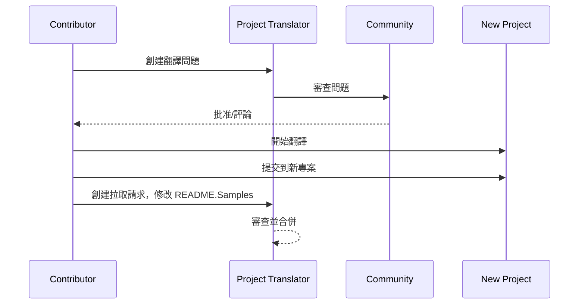

# 專案翻譯器

一個 VSCode 擴充功能：一個易於使用的工具，用於專案的多語言本地化。

<!--
## 可用翻譯

該擴充功能支持翻譯成以下語言：

- [简体中文 (zh-cn)](./readmes/README.zh-cn.md)
- [繁體中文 (zh-tw)](./readmes/README.zh-tw.md)
- [日本語 (ja-jp)](./readmes/README.ja-jp.md)
- [한국어 (ko-kr)](./readmes/README.ko-kr.md)
- [Français (fr-fr)](./readmes/README.fr-fr.md)
- [Deutsch (de-de)](./readmes/README.de-de.md)
- [Español (es-es)](./readmes/README.es-es.md)
- [Português (pt-br)](./readmes/README.pt-br.md)
- [Русский (ru-ru)](./readmes/README.ru-ru.md)
- [العربية (ar-sa)](./readmes/README.ar-sa.md)
- [العربية (ar-ae)](./readmes/README.ar-ae.md)
- [العربية (ar-eg)](./readmes/README.ar-eg.md) -->

## 範例

| 專案                                                                             | 原始儲存庫                                                                                       | 描述                                                                                                                                                               | 星數 | 標籤                                                                                                                                                                                                                                                                                                                                                                                                                                                                                                                                                                                                                                                                 |
| ----------------------------------------------------------------------------------- | --------------------------------------------------------------------------------------------------------- | ------------------------------------------------------------------------------------------------------------------------------------------------------------------------- | ----- | -------------------------------------------------------------------------------------------------------------------------------------------------------------------------------------------------------------------------------------------------------------------------------------------------------------------------------------------------------------------------------------------------------------------------------------------------------------------------------------------------------------------------------------------------------------------------------------------------------------------------------------------------------------------- |
| [algorithm-visualizer](https://github.com/Project-Translation/algorithm-visualizer) | [algorithm-visualizer/algorithm-visualizer](https://github.com/algorithm-visualizer/algorithm-visualizer) | :fireworks:互動式在線平台，可視化來自代碼的算法                                                                                               | 47301 | [`algorithm`](https://github.com/topics/algorithm), [`animation`](https://github.com/topics/animation), [`data-structure`](https://github.com/topics/data-structure), [`visualization`](https://github.com/topics/visualization)                                                                                                                                                                                                                                                                                                                                                                                                                                     |
| [algorithms](https://github.com/Project-Translation/algorithms)                     | [algorithm-visualizer/algorithms](https://github.com/algorithm-visualizer/algorithms)                     | :crystal_ball:算法可視化                                                                                                                                    | 401   | N/A                                                                                                                                                                                                                                                                                                                                                                                                                                                                                                                                                                                                                                                                  |
| [cline-docs](https://github.com/Project-Translation/cline-docs)                     | [cline/cline](https://github.com/cline/cline)                                                             | 在您的 IDE 中自主編碼代理，能夠創建/編輯文件、執行命令、使用瀏覽器等，並在每一步獲得您的許可。 | 39572 | N/A                                                                                                                                                                                                                                                                                                                                                                                                                                                                                                                                                                                                                                                                  |
| [cursor-docs](https://github.com/Project-Translation/cursor-docs)                   | [getcursor/docs](https://github.com/getcursor/docs)                                                       | Cursor 的開源文檔                                                                                                                                        | 309   | N/A                                                                                                                                                                                                                                                                                                                                                                                                                                                                                                                                                                                                                                                                  |
| [gobyexample](https://github.com/Project-Translation/gobyexample)                   | [mmcgrana/gobyexample](https://github.com/mmcgrana/gobyexample)                                           | Go 範例                                                                                                                                                             | 7523  | N/A                                                                                                                                                                                                                                                                                                                                                                                                                                                                                                                                                                                                                                                                  |
| [golang-website](https://github.com/Project-Translation/golang-website)             | [golang/website](https://github.com/golang/website)                                                       | [鏡像] go.dev 和 golang.org 網站的主頁                                                                                                                       | 402   | N/A                                                                                                                                                                                                                                                                                                                                                                                                                                                                                                                                                                                                                                                                  |
| [reference-en-us](https://github.com/Project-Translation/reference-en-us)           | [Fechin/reference](https://github.com/Fechin/reference)                                                   | ⭕ 分享開發者的快速參考速查表。                                                                                                                      | 7808  | [`awk`](https://github.com/topics/awk), [`bash`](https://github.com/topics/bash), [`chatgpt`](https://github.com/topics/chatgpt), [`cheatsheet`](https://github.com/topics/cheatsheet), [`cheatsheets`](https://github.com/topics/cheatsheets), [`css`](https://github.com/topics/css), [`golang`](https://github.com/topics/golang), [`grep`](https://github.com/topics/grep), [`markdown`](https://github.com/topics/markdown), [`python`](https://github.com/topics/python), [`reference`](https://github.com/topics/reference), [`sed`](https://github.com/topics/sed), [`snippets`](https://github.com/topics/snippets), [`vim`](https://github.com/topics/vim) |
| [styleguide](https://github.com/Project-Translation/styleguide)                     | [google/styleguide](https://github.com/google/styleguide)                                                 | Google 開源專案的風格指南                                                                                                                   | 38055 | [`cpplint`](https://github.com/topics/cpplint), [`style-guide`](https://github.com/topics/style-guide), [`styleguide`](https://github.com/topics/styleguide)                                                                                                                                                                                                                                                                                                                                                                                                                                                                                                         |
| [vscode-docs](https://github.com/Project-Translation/vscode-docs)                   | [microsoft/vscode-docs](https://github.com/microsoft/vscode-docs)                                         | Visual Studio Code 的公開文檔                                                                                                                               | 5914  | [`vscode`](https://github.com/topics/vscode)                                                                                                                                                                                                                                                                                                                                                                                                                                                                                                                                                                                                                         |

## 請求專案翻譯

如果您想貢獻翻譯或需要翻譯某個專案：

1. 使用以下模板創建一個問題：

```md
**專案**: [project_url]
**目標語言**: [target_lang]
**描述**: 簡要描述為什麼這個翻譯有價值
```

2. 工作流程：



3. 合併 PR 後，翻譯將被添加到範例部分。

正在進行的翻譯：[查看問題](https://github.com/Project-Translation/project_translator/issues)

## 功能

- 📁 文件夾級別翻譯支持
  - 將整個專案文件夾翻譯成多種語言
  - 保持原始文件夾結構和層次結構
  - 支持子文件夾的遞歸翻譯
  - 自動檢測可翻譯內容
  - 批量處理以提高大規模翻譯效率
- 📄 文件級別翻譯支持
  - 將單個文件翻譯成多種語言
  - 保留原始文件結構和格式
  - 支持文件夾和文件翻譯模式
- 💡 智能翻譯與 AI
  - 自動維護代碼結構完整性
  - 僅翻譯代碼註釋，保留代碼邏輯
  - 維護 JSON/XML 和其他數據結構格式
  - 專業技術文檔翻譯質量
- ⚙️ 靈活配置
  - 配置源文件夾和多個目標文件夾
  - 支持自定義文件翻譯間隔
  - 設置特定文件類型以忽略
  - 支持多種 AI 模型選項
- 🚀 用戶友好操作
  - 實時翻譯進度顯示
  - 支持暫停/恢復/停止翻譯
  - 自動維護目標文件夾結構
  - 增量翻譯以避免重複工作
- 🔄 高級差異應用翻譯
  - **精確更新**：僅翻譯實際更改的內容
  - **逐行控制**：保持精確的格式和結構
  - **增量翻譯**：非常適合維護翻譯文檔
  - **版本控制友好**：生成最小、有針對性的更改
  - **成本效益**：通過僅翻譯差異來減少 API 調用
  - **自動備份**：在應用更改之前自動創建備份文件

## 安裝

1. 在 VS Code 擴展市場中搜索 "[Project Translator](https://marketplace.visualstudio.com/items?itemName=techfetch-dev.project-translator)"
2. 點擊安裝

## 配置

該擴充功能支持以下配置選項：

```json
{
  "projectTranslator.specifiedFolders": [
    {
      "sourceFolder": {
        "path": "源文件夾路徑",
        "lang": "源語言代碼"
      },
      "targetFolders": [
        {
          "path": "目標文件夾路徑",
          "lang": "目標語言代碼"
        }
      ]
    }
  ],
  "projectTranslator.diffApply": {
    "enabled": true,
    "validationLevel": "normal",
    "autoBackup": true,
    "maxOperationsPerFile": 100
  },
  "projectTranslator.specifiedFiles": [
    {
      "sourceFile": {
        "path": "源文件路徑",
        "lang": "源語言代碼"
      },
      "targetFiles": [
        {
          "path": "目標文件路徑",
          "lang": "目標語言代碼"
        }
      ]
    }
  ],
  "projectTranslator.currentVendor": "openai",
  "projectTranslator.vendors": [
    {
      "name": "openai",
      "apiEndpoint": "API 端點 URL",
      "apiKey": "API 認證密鑰",
      "model": "使用的模型名稱",
      "rpm": "每分鐘最大請求數",
      "maxTokensPerSegment": 4096,
      "timeout": 30,
      "temperature": 0.0
    }
  ]
}
```

關鍵配置詳情：

| 配置選項                        | 描述                                                                                    |
| ------------------------------------------- | ---------------------------------------------------------------------------------------------- |
| `projectTranslator.specifiedFolders`        | 多個源文件夾及其對應的目標文件夾用於翻譯           |
| `projectTranslator.specifiedFiles`          | 多個源文件及其對應的目標文件用於翻譯               |
| `projectTranslator.translationIntervalDays` | 翻譯間隔天數（默認 7 天）                                                  |
| `projectTranslator.copyOnly`                | 僅複製但不翻譯的文件（帶有 `paths` 和 `extensions` 數組）                         |
| `projectTranslator.ignore`                  | 完全忽略的文件（帶有 `paths` 和 `extensions` 數組）                              |
| `projectTranslator.currentVendor`           | 當前使用的 API 供應商                                                                      |
| `projectTranslator.vendors`                 | API 供應商配置列表                                                                  |
| `projectTranslator.systemPrompts`           | 系統提示數組，用於指導翻譯過程                                        |
| `projectTranslator.userPrompts`             | 用戶定義的提示數組，這些提示將在翻譯期間添加到系統提示之後 |
| `projectTranslator.segmentationMarkers`     | 按文件類型配置的分段標記，支持正則表達式                     |
| `projectTranslator.debug`                   | 啟用調試模式以將所有 API 請求和響應記錄到輸出通道（默認：false）    |
| `projectTranslator.logFile`                 | 調試日誌文件的配置（參見 [日誌文件功能](./docs/log-file-feature.md)）        |

## 使用

1. 打開命令面板 (Ctrl+Shift+P / Cmd+Shift+P)
2. 輸入 "Translate Project" 並選擇命令
3. 如果未配置源文件夾，將出現文件夾選擇對話框
4. 等待翻譯完成

翻譯期間：

- 可以通過狀態欄按鈕暫停/恢復翻譯
- 可以隨時停止翻譯過程
- 翻譯進度顯示在通知區域
- 詳細日誌顯示在輸出面板中

## 開發

### 構建系統

該擴充功能使用 esbuild 進行快速打包和開發：

#### 可用腳本

- `npm run build` - 生產構建，帶有壓縮
- `npm run compile` - 開發構建
- `npm run watch` - 開發監視模式
- `npm test` - 運行測試

#### VS Code 任務

- **構建** (Ctrl+Shift+P → "Tasks: Run Task" → "build") - 為生產打包擴充功能
- **監視** (Ctrl+Shift+P → "Tasks: Run Task" → "watch") - 開發模式，帶有自動重建

### 開發設置

1. 克隆存儲庫
2. 運行 `npm install` 安裝依賴項
3. 按 `F5` 開始調試或運行 "watch" 任務進行開發

esbuild 配置：

- 將所有 TypeScript 文件打包成單個 `out/extension.js`
- 排除 VS Code API（標記為外部）

## 高級功能

### 差異應用翻譯

有關高級差異應用翻譯模式的詳細信息，請參見 [差異應用使用指南](./docs/diff-apply-usage.md)。

此功能啟用：
- 精確的逐行翻譯更新
- 減少大文件的 API 成本
- 更好的版本控制集成
- 保留文檔格式

### 設計文檔

有關差異應用實現的技術細節，請參見 [差異應用翻譯設計](./docs/diff-apply-translation-design.md)。
- 為開發構建生成源映射
- 為生產構建壓縮代碼
- 提供問題匹配器集成以用於 VS Code

## 注意事項

- 確保有足夠的 API 使用配額
- 建議先使用小型專案進行測試
- 使用專用的 API 密鑰並在完成後刪除

## 許可證

[許可證](LICENSE)