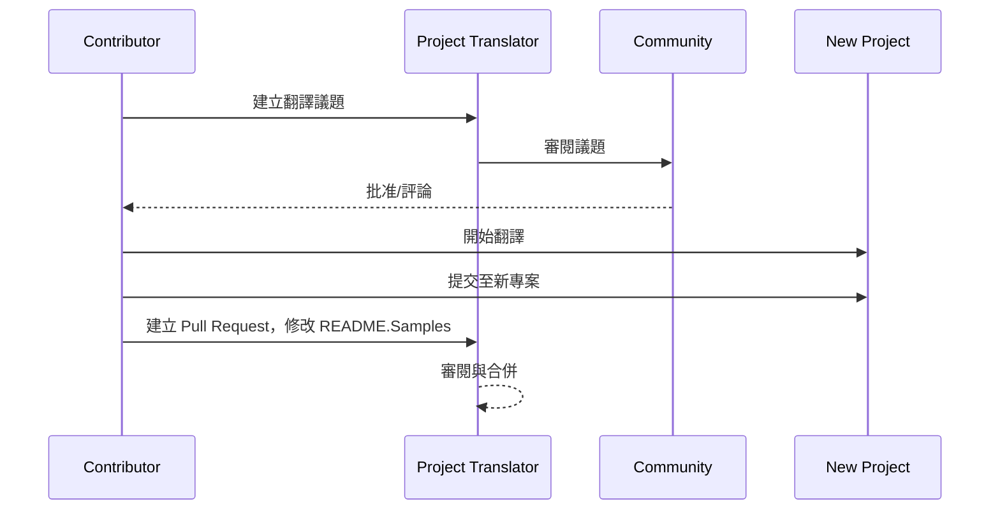

# Project Translator

一個易於使用的 VS Code 擴充功能，用於專案的多語言本地化。

專案儲存庫：`https://github.com/Project-Translation/project_translator`

## 安裝

1. 市場：
   - VS Code Extensions Marketplace: [https://marketplace.visualstudio.com/items?itemName=techfetch-dev.project-translator](https://marketplace.visualstudio.com/items?itemName=techfetch-dev.project-translator)
   - Open VSX Registry: [https://open-vsx.org/extension/techfetch-dev/project-translator](https://open-vsx.org/extension/techfetch-dev/project-translator)
2. 在 VS Code 擴充功能檢視中搜尋 `techfetch-dev.project-translator` 並點擊安裝

<!--  -->


## 可用翻譯

此擴充功能支援翻譯至以下語言：

- [简体中文 (zh-cn)](./README.zh-cn.md)
- [繁體中文 (zh-tw)](./README.zh-tw.md)
- [日本語 (ja-jp)](./README.ja-jp.md)
- [한국어 (ko-kr)](./README.ko-kr.md)
- [Français (fr-fr)](./README.fr-fr.md)
- [Deutsch (de-de)](./README.de-de.md)
- [Español (es-es)](./README.es-es.md)
- [Português (pt-br)](./README.pt-br.md)
- [Русский (ru-ru)](./README.ru-ru.md)
- [العربية (ar-sa)](./README.ar-sa.md)
- [العربية (ar-ae)](./README.ar-ae.md)
- [العربية (ar-eg)](./README.ar-eg.md)

## 樣本

| 專案 | 原始儲存庫 | 描述 | 星數 | 標籤 |
| --- | --- | --- | --- | --- |
| [algorithm-visualizer](https://github.com/Project-Translation/algorithm-visualizer) | [algorithm-visualizer/algorithm-visualizer](https://github.com/algorithm-visualizer/algorithm-visualizer) | :fireworks:互動式線上平台，可從程式碼視覺化演算法 | 47301 | [`algorithm`](https://github.com/topics/algorithm), [`animation`](https://github.com/topics/animation), [`data-structure`](https://github.com/topics/data-structure), [`visualization`](https://github.com/topics/visualization) |
| [algorithms](https://github.com/Project-Translation/algorithms) | [algorithm-visualizer/algorithms](https://github.com/algorithm-visualizer/algorithms) | :crystal_ball:演算法視覺化 | 401 | N/A |
| [cline-docs](https://github.com/Project-Translation/cline-docs) | [cline/cline](https://github.com/cline/cline) | 在您的 IDE 中提供自主編程代理，能夠在您的許可下建立/編輯檔案、執行命令、使用瀏覽器等。 | 39572 | N/A |
| [cursor-docs](https://github.com/Project-Translation/cursor-docs) | [getcursor/docs](https://github.com/getcursor/docs) | Cursor 的開源文件 | 309 | N/A |
| [gobyexample](https://github.com/Project-Translation/gobyexample) | [mmcgrana/gobyexample](https://github.com/mmcgrana/gobyexample) | Go 範例 | 7523 | N/A |
| [golang-website](https://github.com/Project-Translation/golang-website) | [golang/website](https://github.com/golang/website) | [鏡像] go.dev 和 golang.org 網站的首頁 | 402 | N/A |
| [reference-en-us](https://github.com/Project-Translation/reference-en-us) | [Fechin/reference](https://github.com/Fechin/reference) | ⭕ 分享開發者的快速參考备忘單。 | 7808 | [`awk`](https://github.com/topics/awk), [`bash`](https://github.com/topics/bash), [`chatgpt`](https://github.com/topics/chatgpt), [`cheatsheet`](https://github.com/topics/cheatsheet), [`cheatsheets`](https://github.com/topics/cheatsheets), [`css`](https://github.com/topics/css), [`golang`](https://github.com/topics/golang), [`grep`](https://github.com/topics/grep), [`markdown`](https://github.com/topics/markdown), [`python`](https://github.com/topics/python), [`reference`](https://github.com/topics/reference), [`sed`](https://github.com/topics/sed), [`snippets`](https://github.com/topics/snippets), [`vim`](https://github.com/topics/vim) |
| [styleguide](https://github.com/Project-Translation/styleguide) | [google/styleguide](https://github.com/google/styleguide) | Google 起源的開源專案的風格指南 | 38055 | [`cpplint`](https://github.com/topics/cpplint), [`style-guide`](https://github.com/topics/style-guide), [`styleguide`](https://github.com/topics/styleguide) |
| [vscode-docs](https://github.com/Project-Translation/vscode-docs) | [microsoft/vscode-docs](https://github.com/microsoft/vscode-docs) | Visual Studio Code 的公開文件 | 5914 | [`vscode`](https://github.com/topics/vscode) |

## 請求專案翻譯

如果您想要貢獻翻譯或需要翻譯專案：

1. 使用以下範本建立議題：

```md
**Project**: [project_url]
**Target Language**: [target_lang]
**Description**: Brief description of why this translation would be valuable
```

2. 工作流程：


```mermaid
sequenceDiagram
  Contributor->>Project Translator: 建立翻譯議題
  Project Translator->>Community: 審閱議題
  Community-->>Contributor: 批准/評論
  Contributor->>New Project: 開始翻譯
  Contributor->>New Project: 提交至新專案
  Contributor->>Project Translator: 建立 Pull Request，修改 README.Samples
  Project Translator-->>Project Translator: 審閱與合併
```

3. PR 合併後，翻譯將新增至樣本區段。

目前正在進行的翻譯：[查看議題](https://github.com/Project-Translation/project_translator/issues)

## 功能

- 📁 資料夾級別翻譯支援
  - 將整個專案資料夾翻譯為多種語言
  - 維護原始資料夾結構和階層
  - 支援子資料夾的遞迴翻譯
  - 自動檢測可翻譯內容
  - 批次處理以提高大規模翻譯效率
- 📄 檔案級別翻譯支援
  - 將個別檔案翻譯為多種語言
  - 保留原始檔案結構和格式
  - 支援資料夾和檔案翻譯模式
- 💡 智慧 AI 翻譯
  - 自動維護程式碼結構完整性
  - 僅翻譯程式碼註解，保留程式碼邏輯
  - 維護 JSON/XML 和其他資料結構格式
  - 專業技術文件翻譯品質
- ⚙️ 彈性配置
  - 配置來源資料夾和多個目標資料夾
  - 支援自訂檔案翻譯間隔
  - 設定要忽略的特定檔案類型
  - 支援多種 AI 模型選項
- 🚀 使用者友好操作
  - 即時翻譯進度顯示
  - 支援暫停/恢復/停止翻譯
  - 自動維護目標資料夾結構
  - 增量翻譯以避免重複工作
- 🔄 差異翻譯（實驗性）
  - 差異套用模式，可高效更新現有翻譯
  - 僅翻譯變更內容，減少 API 使用量
  - 以最小編輯保留版本歷史
  - ⚠️ 實驗性功能 - 詳見[進階功能](#differential-translation-diff-apply-mode)

## 配置

此擴充功能支援以下配置選項：

```json
{
  "projectTranslator.specifiedFolders": [
    {
      "sourceFolder": {
        "path": "Source folder path",
        "lang": "Source language code"
      },
      "targetFolders": [
        {
          "path": "Target folder path",
          "lang": "Target language code"
        }
      ]
    }
  ],
  "projectTranslator.specifiedFiles": [
    {
      "sourceFile": {
        "path": "Source file path",
        "lang": "Source language code"
      },
      "targetFiles": [
        {
          "path": "Target file path",
          "lang": "Target language code"
        }
      ]
    }
  ],
  "projectTranslator.currentVendor": "openai",
  "projectTranslator.vendors": [
    {
      "name": "openai",
      "apiEndpoint": "API endpoint URL",
      "apiKeyEnvVarName": "MY_OPENAI_API_KEY",
      "model": "gpt-4o",
      "rpm": "10",
      "maxTokensPerSegment": 4096,
      "timeout": 180,
      "temperature": 0.1
    }
  ],
  "projectTranslator.userPrompts": [
      "1. Should return no need translate if the markdown file has 'draft' set to 'true' in the front matter.",
      "2. './readmes/' in the sentences should replace with './'",
  ],
  "projectTranslator.ignore": {
    "paths": [
      "**/node_modules/**"
    ],
    "extensions": [
      ".log"
    ]
  },
}
```

關鍵配置細節：

| 配置選項 | 描述 |
| --- | --- |
| `projectTranslator.specifiedFolders` | 多個來源資料夾及其對應的目標資料夾用於翻譯 |
| `projectTranslator.specifiedFiles` | 多個來源檔案及其對應的目標檔案用於翻譯 |
| `projectTranslator.translationIntervalDays` | 翻譯間隔（天數）（預設 7 天） |
| `projectTranslator.copyOnly` | 僅複製而不翻譯的檔案（使用 `paths` 和 `extensions` 陣列） |
| `projectTranslator.ignore` | 完全忽略的檔案（使用 `paths` 和 `extensions` 陣列） |
| `projectTranslator.skipFrontMatterMarkers` | 根據前置標記跳過檔案（使用 `enabled` 和 `markers` 陣列） |
| `projectTranslator.currentVendor` | 目前使用的 API 供應商 |
| `projectTranslator.vendors` | API 供應商配置清單（可直接使用 apiKey 或使用 apiKeyEnvVarName 設定環境變數） |
| `projectTranslator.systemPromptLanguage` | 內建系統提示使用的語言（預設：en）。影響模型指令方式，而非 UI 語言 |
| `projectTranslator.systemPrompts` | 用於指導翻譯流程的系統提示陣列 |
| `projectTranslator.userPrompts` | 使用者定義的提示陣列，這些提示將在翻譯過程中新增至系統提示之後 |
| `projectTranslator.segmentationMarkers` | 按檔案類型配置的分段標記，支援正規表示式 |
| `projectTranslator.debug` | 啟用偵錯模式，將所有 API 請求和回應記錄至輸出頻道（預設：false） |
| `projectTranslator.logFile` | 偵錯日誌檔配置（詳見[日誌檔案功能](./docs/log-file-feature.md)） |
| `projectTranslator.diffApply.enabled` | 啟用實驗性差異翻譯模式（預設：false） |

## 使用方法

1. 開啟命令選擇區（Ctrl+Shift+P / Cmd+Shift+P）
2. 輸入「Translate Project」並選擇指令
3. 如果未設定來源資料夾，將出現資料夾選擇對話框
4. 等待翻譯完成

翻譯期間：

- 可透過狀態列按鈕暫停/恢復翻譯
- 可隨時停止翻譯流程
- 翻譯進度顯示在通知區域
- 詳細日誌顯示在輸出面板

### 開啟工作區時自動翻譯

您可以啟用一個在開啟工作區時自動執行的翻譯任務：

1. 執行指令：`Enable Auto Translate On Open`
2. 擴充功能將更新 `.vscode/tasks.json`
3. 下次開啟工作區時生效（擴充功能不會觸發視窗重載）

要停用此功能，請執行：`Disable Auto Translate On Open`。

## CLI 使用方法

除了 VS Code 擴充功能外，專案現在也支援 CLI 執行。

建置 CLI 輸出：

```bash
npm run compile
```

執行翻譯：

```bash
# 預設目標語言：en-us
npx project-translator translate project --workspace . --config project.translation.json

# 指定目標語言
npx project-translator translate project --workspace . --config project.translation.json --lang ja-jp
```

管理配置：

```bash
npx project-translator config list --workspace . --config project.translation.json --json
npx project-translator config set currentVendor deepseek --workspace . --config project.translation.json
npx project-translator config schema --workspace .
npx project-translator config validate --workspace . --config project.translation.json
```

`config schema` 預設會匯出 `project.translation.schema.json`。  
`config validate` 對配置檔案執行 JSON Schema 驗證，當無效時會傳回非零退出碼。

## 開發

### 建置系統

此擴充功能使用 esbuild 進行快速捆綁和開發：

#### 可用腳本

- `npm run build` - 生產環境建置（壓縮）
- `npm run compile` - 開發環境建置
- `npm run watch` - 開發監控模式
- `npm test` - 執行測試

#### VS Code 任務

- **建置**（Ctrl+Shift+P →「Tasks: Run Task」→「build」）- 將擴充功能打包為生產版本
- **監控**（Ctrl+Shift+P →「Tasks: Run Task」→「watch」）- 開發模式，自動重建

### 開發環境設定

1. 複製儲存庫
2. 執行 `npm install` 安裝相依套件
3. 按 `F5` 開始偵錯，或執行「watch」任務進行開發

esbuild 配置：

- 將所有 TypeScript 檔案打包為單一 `out/extension.js`
- 排除 VS Code API（標記為外部）

## 進階功能

### 使用環境變數儲存 API 金鑰

Project Translator 支援使用環境變數儲存 API 金鑰，這比將 API 金鑰直接儲存在配置檔案中更安全：

1. 使用 `apiKeyEnvVarName` 屬性設定您的供應商：

```json
{
  "projectTranslator.vendors": [
    {
      "name": "openai",
      "apiEndpoint": "https://api.openai.com/v1",
      "apiKeyEnvVarName": "OPENAI_API_KEY",
      "model": "gpt-4"
    },
    {
      "name": "openrouter",
      "apiEndpoint": "https://openrouter.ai/api/v1",
      "apiKeyEnvVarName": "OPENROUTER_API_KEY",
      "model": "anthropic/claude-3-opus"
    }
  ]
}
```

2. 在您的系統中設定環境變數：
   - Windows：`set OPENAI_API_KEY=your_api_key`
   - macOS/Linux：`export OPENAI_API_KEY=your_api_key`

3. 當擴充功能執行時，它會：
   - 首先檢查配置中是否直接提供了 `apiKey`
   - 如果沒有，它將尋找由 `apiKeyEnvVarName` 指定的環境變數

此方法可讓您的 API 金鑰遠離配置檔案和版本控制系統。

### 根據前置資料跳過翻譯

Project Translator 可根據 Markdown 檔案的前置資料中繼資料跳過翻譯。這對於草稿文件或標記為無需翻譯的檔案非常有用。

要啟用此功能，請設定 `projectTranslator.skipFrontMatterMarkers` 選項：

```json
{
  "projectTranslator.skipFrontMatterMarkers": {
    "enabled": true,
    "markers": [
      {
        "key": "draft",
        "value": "true"
      },
      {
        "key": "translate",
        "value": "false"
      }
    ]
  }
}
```

使用此配置，任何包含 `draft: true` 或 `translate: false` 前置資料的 Markdown 檔案將在翻譯過程中跳過，並直接複製到目標位置。

會跳過的 Markdown 檔案範例：

```
---
draft: true
title: "Draft Document"
---

This document is a draft and should not be translated.
```

### 差異翻譯（Diff-Apply）模式

> **⚠️ 實驗性功能警告**：差異翻譯模式目前是實驗性功能，可能存在穩定性和相容性問題。建議在生產環境中謹慎使用，並務必備份重要檔案。

擴充功能支援可選的差異翻譯模式（diff-apply）。啟用時，擴充功能會將來源內容和現有的翻譯目標檔案一起傳送給模型。模型應返回一個或多個 SEARCH/REPLACE 區塊（純文字，無程式碼圍欄）。擴充功能在本機套用這些區塊，以最小化變更、減少 API 使用量，並更好地保留版本歷史。

- **切換**：在 VS Code 設定或 `project.translation.json` 中設定 `projectTranslator.diffApply.enabled`（預設：`false`）。
- **選項**：
  - `validationLevel`：`normal` 或 `strict`（預設：`normal`）。在 `strict` 模式下，無效標記或匹配失敗將導致錯誤，擴充功能將回退至標準翻譯流程。
  - `autoBackup`：若為 true，在套用編輯前建立目標檔案的 `.bak` 備份（預設：`true`）。
  - `maxOperationsPerFile`：（為相容性保留）新策略未使用。

工作流程：
1. 若 `diffApply.enabled` 為 `true` 且目標檔案存在，擴充功能將讀取來源和目標內容。
2. 它以差異提示呼叫模型，並要求返回純文字 SEARCH/REPLACE 區塊。
3. 在本機，擴充功能解析並套用 SEARCH/REPLACE 區塊。若套用失敗，則回退至正常完整翻譯並覆蓋目標檔案。

SEARCH/REPLACE 範例（允許多個區塊）：

```
<<<<<<< SEARCH
:start_line: 10
-------
const label = "Old"
=======
const label = "New"
>>>>>>> REPLACE
```

注意：
- 在 SEARCH 區段中使用包含縮排和空白的確切內容。如果不確定，請使用最新的檔案內容。
- 在 SEARCH 和 REPLACE 之間保留一行 `=======`。
- 如果不需要變更，模型應返回空字串。

為何差異翻譯目前表現不佳（說明）

- **跨語言對齊和比較挑戰**：差異翻譯需要將原始來源文件和現有翻譯文件一起傳送給模型，且模型必須跨語言比較它們以決定翻譯的哪些部分需要變更。這本質上比原地修改單一文件更困難，因為模型必須準確對齊不同語言中的片段並判斷語義差異。

- **格式和邊界保留的複雜性**：許多文件包含程式碼區塊、表格、前端標記或特殊預留位置。可靠的 diff 工作流程必須在進行文字編輯的同時保留這些結構。如果模型無法一致地產生嚴格遵循 SEARCH/REPLACE 格式的結果，自動套用編輯可能會引入格式回退或結構錯誤。

- **上下文和術語一致性問題**：小範圍的本地化編輯通常依賴於更廣泛的上下文和現有的術語/風格詞彙表。當要求產生最小編輯時，模型可能會忽略全局一致性（術語、風格、註解、變數名稱），導致翻譯不一致或語義偏移。

- **模型穩定性和成本取捨**：實現可靠的差異翻譯需要具有強大比較推理能力和穩定、可預測輸出格式的模型。目前主流模型無法在合理成本下同時提供強大的跨語言對齊和嚴格格式化的輸出，因此系統通常回退至完整重譯以確保正確性。

因此，雖然差異翻譯理論上可以減少昂貴的輸出記號並更好地保留版本歷史，但目前受限於模型的跨語言比較能力和輸出穩定性。此功能仍處於實驗階段；建議的緩解措施包括保持自動備份（`autoBackup: true`）、使用容許的驗證等級（`validationLevel: "normal"`），以及在匹配或格式化失敗時回退至完整重譯。未來，專業的雙語對齊後處理器或自訂較小模型可能會改善 diff 方法的穩定性。

成本節省及其幫助原因

- **輸入與輸出記號成本**：大型模型 API 通常對輸入（提示）和輸出（完成）記號收取不同費用。通常，輸出記號昂貴得多，因為模型產生更長的文字。Diff-apply 有幫助是因為我們將**更新的來源（輸入）**和**現有翻譯檔案（輸入）**傳送給模型，並要求返回緊湊的編輯 JSON。模型的回應是一個小 JSON（少量輸出記號），而不是完整重譯的檔案（大量輸出記號），因此您只需為昂貴的輸出部分支付更少費用。

- **僅發送變更內容**：每當發生小變更時，diff-apply 不是重新翻譯整個檔案，而是指示模型計算最小編輯操作以更新現有翻譯。這對於先前已翻譯且僅接收增量編輯的檔案特別有效。

- **最適合格式化檔案**：具有嚴格格式的檔案（JSON、XML、包含程式碼區塊的 Markdown）受益匪淺，因為 diff-apply 保留結構且僅變更需要翻譯的文字部分。這減少了與格式相關的回退和模型重新格式化導致的額外輸出記號。

- **以行為基礎的單位，更智慧的聚合**：工具將基本翻譯單位視為「行」，且 SEARCH/REPLACE 策略在 `:start_line:` 附近應用精確或模糊匹配。使用 `validationLevel: "normal"` 以獲得容許行為，在需要保守、精確編輯時使用 `"strict"`。

何時使用 diff-apply：

- 當目標檔案已存在且先前已翻譯時使用。
- 對於大型格式化文件，重新翻譯整個檔案會很昂貴時使用。
- 避免用於沒有任何先前翻譯的全新檔案，或當您想要全新重譯時。

### 設計文件

- 為開發建置產生原始碼對應
- 為生產建置壓縮程式碼
- 提供 VS Code 的問題匹配器整合

## 注意事項

- 確保足夠的 API 使用額度
- 建議先以小型專案測試
- 使用專用 API 金鑰，完成後移除

## 授權

[授權](LICENSE)